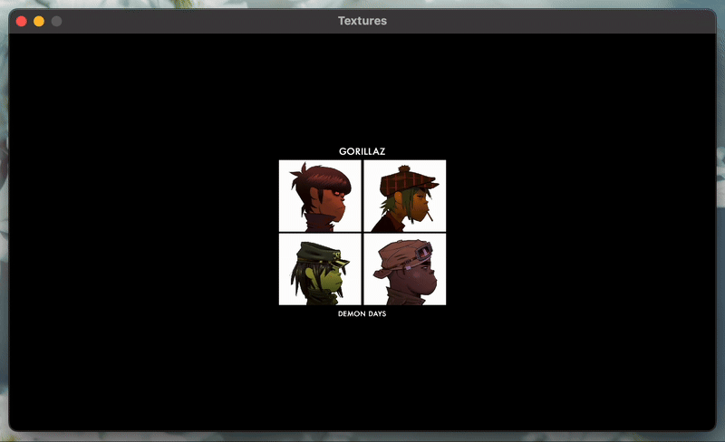

<h2 align=center>Week III</h2>

<h1 align=center>Textures: <em>Feel Good Inc.</em></h1>

<h4 align=center><a href="assets/02-textures.zip">Download The Project's Zip File Here</a><h4>

---

## Sections
1. [**The Problem**](#1)
2. [**The Requirements**](#2)
3. [**How and What to Submit**](#3)

---

<a id="1"></a>

## The Problem

If you run [**`main.cpp`**](main.cpp), you will see the following screen:

<a id="fg-1"></a>

<p align=center>
    
    </img>
</p>

<p align=center>
    <sub>
        <strong>Figure I</strong>: Your starting condition. All rights go to the iconic <a href="https://en.wikipedia.org/wiki/Gorillaz"><strong>Gorillaz™</strong></a>.
    </sub>
</p>

Your goal is to [**manipulate the texture's UV-coordinates**](https://github.com/sebastianromerocruz/CS-3113-Intro-To-Game-Programming/tree/main/lectures/03-textures#2-2-1) in order for the following to happen:

<a id="fg-2"></a>

<p align=center>
    
    </img>
</p>

<p align=center>
    <sub>
        <strong>Figure II</strong>: Your goal.
    </sub>
</p>

In other words:

1. Smooth out the scaling to be frame-independent/time-dependent.
2. Isolate one of the four members every _100 frames_.
3. Make that member's quadrant the entire texture applied to the game object.

Note the enum defined at the top of the file with each member's names, starting from the top left, going clockwise:

```cpp
enum Member { MURDOC, TWO_D, RUSSEL, NOODLE };
```

Note also that this project uses `cs3113.cpp` and `cs3113.h`. In your `makefile`, but sure to change the source files to the following:

```sh
# Source Files
SRCS = main.cpp CS3113/cs3113.cpp
```

<br>

<a id="2"></a>

## The Requirements

- You _must_ manually calculate and use delta time
- You _must_ adhere to only concepts learned in class so far.
- You must try to minimise the amount of hard-coding (i.e. create as many constants as possible!)
- If your finger even _hovers_ over the Copilot button on VSCode, I _swear to you_ that swift and merciless justice will fall upon your grade

<br>

<a id="3"></a>

## How and What to Submit

1. Show your working solution to the professor. All group members must have it working on their computers for the whole team to get checked out.
2. You must submit in the relevant [**"discussion" board**](https://brightspace.nyu.edu/d2l/le/501465/discussions/List?dst=1) on Brightspace. **Only one person per team must upload the team's solution, but that person must include everybody's names**.