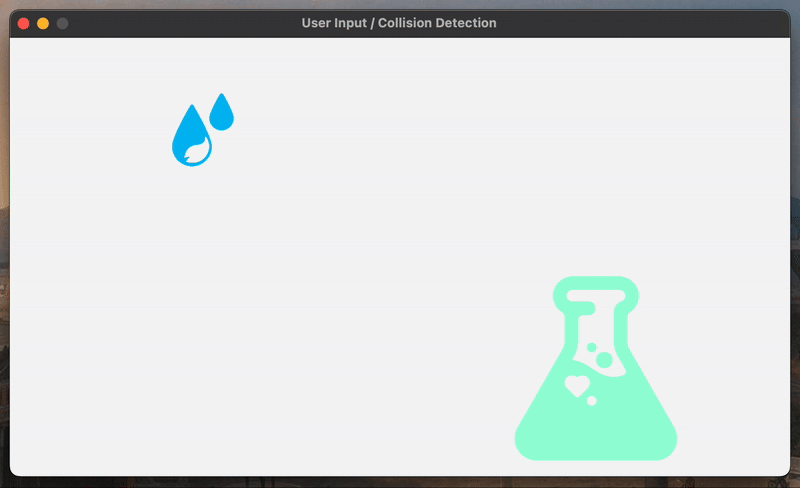
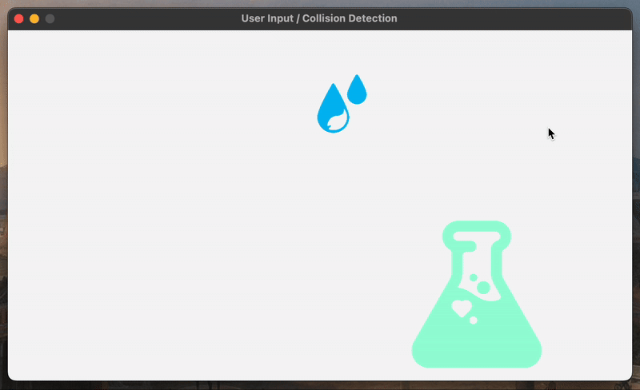
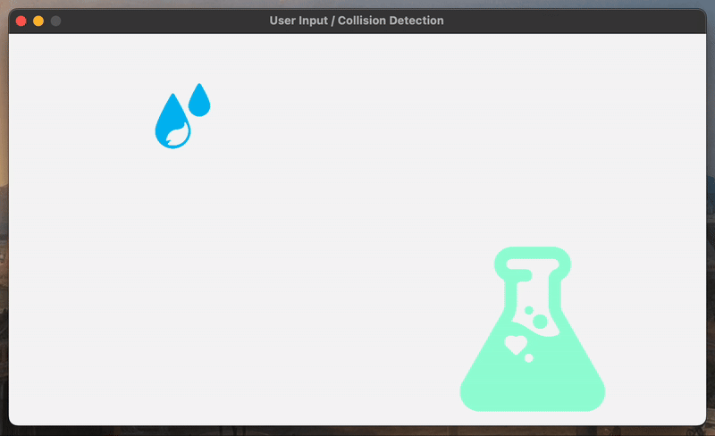

<h2 align=center>Week IV</h2>

<h1 align=center>Textures: <em>Pixel Chemistry.</em></h1>

<!-- <h4 align=center><a href="assets/02-textures.zip">Download The Project's Zip File Here</a><h4> -->

---

## Sections
1. [**The Problem**](#1)
2. [**The Requirements**](#2)
3. [**How and What to Submit**](#3)

---

<a id="1"></a>

## The Problem

If you run [**`main.cpp`**](main.cpp), you will see the following scene:

<a id="fg-1"></a>

<p align=center>
    
    </img>
</p>

<p align=center>
    <sub>
        <strong>Figure I</strong>: Your starting condition.
    </sub>
</p>

Your goal is to:

1. Accept and handle the user's [**mouse input**](https://github.com/sebastianromerocruz/CS-3113-Intro-To-Game-Programming/tree/main/lectures/04-user-input-collisions#3) and,
2. _if_ the player [**clicks anywhere within the drops object**](https://github.com/sebastianromerocruz/CS-3113-Intro-To-Game-Programming/tree/main/lectures/04-user-input-collisions#iskeydown-and-the-movement-vector), utilise the drops' [**movement vector**](https://github.com/sebastianromerocruz/CS-3113-Intro-To-Game-Programming/tree/main/lectures/04-user-input-collisions#iskeydown-and-the-movement-vector) to have them:
    1. Stop moving from left to right and,
    2. Drop straight down.
3. Finally, if (and only if) the drops hit the beaker on their downward trajectory, they should gradually shrink until they "disappear" inside of the beaker (your "win" condition). Otherwise, it should just continue falling straight down (your "lose" condition).

<a id="fg-2"></a>

<p align=center>
    
    </img>
</p>

<p align=center>
    <sub>
        <strong>Figure II</strong>: Your winning condition.
    </sub>
</p>

<a id="fg-3"></a>

<p align=center>
    
    </img>
</p>

<p align=center>
    <sub>
        <strong>Figure III</strong>: Your lose condition.
    </sub>
</p>

Note the constants and global variables I've added:

```c++
// Enums
enum TeardropStatus { HANGING, RELEASED };

// Global Constants
constexpr int SHRINK_RATE   = 100;

constexpr Vector2 ORIGIN             = { SCREEN_WIDTH / 2, SCREEN_HEIGHT / 2 },
                  TEARDROP_BASE_SIZE = { 100.0f, 100.0f },
                  BEAKER_BASE_SIZE   = { 250.0f, 250.0f },
                  TEARDROP_INIT_POS  = { ORIGIN.x, ORIGIN.y - 130.0f },
                  BEAKER_INIT_POS    = { ORIGIN.x + 200.0f, ORIGIN.y + 115.0f };

// @see https://idol.st/idols/ for source
constexpr char TEARDROP_FP[] = "assets/game/drops.png";
constexpr char BEAKER_FP[]   = "assets/game/beaker.png";

// ...

// Global Variables
Vector2 gTeardropPosition = TEARDROP_INIT_POS,
        gTeardropMovement = { 0.0f, 0.0f },
        gTeardropScale    = TEARDROP_BASE_SIZE,

        gBeakerPosition = BEAKER_INIT_POS,
        gBeakerMovement = { 0.0f, 0.0f },
        gBeakerScale    = BEAKER_BASE_SIZE,

        gMousePosition = GetMousePosition();

Texture2D gTeardropTexture;
Texture2D gBeakerTexture;

TeardropStatus gTeardropStatus = HANGING;
```

Once again, it's not absolutely necessary to use every one of these, but you'll definite be needing quite a few of these.

<br>

<a id="2"></a>

## The Requirements

- You _must_ manually calculate and use delta time.
- You _must_ adhere to only concepts learned in class so far.
- You must try to minimise the amount of hard-coding (i.e. use your objects' coordinates, scales, create as many constants as possible!).
- If your finger even _hovers_ over the Copilot button on VSCode, I _swear to you_ that swift and merciless justice will fall upon your grade.

<br>

<a id="3"></a>

## How and What to Submit

1. Show your working solution to the professor. All group members must have it working on their computers for the whole team to get checked out.
2. You must submit in the relevant [**discussion board**](https://brightspace.nyu.edu/d2l/le/501465/discussions/topics/574634/View) on Brightspace. **Only one person per team must upload the team's solution, but that person must include everybody's names**. You submission ***must adhere to the following format***:
    - **Subject**: `Team #X`
    - **Body**: 
        ```
        - Team Member A Name (teamMemberAEmail@nyu.edu)
        - Team Member B Name (teamMemberBEmail@nyu.edu)
        - Team Member C Name (teamMemberCEmail@nyu.edu)
        - Team Member D Name (teamMemberDEmail@nyu.edu)
        ```
    - **Attached File**: `teamX_main.cpp`