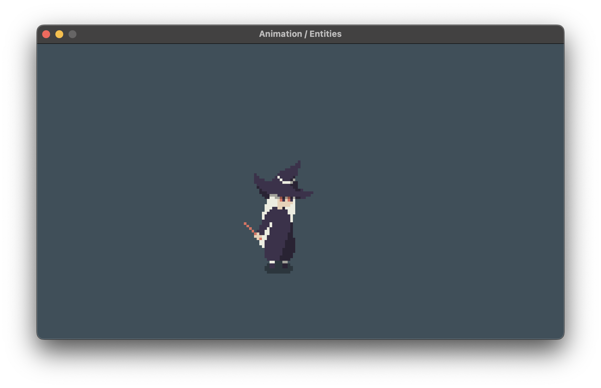
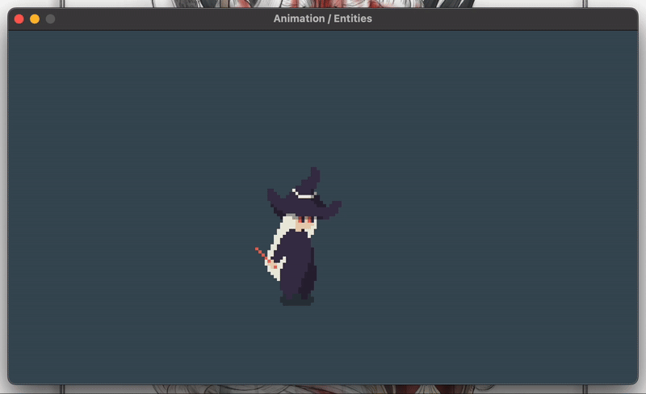
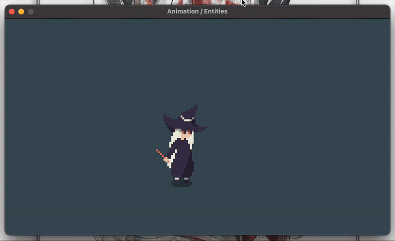

<h2 align=center>Week V</h2>

<h1 align=center>Animation: <em>Witching Hour</em></h1>

<!-- <h4 align=center><a href="assets/02-textures.zip">Download The Project's Zip File Here</a><h4> -->

---

## Sections
1. [**The Problem**](#1)
2. [**The Requirements**](#2)
3. [**How and What to Submit**](#3)

All assets from this exercise were made by the wonderful [**9E0**](https://9e0.itch.io/). Please support their work by buying the assets yourself!

---

<a id="1"></a>

## The Problem

Happy October! It's spooky time so you know I had to do it to 'em. If you run [**`main.cpp`**](main.cpp), you will see the following scene:

<a id="fg-1"></a>

<p align=center>
    
    </img>
</p>

<p align=center>
    <sub>
        <strong>Figure I</strong>: Your starting condition.
    </sub>
</p>

Your goal is to add some logic to a modified version of the **`Entity`** class (defined [**here**](CS3113/Entity.h) and implemented [**here**](CS3113/Entity.cpp)) to achieve the follow **idle animation**:

<a id="fg-2"></a>

<p align=center>
    
    </img>
</p>

<p align=center>
    <sub>
        <strong>Figure II</strong>: Our witch's idle animation.
    </sub>
</p>

And, every time the player **presses the `P` key** (but not _holds_ it), the witch will switch to her powering-up animation. Pressing the `P` key again will switch her back to her idle animation:

<a id="fg-2"></a>

<p align=center>
    
    </img>
</p>

<p align=center>
    <sub>
        <strong>Figure II</strong>: Your final goal.
    </sub>
</p>

In order to do this, you can:

1. Make it so the animations will not longer only trigger when the `Entity` object is moving (completing this step will automatically trigger the idle animation). 
2. Add logic _to the `Entity` class_ that will change animations. Note that all of this logic must be encapsulated, and so only takes place inside of [**`Entity.cpp`**](CS3113/Entity.cpp). Also note that, since the idle atlas and powerup atlas exist in two different files, the following changes have been made to the class:
    ```cpp
    // Entity.h
    enum WitchState { IDLE, POWERING_UP };

    class Entity
    {
    private:
        // ...

        std::map<WitchState, Texture2D> mTextures;
        Texture2D mCurrentTexture;

        // ...

        WitchState mWitchStatus;

        // ...
    
    public:
        // ...
        static const int IDLE_ROWS        = 6;
        static const int POWERING_UP_ROWS = 8;

        Entity(Vector2 position, Vector2 scale, 
            std::vector<const char*> textureFilepaths,
            TextureType textureType, Vector2 spriteSheetDimensions, 
            std::map<WitchState, std::vector<int>> animationAtlas);
    };  
    ```
    ```c++
    // Entity,cpp

    // ...
    Entity::Entity(Vector2 position, Vector2 scale, 
        std::vector<const char*> textureFilepaths, TextureType textureType,
        Vector2 spriteSheetDimensions, std::map<WitchState, 
        std::vector<int>> animationAtlas) : mPosition {position}, 
        mMovement { 0.0f, 0.0f }, mScale {scale}, mColliderDimensions {scale}, 
        mTextureType {ATLAS}, mSpriteSheetDimensions {spriteSheetDimensions},
        mAnimationAtlas {animationAtlas}, mDirection {DOWN}, 
        mAnimationIndices {animationAtlas.at(IDLE)}, 
        mFrameSpeed {DEFAULT_FRAME_SPEED}, mAngle { 0.0f }, 
        mSpeed { DEFAULT_SPEED }, mWitchStatus { IDLE } 
    {
        for (int i = 0; i < textureFilepaths.size(); i++)
            mTextures[(WitchState) i] = LoadTexture(textureFilepaths[i]);

        mCurrentTexture = mTextures[mWitchStatus];
    }

    Entity::~Entity() 
    {
        for (int i = 0; i < mTextures.size(); i++)
            UnloadTexture(mTextures[(WitchState) i]); 
    };

    // ...
    void Entity::update(float deltaTime)
    {
        mAnimationIndices = mAnimationAtlas.at(mWitchStatus);

        // ...
    }
    ```
3. Finally, write a method for the `Entity` class that will switch between the `IDLE` and `POWERING_UP` states. Then, call it every time the player presses the `P` key.

<a id="2"></a>

## The Requirements

- When I say that you _must_ encapsulate this behaviour, I mean it; the programmer in `main` should have no idea what's going inside of the class other than the powerup is being triggered.
- You _must_ adhere to only concepts learned in class so far.
- You must try to minimise the amount of hard-coding (i.e. use your objects' coordinates, scales, create as many constants as possible!).
- If your finger even _hovers_ over the Copilot button on VSCode, I _swear to you_ that swift and merciless justice will fall upon your grade.

<br>

<a id="3"></a>

## How and What to Submit

1. Show your working solution to the professor. All group members must have it working on their computers for the whole team to get checked out.
2. You must submit in the relevant [**discussion board**](https://brightspace.nyu.edu/d2l/le/501465/discussions/topics/574634/View) on Brightspace. **Only one person per team must upload the team's solution, but that person must include everybody's names**. You submission ***must adhere to the following format***:
    - **Subject**: `Team #X`
    - **Body**: 
        ```
        - Team Member A Name (teamMemberAEmail@nyu.edu)
        - Team Member B Name (teamMemberBEmail@nyu.edu)
        - Team Member C Name (teamMemberCEmail@nyu.edu)
        - Team Member D Name (teamMemberDEmail@nyu.edu)
        ```
    - **Attached File**: `teamX.zip` containing the following file structure...
        ```
        teamX
        ├── CS3113
        │   ├── Entity.cpp
        │   └── Entity.h
        └── main.cpp
        ```