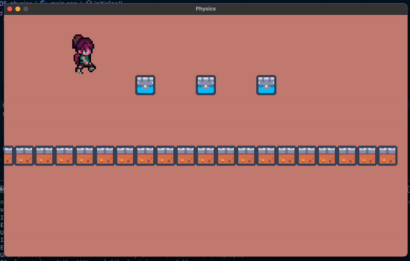
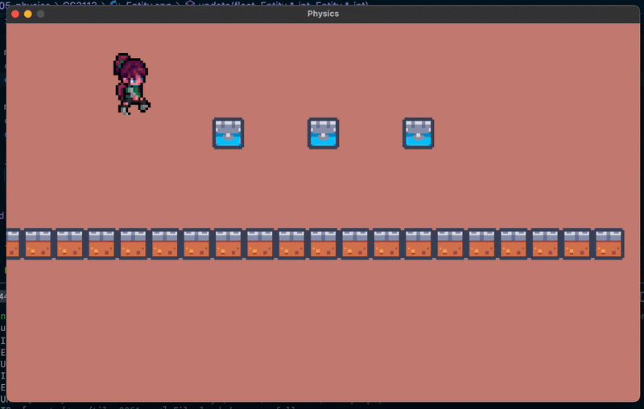

<h2 align=center>Week 06</h2>

<h1 align=center>Physics: <em>Onto The Next Castle</em></h1>

<!-- <h4 align=center><a href="assets/02-textures.zip">Download The Project's Zip File Here</a><h4> -->

---

## Sections
1. [**The Problem**](#1)
2. [**The Requirements**](#2)
3. [**How and What to Submit**](#3)

---

<a id="1"></a>

## The Problem

If you run [**`main.cpp`**](main.cpp), you will see the following scene:

<a id="fg-1"></a>

<p align=center>
    
    </img>
</p>

<p align=center>
    <sub>
        <strong>Figure I</strong>: Your starting condition.
    </sub>
</p>

Your goal is to add some logic to a modified version of the **`Entity`** class (defined [**here**](CS3113/Entity.h) and implemented [**here**](CS3113/Entity.cpp)) _as well as to your [**`main.cpp`**](main.cpp) file_, to achieve the following behaviour:

<a id="fg-2"></a>

<p align=center>
    
    </img>
</p>

<p align=center>
    <sub>
        <strong>Figure II</strong>: Your goal.
    </sub>
</p>

In other words:

1. Make it so that once Xochitl hits all three blocks, the platform she is standing on _disappears_ (i.e. becomes [**_inactive_**](https://github.com/sebastianromerocruz/CS-3113-Intro-To-Game-Programming/tree/main/lectures/06-physics#2)). In order to do this, you must...
2. ...add logic _to the `Entity` class_ that will deactivate any collidable entities a) are blocks and b) are hit from the bottom. To help you do this, the following additions have been made to the `Entity` class:
    ```cpp
    // Entity.h
    enum EntityType { PLAYER, BLOCK, PLATFORM, NONE };

    class Entity
    {
    private:
        // ...

        EntityType mEntityType;

        // ...
    
    public:
        // ...
        Entity(Vector2 position, Vector2 scale, const char *textureFilepath, 
        EntityType entityType);
        Entity(Vector2 position, Vector2 scale, const char *textureFilepath, 
            TextureType textureType, Vector2 spriteSheetDimensions, 
            std::map<Direction, std::vector<int>> animationAtlas, 
            EntityType entityType);

        // ...
        void setEntityType(EntityType entityType)
            { mEntityType = entityType; }
    };  
    ```
    ```c++
    // Entity,cpp

    Entity::Entity(Vector2 position, Vector2 scale, const char *textureFilepath, 
        EntityType entityType) : mPosition {position}, mVelocity {0.0f, 0.0f}, 
        mAcceleration {0.0f, 0.0f}, mScale {scale}, mMovement {0.0f, 0.0f}, 
        mColliderDimensions {scale}, mTexture {LoadTexture(textureFilepath)}, 
        mTextureType {SINGLE}, mDirection {RIGHT}, mAnimationAtlas {{}}, 
        mAnimationIndices {}, mFrameSpeed {0}, mSpeed {DEFAULT_SPEED}, 
        mAngle {0.0f}, mEntityType {entityType} { }

    Entity::Entity(Vector2 position, Vector2 scale, const char *textureFilepath, 
            TextureType textureType, Vector2 spriteSheetDimensions, std::map<Direction, 
            std::vector<int>> animationAtlas, EntityType entityType) : 
            mPosition {position}, mVelocity {0.0f, 0.0f}, 
            mAcceleration {0.0f, 0.0f}, mMovement { 0.0f, 0.0f }, mScale {scale},
            mColliderDimensions {scale}, mTexture {LoadTexture(textureFilepath)}, 
            mTextureType {ATLAS}, mSpriteSheetDimensions {spriteSheetDimensions},
            mAnimationAtlas {animationAtlas}, mDirection {RIGHT},
            mAnimationIndices {animationAtlas.at(RIGHT)}, 
            mFrameSpeed {DEFAULT_FRAME_SPEED}, mAngle { 0.0f }, 
            mSpeed { DEFAULT_SPEED }, mEntityType {entityType} { }
    ```
    ```cpp
    // main.cpp
    // ...
    constexpr int NUMBER_OF_BLOCKS = 3;

    Entity *gBlocks  = nullptr;

    void initialise()
    {
        // ...

        gXochitl = new Entity(
            {ORIGIN.x - 300.0f, ORIGIN.y - 200.0f}, 
            {250.0f * sizeRatio, 250.0f},           
            "assets/game/walk.png",                 
            ATLAS,                                  
            { 6, 8 },                               
            animationAtlas,                         
            PLAYER                                  // entity type
        );

        // ...

        for (int i = 0; i < NUMBER_OF_TILES; i++) 
        {
            // ...
            gTiles[i].setEntityType(PLATFORM);
            // ...
        }

        // ...

        gBlocks = new Entity[NUMBER_OF_BLOCKS];

        for (int i = 0; i < NUMBER_OF_BLOCKS; i++) 
        {
            // assets from @see https://kenney.nl/assets/pixel-platformer-industrial-expansion
            gBlocks[i].setTexture("assets/game/tile_0061.png");
            gBlocks[i].setEntityType(BLOCK);
            gBlocks[i].setScale({TILE_DIMENSION, TILE_DIMENSION});
            gBlocks[i].setColliderDimensions({TILE_DIMENSION, TILE_DIMENSION});
        }

        gBlocks[0].setPosition({ORIGIN.x - TILE_DIMENSION * 3, ORIGIN.y - TILE_DIMENSION * 2.5f});
        gBlocks[1].setPosition({ORIGIN.x, ORIGIN.y - TILE_DIMENSION * 2.5f});
        gBlocks[2].setPosition({ORIGIN.x + TILE_DIMENSION * 3, ORIGIN.y - TILE_DIMENSION * 2.5f});

        // ...
    }

    // ..
    ```
3. Make it so that `main` deactivates all tiles of the platform the moment all blocks are deactivated.

<a id="2"></a>

## The Requirements

- You _must_ use the `EntityType` enumerator in your logic.
- You _must not_ call the `update` method of any `Entity` object more than _once_ per frame; modify the `Entity` class's `udpate` method's signature instead.
- You _must_ adhere to only concepts learned in class so far.
- You must try to minimise the amount of hard-coding (i.e. use your objects' coordinates, scales, create as many constants as possible!).
- If your finger even _hovers_ over the Copilot button on VSCode, I _swear to you_ that swift and merciless justice will fall upon your grade.

<br>

<a id="3"></a>

## How and What to Submit

1. Show your working solution to the professor. All group members must have it working on their computers for the whole team to get checked out.
2. You must submit in the relevant [**discussion board**](https://brightspace.nyu.edu/d2l/le/501465/discussions/topics/574634/View) on Brightspace. **Only one person per team must upload the team's solution, but that person must include everybody's names**. You submission ***must adhere to the following format***:
    - **Subject**: `Team #X`
    - **Body**: 
        ```
        - Team Member A Name (teamMemberAEmail@nyu.edu)
        - Team Member B Name (teamMemberBEmail@nyu.edu)
        - Team Member C Name (teamMemberCEmail@nyu.edu)
        - Team Member D Name (teamMemberDEmail@nyu.edu)
        ```
    - **Attached File**: `teamX.zip` containing the following file structure...
        ```
        teamX
        ├── CS3113
        │   ├── Entity.cpp
        │   └── Entity.h
        └── main.cpp
        ```