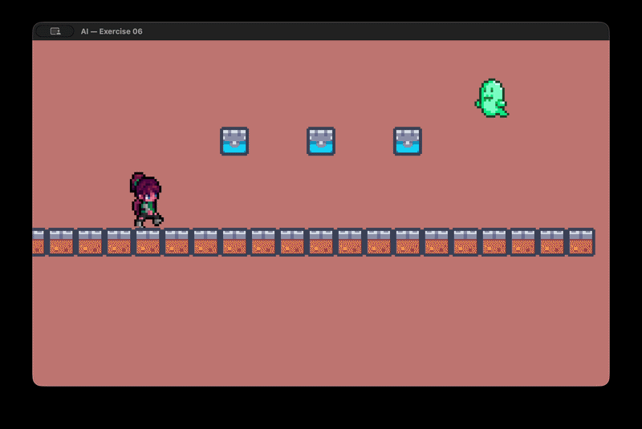

<h2 align=center>Week VII</h2>

<h1 align=center>AI: <em>Smooth Operator</em></h1>

---

## Sections
1. [**The Problem**](#1)
2. [**Background: Linear Interpolation**](#2)
3. [**The Requirements**](#3)
4. [**How and What to Submit**](#4)

---

<a id="1"></a>

## The Problem

If you run [**`main.cpp`**](main.cpp) right now, you will see the following:

<a id="fg-1"></a>

<p align=center>
    
    </img>
</p>

<p align=center>
    <sub>
        <strong>Figure I</strong>: Your starting condition.
    </sub>
</p>

No matter how close you get to the ghost, _it won't move_. That's because its AI type is set to `LERPER`, and the `AILerp` method in [**`Entity.cpp`**](CS3113/Entity.cpp) is currently an empty stub.

Your goal is to implement the `AILerp` method so that our ghost **smoothly follows the player using linear interpolation**. Once you do, the it should glide through the air toward Xochitl whenever she comes within range in this kind of smooth ease-out. In other words:

<a id="fg-1"></a>

<p align=center>
    
    </img>
</p>

<p align=center>
    <sub>
        <strong>Figure II</strong>: Your ending condition.
    </sub>
</p>

- While Xochitl is far away, the ghost is `IDLE` and stays put.
- Once Xochitl comes within **350 pixels**, the ghost switches to `FOLLOWING` and begins interpolating its position toward hers every frame.

The built-in raylib function [**`Vector2Distance`**](https://www.raylib.com/cheatsheet/cheatsheet.html) may come in handy here.

<a id="2"></a>

## Background: Linear Interpolation

**Linear interpolation** (lerp) is one of the most widely-used tools in game development. It answers the question: _"What value lies `t`% of the way between `a` and `b`?"_

The formula is as follows:

```
lerp(a, b, t) = a + (b - a) * t
```

where `t` is a value between `0.0` and `1.0`. When `t = 0`, the result is `a`; when `t = 1`, the result is `b`; when `t = 0.5`, the result is exactly halfway between the two.

In a game loop, we apply lerp **per frame** to smoothly move one value toward another. Because we multiply `t` by `deltaTime`, the interpolation is frame-rate independent:

```
t = mLerpFactor * deltaTime
```

Applying this to the **position vector** each frame creates its characteristic **ease-out** motion: fast at first, then slowing as the entity approaches its target. This happens because the distance being covered each frame is a _fraction of the remaining distance_—the closer you get, the smaller the step.

---

<a id="3"></a>

## The Requirements

You must make **two additions** to the `Entity` class and implement **one method**:

### 1. Add `mLerpFactor` to `Entity.h`

In [**`Entity.h`**](CS3113/Entity.h), add a `float` private attribute that holds the lerp speed factor.

### 2. Add `setLerpFactor` / `getLerpFactor` to `Entity.h`

In the `public` section of [**`Entity.h`**](CS3113/Entity.h), add the corresponding getter and setter. Make sure to set the its initial value in [**`main.cpp`**](main.cpp). (Start with `2.0f` and feel free to experiment.)

### 3. Implement `AILerp` in `Entity.cpp`

Open [**`Entity.cpp`**](CS3113/Entity.cpp) and find the `AILerp` method skeleton. Implement a two-state FSM: 

- When the player comes within range, the ghost switches from `IDLE` to `FOLLOWING`
- When the ghost is `FOLLOWING`, it should begin smoothly pursuing them each frame using the lerp formula from the previous section.

### Constraints

- You _must_ use the `LERPER` AI type and the `FOLLOWING` AI state in your logic.
- You _must_ implement the lerp formula yourself; ***do not use Raylib's `Vector2Lerp`***.
- You _must_ adhere to only concepts learned in class so far.
- This is supposed to be an in-class exercise meant to be fun challenge you and it's really not that difficult; don't use AI to solve it.

<br>

<a id="4"></a>

## How and What to Submit

1. Show your working solution to the professor. All group members must have it working on their computers for the whole team to get checked out.
2. Submit in the relevant [**discussion board**](https://brightspace.nyu.edu/d2l/le/501465/discussions/topics/574634/View) on Brightspace. **Only one person per team must upload the team's solution, but that person must include everybody's names**. Your submission ***must adhere to the following format***:
    - **Subject**: `Team #X`
    - **Body**:
        ```
        - Team Member A Name (teamMemberAEmail@nyu.edu)
        - Team Member B Name (teamMemberBEmail@nyu.edu)
        - Team Member C Name (teamMemberCEmail@nyu.edu)
        - Team Member D Name (teamMemberDEmail@nyu.edu)
        ```
    - **Attached File**: `teamX.zip` containing the following file structure...
        ```
        teamX
        ├── CS3113
        │   ├── Entity.cpp
        │   └── Entity.h
        └── main.cpp
        ```
