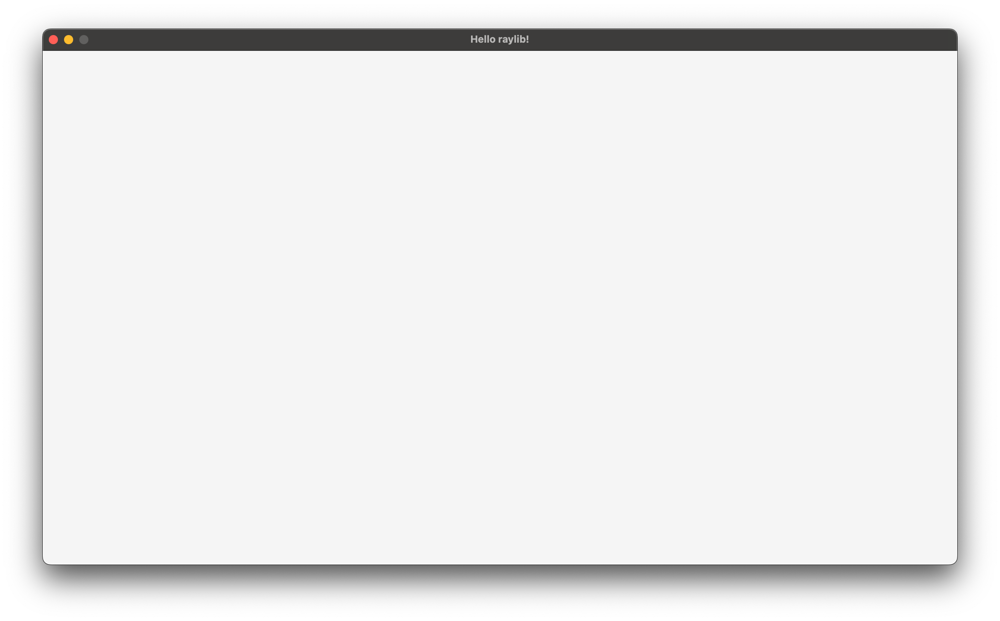
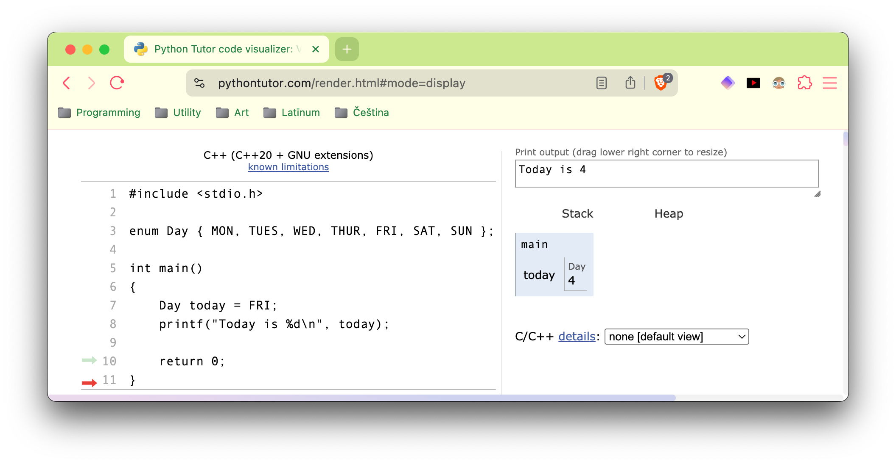

<h2 align=center>Week I</h2>

<h1 align=center>Hello, Raylib!</h1>

<h3 align=center>XIX Harpstring Moon, Imperial Year MMXXVI</h3>

<p align=center><strong><em>Song of the day</strong>: <a href="https://youtu.be/0qUtT6k83Go?si=c-pKA-WsWJ57CQjp"><strong><u>Fior di Latte</u></strong></a> by Phoenix (2017)</em></p>

---

## Sections

1. [**What Is Game Programming?**](#1)
2. [**Why raylib?**](#2)
3. [**Hello, Raylib!**](#3)
    1. [**`main`**](#3-1)
    2. [**`initialise`**](#3-2)
    3. [**`processInput`**](#3-3)
    4. [**`update`**](#3-4)
    5. [**`render`**](#3-5)
    6. [**`shutdown`**](#3-6)

---

<a id="1"></a>

## What Is Game Programming?

Let's start by addressing _the_ single most common question I get whenever anybody asks me about this class: why aren't we using Unity / Unreal / literally any other industry-standard game engine that's freely-available to us? Wouldn't _that_ be the best way to jump start a career in games?

Yes and no. It is true that a lot of video game developers get their careers started with pre-built engines. The whole appeal of using them is that you don't have to worry about the minutiae that come with rendering pixels on the screen and making them interactive. At the risk of sounding a little patronising (this isn't my intention—I've programmed a lot in Unity), you could call this way of learning "game dev with training wheels". And there's nothing wrong with that! A lot of the times, developers have a strong vision and whichever tool helps them achieve that goal most efficiently is going to be the most obvious choice. Honestly, as long as we're getting good games out of it, who cares? 

So, why aren't _we_ doing that?

Consider the name of this course: "Introduction to Game Programming." How would you define game programming? Or, put another way, what is a game developer responsible for? It's not a straightforward question with a straightforward answer, especially with tools like Unity and Unreal. If I were to hazard an answer, it would be the following:

1. The implementation of the game's interactivity.
2. The implementation of the game's graphics.
3. The implementation of the game's physics, if any.

The last two of these are especially important, in my opinion, and a lot more complex than you may think. We tend to take graphics for granted as citizens of the 21st century, since we see them everywhere, all the time. We're used to a drag-and-drop model of interacting with images where we don't really need to even think about the resources necessary for the liquid crystals under our screens to show us what we want where we want. Taking into account that, under the hood, all of this ends up being broken into machine code anyway, there's quite a bit to this process that we're (by design) simply not thinking about.

Physics, too, is a more loaded topic than meets the eye. When we say that a game has very immersive movement or control, what _exactly_ are we saying? Generally speaking, we say this when something feels _realistic_—that is, akin to the laws of physics that we interact with in the real world. It feels familiar to us, so it makes us forget, for a little bit, that we're playing a game. Evoking this feeling is not easy, because mechanics are extremely complicated. Simulating the way a body moves through space, complete with its reactions to outside stimuli (like air resistance, etc) is really difficult! We don't think about it, because we literally live it, but when it comes time to tell something digital to act the same way, we're suddenly talking about something magnitudes more complex.

The reason why I choose not to utilise pre-built engines in this class is because they tend to take the responsibility for these two things away from the developer—or at least abstract them away so much to the point of triviality. Of course, it's not as if you _can't_ ask for finer control in pre-built engines—you can (especially in Unreal), but at that point, it's almost as if you were working "against the grain" of these pieces of software. Meaning: why are you even using Unity if you're just going to reprogram the way Unity handles things? That kind of thing.

So, what does this amount to? By choosing not to use a pre-built engine, we are effectively choosing to _build an engine ourselves_. That's right: from the ground up, we will be using a cute little library called **raylib** to build our own custom game engine, capable of rendering graphics the way _we_ want it to, handle user input the way _we_ want it to, and simulate physics the way _we_ want it to. The benefits of this approach, in my opinion, far outweigh any "handicap" we might have for not using a pre-built engine:

1. You get lots of programming practice doing something you can call your own.
2. You can immediately expand your résumé with any of the games that you will program this semester, stating (correctly) that it was done in your own custom engine.
3. Most [**professional developers**](https://gist.github.com/raysan5/909dc6cf33ed40223eb0dfe625c0de74) use their own custom engines, which they of course build themselves.
4. After this class, picking up Unity and/or Unreal will be a piece of cake. (Getting good at them? Another story.)

If you agree with my reasoning, or at least if you're not going to drop the class after today, then I welcome you. I can't wait to see what you make.

<br>

<a id="2"></a>

## Why raylib?

The better-informed amongst you may be aware that I used to teach this course using an [**old, janky version of a library called OpenGL**](https://github.com/sebastianromerocruz/CS3113-intro-to-game-programming/tree/main?tab=readme-ov-file#cs3113-introduction-to-game-programming). We actually will still be using OpenGL, but in a slight different, more controlled way. [**OpenGL**](https://www.opengl.org/) is a quite famous library that interacts directly with your graphics card to create hi-fi graphics with much smaller overhead than, say, Unity or even Unreal. The particulars of why I'm switching out of that model are not important, but the gist is that as students' machines started to get newer, compatibility issues basically became the norm, and it was really messing with the focus of the class. Basically, more time was being spent figuring out why the setup didn't work than actually working on the game themselves.

So, a former student recommended [**raylib**](https://www.raylib.com/index.html) which, in their own words:

> _...is a programming library to enjoy videogames programming; no fancy interface, no visual helpers, no gui tools or editors... just coding in pure spartan-programmers way._
> 
> — Official raylib website.

<a id="fg-1"></a>

<p align=center>
    
    </img>
</p>

<p align=center>
    <sub>
        <strong>Figure I</strong>: raylib's entire architecture (<a href="https://github.com/raysan5/raylib/wiki/raylib-architecture"><strong>source</strong></a>).
    </sub>
</p>

As you can see, raylib itself is built on OpenGL, so we are still getting a pretty fine level of control over our machines, just with more friendly programmatic interface. Other things that I like about it are that:

- It's a breeze to set up.
- It is [**highly-modular**](https://github.com/raysan5/raylib/wiki/raylib-architecture). We like that.
- It is open-source. We _love_ that.
- It's ported to [**every language under the sun**](https://github.com/raysan5/raylib/blob/master/BINDINGS.md#raylib-bindings-and-wrappers). We're really only using the C version because C/C++ tends to be the standard in the industry.

Overall, while there are some things I wish it did differently / closer to how raw OpenGL does it, it seems to be a really small but powerful library—and more than enough for what we will be covering this semester.

<br>

<a id="3"></a>

## Hello, Raylib!

To get started with the library, let's analyse the code necessary to display an off-white screen using raylib and break it up part-by-part:

<a id="cb-1"></a>

```cpp
#include "raylib.h"

// Enums
enum AppStatus { TERMINATED, RUNNING };

// Global Constants
constexpr int SCREEN_WIDTH  = 1200,
              SCREEN_HEIGHT = 675,
              FPS           = 60;

// Global Variables
AppStatus gAppStatus   = RUNNING;

// Function Declarations
void initialise();
void processInput();
void update();
void render();
void shutdown();

// Function Definitions
void initialise()
{
    InitWindow(SCREEN_WIDTH, SCREEN_HEIGHT, "Hello raylib!");

    SetTargetFPS(FPS);
}

void processInput() 
{
    if (WindowShouldClose()) gAppStatus = TERMINATED;
}

void update() {}

void render()
{
    BeginDrawing();

    ClearBackground(RAYWHITE);

    EndDrawing();
}

void shutdown() 
{ 
    CloseWindow(); // Close window and OpenGL context
}

int main(void)
{
    initialise();

    while (gAppStatus == RUNNING)
    {
        processInput();
        update();
        render();
    }

    shutdown();

    return 0;
}
```

<p align=center>
    <sub>
        <strong>Code Block I</strong>: The contents of this week's <a href="main.cpp"><strong>source code</strong></a>.
    </sub>
</p>

To run the following code (assuming you have its [**corresponding `makefile`**](makefile) in the same folder), simply run the following command in your terminal/command line:

```bash
make run
```

And voilà!

<a id="fg-2"></a>

<p align=center>
    
    </img>
</p>

<p align=center>
    <sub>
        <strong>Figure II</strong>: Fascinating, I know.
    </sub>
</p>

<a id="3-1"></a>

### `main`

As with any program, we should look at its driver function if we want to get a good idea of how it works on a high-level. In the case of video games, this tends to take the shape of something called a **game loop**:

<a id="cb-2"></a>

```cpp
int main(void)
{
    initialise();

    while (gAppStatus == RUNNING)
    {
        processInput();
        update();
        render();
    }

    shutdown();

    return 0;
}
```

<p align=center>
    <sub>
        <strong>Code Block II</strong>: Our invariable `main` function. With maybe a single exception this semester, this function should/will never change.
    </sub>
</p>

[**Michael Stutz**](https://en.wikipedia.org/wiki/Video_game_programming#Game_structure) gives us a slightly more specific, pseudo-code definition:

```
while (user does not exit)
    check for user input
    run AI
    move enemies
    resolve collisions
    draw graphics
    play sounds
end while
```

Essentially, what we're seeing here is that, in order to run a game, you must:
1. **Initialise it**, i.e., setting up the screen, clearing the memory buffers, etc.
2. Until the user quits, **run it**. This involves:
    1. **Getting input from the user**, which may come from a keyboard, a mouse, a controller, etc. We then _record_ this input somewhere to use it later (if there was any input at all).
    2. **Process the game's current frame**, which is a catch-all way of saying: "make everything do what it's supposed to do under the current circumstances". The player pressed `A` to jump in step 2.1? It's time to make the character jump. Did two enemies collide, causing them to walk in opposite directions? Time to change their direction vectors. So on and so forth. In essence, most of your game logic will go in here.
    3. Whatever it is that happened this frame **render/draw it on the screen**. This usually involves clearing the previous frame and asking the GPU to draw the new one, complete with whichever new positions/rotations/scales we ended up with after step 2.2.

This is important, if only because you will see this pattern again and again in every game development environment you're in. What's even more important right now, though, is to remember to _not mix things up_. In other words, make sure that _all_ user input is handled by the `processInput` function, _all_ state updates happen in `update`, and _all_ drawing happens in `render`. This way we can keep everything nice and modularised while keeping up with the industry's best practices.

If you've never seen an [**enum**](https://en.wikipedia.org/wiki/Enumerated_type) before, the following might be a little confusing:

```c++
enum AppStatus { TERMINATED, RUNNING };

AppStatus gAppStatus = RUNNING;

int main()
{
    while (gAppStatus == RUNNING) 
    {
        // ...
    }
}
```

Behind the hood, the values of enums are actually integers, starting from 0 and incrementing by a step of 1. This means that if I defined the following enum:

```c++
enum Day { MON, TUES, WED, THUR, FRI, SAT, SUN };
```

`MON` actually has a value of `0`, `TUES` has a value of `1`, `WED` of `2`, and so on. You can see this in the following screenshot:

<a id="fg-3"></a>

<p align=center>
    
    </img>
</p>

<p align=center>
    <sub>
        <strong>Figure III</strong>: Enumerators under the hood.
    </sub>
</p>

In general, they are considered to be a better way of handling logic than booleans are, as they are easily readable and are not limited to only two values.

<a id="3-2"></a>

### `initialise`

The first function we find in our `main` is that of `initialise`. As previously alluded to, this function takes care of a lot of the "housecleaning" necessary for your game to run smoothly. In general, this will involve the following:

1. **Initialising a window and OpenGL context**. I mean this literally, too. Computers don't just generate windows just because we click on icons. We have to _tell_ our operating system, and our graphics card by extension, to dedicate a portion of the screen to what we want to display. In raylib, this is relatively simple, using the following line:
    ```cpp
    InitWindow(
        SCREEN_WIDTH,   // in pixels
        SCREEN_HEIGHT,  // in pixels
        "Hello raylib!" // text shown on the title of the window
    );
    ```
    Keep in mind that, at a standard screen resolution of 96 DPI, [**1 pixel is equivalent to roughly 0.265 mm**](https://www.unitconverters.net/typography/pixel-x-to-centimeter.htm), though this varies by display.
    - You can think of an **OpenGL context** as a structure that stores the state, functions, and resources needed for rendering graphics using OpenGL.
2. **Set the game's parameters**. This can be a number of things, but for now, we're only setting the game's frame rate. We'll explore frame rates, what they actually do and how they work later in the semester, but for now, all you need to know is that this is how you set it:
    ```cpp
    SetTargetFPS(FPS);
    ```
3. **Initialising the game's camera**. We won't do that for a while, but this is certainly when we would do it.
4. **Initialising any game objects necessary for the scene**. Loading screens are basically there to give your game time to put everything that is supposed to be in your game where and how it's supposed to be. Before any updates happen, we first have to make sure that they exist.

<a id="3-3"></a>

### `processInput`

Our game is pretty empty at the moment, so all we have in terms of interactivity is the ability to close the window. That is precisely what this selection statement is checking for:

```cpp
void processInput() 
{
    if (WindowShouldClose()) gAppStatus = TERMINATED;
}
```

According to the official [**raylib docs**](https://www.raylib.com/cheatsheet/cheatsheet.html), `WindowShouldClose` will...

```c
// Check if application should close (KEY_ESCAPE pressed or windows close icon clicked)
bool WindowShouldClose(void);
```

Now, remember that `processInput` is being checked _every single frame_, so this function is constantly _listening_ for the user to perform either of those actions. In general, that will be the case for all user input functions, though there are some important distinctions we will have to consider when we get to that point in the course.

Notice, too, that _if_ the player does close the window, **`processInput` does not close the game itself**—it only marks its eventual termination. Why? Remember—`processInput` must do only that: register a user's input and keep track of it. It'll up to other functions within your game to do something with that input.

<a id="3-4"></a>

### `update`

Since there is no actual game to speak of in this current application of ours, it makes sense for `update` to be empty; this function is the one to update all game logic given the game's current state and the user's input. We have neither, so we can't do much.

<a id="3-5"></a>

### `render`

`render`, on the other hand, still has some tasks to perform, in spite of there not being much to actually draw. Remember that, fundamentally, raylib and OpenGL are _computer graphics libraries_. Their sole job is to take pixel data and run it through your GPU in order to display it on the screen. That means that even a simple job like a screen with a solid colour has to be explicitly requested.

In general, we will always begin our `render` function with the following line:

```C
void BeginDrawing(void);  // Setup canvas (framebuffer) to start drawing
```

And end it with the following line:

```C
void EndDrawing(void);  // End canvas drawing and swap buffers (double buffering)
```

What exactly does this mean? Consider the following question: what is the most effective way to draw data onto the screen?

1. Bit-by-bit? or...
2. By chunks?

Loading and rendering data is a fairly expensive operation, so your computer will usually load a sizable chunk from the source to render instead of pulling a individual bits. A **buffer** is essentially that chunk of data, is reserved by your computer to do basically anything—play music, videos, read files, you name it. In terms of computer graphics, what our computers do is that they _load the entire image to be drawn into a buffer (the `framebuffer` in our case), and **only then** does it draw it on screen_. [**Gulraiz Noor Bari**](https://medium.com/@gulraiznoorbari/buffer-swapping-v-sync-explained-a-beginners-journey-into-the-c-big-boys-league-0a5b53920152) on Medium gives a really good analogy to what happens next:

> Imagine you’re flipping through a sketchpad to show someone your animation. Rather than drawing on the same page they’re looking at (which would look messy), you draw on the next page while they view the current one. Once you’re done, you flip the page—smooth transition, no mess. That’s double buffering.
>
> When rendering graphics (especially with OpenGL), you’re not drawing directly to the screen. Instead, you use two frame buffers:
>
> - **Back Buffer**
> - **Front Buffer**

The buffer that we are filling up during the course of `render` is the **back buffer**, and the frame being currently shown on screen is the **front buffer**. What we meant by _buffer swapping_ is literally flipping them like you would between pages of an animation book:

> 1. The newly drawn frame (in the back buffer) becomes visible.
> 2. The old frame (in the front buffer) is now free to be drawn on for the next update.

<a id="3-6"></a>

### `shutdown`

There won't be much here for a while besides the following line:

```cpp
void shutdown() 
{ 
    CloseWindow(); // Close window and OpenGL context
}
```

Though eventually we will be releasing some manually allocated data as well.
