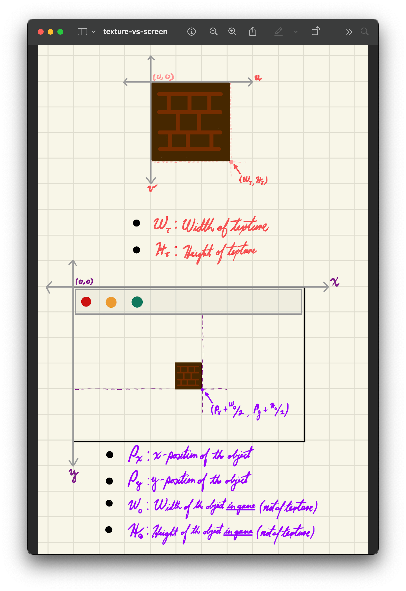
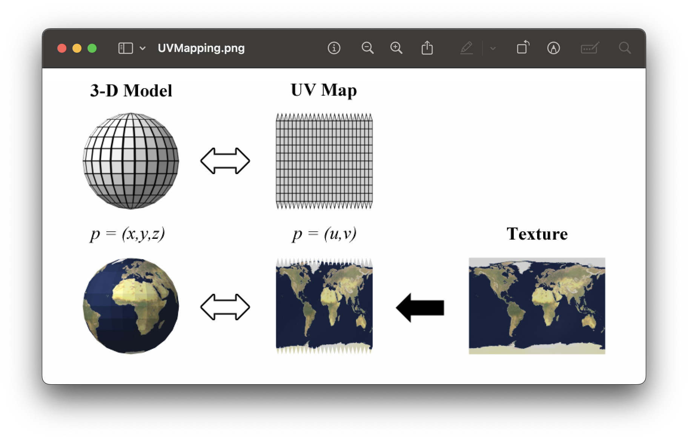
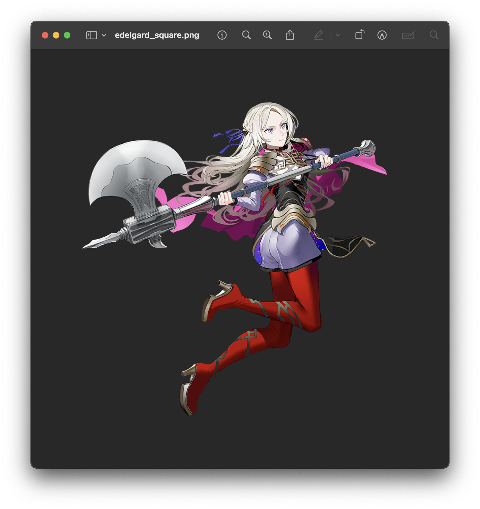
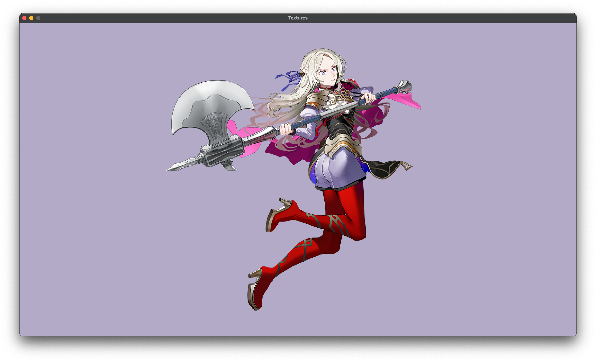

<h2 align=center>Week 03</h2>

<h1 align=center>Textures and Delta Time</h1>

<h3 align=center>VI Pegasus Moon, Imperial Year MMXXVI</h3>

<p align=center><strong><em>Song of the day</strong>: <a href="https://youtu.be/8vEahj1dd2E?si=xolYZwJgVFHl8Qtl"><strong><u>Arcturus Beaming</u></strong></a> by The Crane Wives (2024)</em></p>

---

## Sections

1. [**Some Housecleaning**](#1)
2. [**Textures**](#2)
    1. [**Two Sets Of Coordinates**](#2-1)
    2. [**Textures in raylib**](#2-2)
        1. [**_Determine The Texture's UV Coordinates_**](#2-2-1)
        2. [**_Determine The Target Game Object's XY Coordinates_**](#2-2-2)
        3. [**_Determine The Target Game Origin Inside The **Destination** Rectangle_**](#2-2-3)
        4. [**_Draw/Render The Texture!_**](#2-2-4)
        5. [**_Unload The Texture_**](#2-2-5)
3. [**Delta Time**](#3)
    1. [**Implementation**](#3-1)
    2. [**Calculation**](#3-2)

---

<a id="1"></a>

## Some Housecleaning

Remember that function I included in [**last week's `main`**](https://github.com/sebastianromerocruz/CS-3113-Intro-To-Game-Programming/blob/main/lectures/02-transformations/main.cpp) which converted hex codes to raylib `Color` objects? While it certainly is a handy function to have around, I wouldn't consider it something so essential so as to have it in our `main.cpp` file. In cases like these, we tend to place these function in some other file and then import that file to have access to their functions. I have done just that in this week's folder structure. Check out the tree structure of today's lecture:

```
.
├── assets
│   └...
├── CS3113
│   ├── cs3113.cpp
│   └── cs3113.h
├── main.cpp
└── ...
```

You will notice that we have a new folder, containing both [**`cs3113.cpp`**](CS3113/cs3113.cpp) and [**`cs3113.h`**](CS3113/cs3113.h):

```h
// cs3113.h
#ifndef CS3113_H
#define CS3113_H
#define LOG(argument) std::cout << argument << '\n'

#include "raylib.h"
#include <stdio.h>

enum AppStatus { TERMINATED, RUNNING };

Color ColorFromHex(const char *hex);

#endif // CS3113_H
```
```c++
#include "cs3113.h"

Color ColorFromHex(const char *hex)
{
    // Skip leading '#', if present
    if (hex[0] == '#') hex++;

    // Default alpha = 255 (opaque)
    unsigned int r = 0, 
                 g = 0, 
                 b = 0, 
                 a = 255;

    // 6‑digit form: RRGGBB
    if (sscanf(hex, "%02x%02x%02x", &r, &g, &b) == 3) {
        return (Color){ (unsigned char) r,
                        (unsigned char) g,
                        (unsigned char) b,
                        (unsigned char) a };
    }

    // 8‑digit form: RRGGBBAA
    if (sscanf(hex, "%02x%02x%02x%02x", &r, &g, &b, &a) == 4) {
        return (Color){ (unsigned char) r,
                        (unsigned char) g,
                        (unsigned char) b,
                        (unsigned char) a };
    }

    // Fallback – return white so you notice something went wrong
    return RAYWHITE;
}
```

You don't need to know too much about creating libraries in C/C++. What you _do_ need to keep an eye out is you [**`makefile`**](makefile). Whenever you add another C++ file to your compilation process, be sure to also tell you `makefile` to compile it. In my case, I had to modify the line:

```sh
# Source Files
SRCS = main.cpp
```

To:

```sh
# Source Files
SRCS = main.cpp CS3113/cs3113.cpp
```

I also added the relevant import statement to our [**`main.cpp`**](main.cpp):

```cpp
#include "CS3113/cs3113.h"
```

<br>

<a id="2"></a>

## Textures

Back in the good old days of solid colour polygons (literally last week), we were able to simply draw a triangle on screen via the following line:

```c++
DrawPoly(
    gPosition,     // location on screen
    SIDES,         // the n in n-polygon; 3 for triangle
    gScaleFactor,  // how big our triangle will be
    gAngle,        // by how much it will be rotated upon the z-axis
    RED            // the fill colour of the triangle
);
```

Well, gone are those good old days! While lots of good games have been made with just solid colour shapes, our goal this semester is to make games that use **textures** we can and use. A texture to any 2D image applied to either 3D models or surfaces that gives them a level of visual detail and realism. Naturally, this process comes with its own bit of setup, so that's what we'll be going through today.

<a id="2-1"></a>

### Two Sets Of Coordinates

Applying textures to our game object looks a lot like applying a sticker onto the surface of the back of your laptop; the sticker represents your texture, and the back of your laptop represents your game window. We've got two sets of "data" in this case:

1. The dimensions of the **design** itself, independent of your laptop.
2. The _size_ of the design, as a sticker, and _where_ we want it on your **laptop**.

In game programming terms, the _design_ would correspond to the file containing your texture and the _laptop_ would correspond to your screen, as follows:

<a id="fg-1"></a>

<p align=center>
    
    </img>
</p>

<p align=center>
    <sub>
        <strong>Figure I</strong>: A texture existing as its own file (top) and as part of our games (bottom).
    </sub>
</p>

As you can see, both of these exist in completely different "worlds". That is, the texture itself has its own set of "local" coordinates (typically called **UV coordinates**), while the game's world has its own set of "global" coordinates (our regular XY coordinates). The process of turning the texture's local coordinates to the game's global coordinates is called [**UV mapping**](https://en.wikipedia.org/wiki/UV_mapping), as we can see in the following 3D example:

<a id="fg-2"></a>

<p align=center>
    
    </img>
</p>

<p align=center>
    <sub>
        <strong>Figure II</strong>: The application of a texture in the UV space related to the effect in 3D (<a href="https://en.wikipedia.org/wiki/UV_mapping#/media/File:UVMapping.png"><strong>source</strong></a>)
    </sub>
</p>


<a id="steps"></a>
So what does this all mean? What this means is that, in raylib, in order to use graphics from an external source, like files, we need three things:

1. The texture's UV coordinates.
2. The game object's dimensions (width and height) within the game space (which can be different to the dimensions of the actual texture file).
3. The game object's _origin's_ location (its x- and y-coordinates) within the game space.

<a id="2-2"></a>

### Textures in raylib

In order to demonstrate how this is done in raylib, I found this [**transparent**](https://www.linearity.io/blog/transparent-background/#what-exactly-is-a-transparent-background) image of my favourite video game character—Edelgard from [**Fire Emblem™️: _Three Houses_**](https://en.wikipedia.org/wiki/Fire_Emblem:_Three_Houses) (Image owned by Nintendo please don't sue me):

<a id="fg-3"></a>

<p align=center>
    
    </img>
</p>

<p align=center>
    <sub>
        <strong>Figure III</strong>: This is Edelgard, and she did nothing wrong 😌.
    </sub>
</p>

I chose this image in particular for a couple of reasons:

1. It's a square file (i.e. its width and height are equal).
2. It is transparent.

Neither of these are a requirement for using textures in our games, but they do end up both making our lives a little easier and looking quite nice in-game. So, our first order of business is reference this file in our `main.cpp`. Additionally, I'm going to declare a variable to eventually store a fully-fledged raylib `Texture2D`:

```cpp
// ...

// Image owned by Nintendo — please don't sue me.
constexpr char EDELGARD_FP[]  = "assets/game/edelgard_square.png";

// ...

Texture2D gTexture;
```

Loading a texture from our image file is also as easy as 1-2-3, and it happens—you guessed it—in `initialise`, while we're "loading" the game:

```cpp
void initialise()
{
    InitWindow(SCREEN_WIDTH, SCREEN_HEIGHT, "Textures");

    gTexture = LoadTexture(EDELGARD_FP);

    SetTargetFPS(FPS);
}
```

Amazing! Super simple! Now we're ready to draw our texture onto our window. This is the part where we need to pay attention and follow the [**steps that I outlined earlier**](#steps), since we're going to have to do them _for every single texture we want to render onto the screen_.

<a id="2-2-1"></a>

#### Step 1: _Determine The Texture's UV Coordinates_

What this step effectively means is the following:

> _Which portion, out of the entire texture, do we want to render in the game?_

As we [**saw earlier**](#fg-1), using the UV coordinates (_Width<sub>texture</sub>_, _Height<sub>texture</sub>_) will yield us the entire texture itself, so our job right now is to tell raylib that we want to create a **`Rectangle`** area comprising of these dimensions. Helpfully, raylib has just the class for this:

```cpp
void render()
{
    BeginDrawing();
    ClearBackground(ColorFromHex(BG_COLOUR));

    // Whole texture (UV coordinates)
    Rectangle textureArea = {
        // top-left corner
        0.0f, 0.0f,

        // bottom-right corner (of texture)
        static_cast<float>(gTexture.width),
        static_cast<float>(gTexture.height)
    };

    EndDrawing();
}
```

<a id="2-2-2"></a>

#### Step 2: _Determine The Target Game Object's XY Coordinates_

This step is asking the following question:

> Where on the screen, and in which way, do you want to apply the texture you got from [**step 1**](#2-2-1)?

[**In our earlier example**](#fg-1), we saw that the texture was applied somewhere near the centre of the screen, and shrank quite a bit from its original size. These are the types of things that we will determine in this step using a second `Rectangle` object. Earlier in the file, I determined that my game object's current position will be the origin, and that its size would be 1000-by-1000 (note that I'm now using a `Vector2` object for scale as well):

```c++
// ...

constexpr Vector2 ORIGIN    = { SCREEN_WIDTH / 2, SCREEN_HEIGHT / 2 };
constexpr Vector2 BASE_SIZE = { 1000.0f, 1000.0f };

// ...

Vector2 gPosition = ORIGIN;
Vector2 gScale    = BASE_SIZE;

// ...
```

Thus, our destination rectangle will look something like this:

```c++
void render()
{
    // ...

    Rectangle destinationArea = {
        gPosition.x,
        gPosition.y,
        static_cast<float>(gScale.x),
        static_cast<float>(gScale.y)
    };

    // ...
}
```

If you've got a keen eye, you might be wondering why we're using (`gPosition.x`, `gPosition.y`) instead of offseting the destination rectangle by half its size (i.e. `gPosition.x / 2` and `gPosition.y / 2`). Both are actually a perfectly valid ways of achieving the same effect, and the reason for this will become clear in step 3.

<a id="2-2-3"></a>

#### Step 3: _Determine The Target Game Origin Inside The **Destination** Rectangle_

This last step is a little confusing, but it is basically asking the question:

> Now that we've created a destination area on the window, what point _within the rectangle_ would you like to consider the _rotational origin_.

In other words, what point on your window would you like to pick so that, when we apply the texture on it, that point will be its origin? Here, we can apply that offset that we caused in step 2:

<a id="other-way"></a>

```cpp
void render()
{
    // ...

    // Origin inside the source texture (lower-left corner of dest rect)
    Vector2 originOffset = {
        static_cast<float>(gScale.x) / 2.0f,
        static_cast<float>(gScale.y) / 2.0f
    };

    // ...
}
```

If you prefer to keep `originOffset` as the texture centre (i.e. `gPosition.x / 2` and `gPosition.y / 2`), then you must subtract half the scaled size from the rectangle’s top‑left corner:

```c++
void render() 
{
    // ...

    Rectangle destinationArea = {
        gPosition.x - static_cast<float>(gScale.x) / 2.0f,
        gPosition.y - static_cast<float>(gScale.y) / 2.0f,
        static_cast<float>(gScale.x),
        static_cast<float>(gScale.y)
    };

    Vector2 originOffset = {
        static_cast<float>(gTexture.width)  / 2.0f,
        static_cast<float>(gTexture.height) / 2.0f
    };

    // ...
}
```

That version works too; just remember that the origin you give must correspond to the same coordinate space as the destination rectangle. I personally like [**the other way**](#other-way) better, since it's simpler.

<a id="2-2-4"></a>

#### Step 4: _Draw/Render The Texture!_

Finally, we'll use these three values as arguments for a brand new raylib function, **`DrawTexturePro`**, which is defined as follows:

```cpp
void DrawTexturePro(
    Texture2D texture, // the texture object
    Rectangle source,  // the UV coordinates from step 1
    Rectangle dest,    // the XY coordinates from step 2
    Vector2 origin,    // the texture origin from step 2
    float rotation,    // upon the z-axis
    Color tint         // a sort of colour lens; use WHITE for none
);
```

In our case, the call will look like this:

```cpp
void render()
{
    // ...

    // Render the texture on screen
    DrawTexturePro(
        gTexture, 
        textureArea, 
        destinationArea, 
        originOffset, 
        gAngle, 
        WHITE
    );

    // ...
}
```

_Et voilá!_

<a id="fg-4"></a>

<p align=center>
    
    </img>
</p>

<p align=center>
    <sub>
        <strong>Figure IV</strong>: Hello, Textures!
    </sub>
</p>


<a id="2-2-5"></a>

#### Step 5: _Unload The Texture_

To avoid memory leaks, in `shutdown`, we also want to add the following line _for every single texture that we load_ in order to deallocate the memory:

```cpp
void shutdown() 
{ 
    CloseWindow(); 
    UnloadTexture(gTexture);  // right here!
}
```

<br>

<a id="3"></a>

## Delta Time

Switching gears a little bit, if multiplayer games are something that you're interested in, the question of frame rates may have popped into your mind already. Specifically, since (right now) all game logic is based on how fast our computers can run our game loop, what happens when computer A runs faster/slower than computer B? The answer is that, of course, the game will run at completely different speeds in each machine.

This is not a problem singular to multiplayer games, either. Imagine you spend months developing a single-player game on a computer that runs at 60 frames-per-second (FPS). You've worked on this thing for months and are very proud of it. Your first customer then happens to be somebody whose computer can only run games at 30 frames-per-second. Well, guess what? Your game is now running at half-speed for that person's machine, they feel scammed, and they're writing a scathing review on Steam. Your career is ruined.

Just kidding—it's not that serious—but frame rates do actually work like this. We thus need to find a way to standardise all of our players' game "refresh rate" to something that is not frame-dependent, but rather _time-dependent_—since time ticks the same for everybody. In order to do this, we will be utilising something called **delta time**.

<a id="3-1"></a>

### Implementation

In game development, delta time (often abbreviated as `dt`) refers to the _time elapsed between the current frame and the previous frame_. The delta time allows your game to run consistently regardless of the frame rate, so whether your game is running at 30 FPS or 60 FPS, the in-game events will occur at the same speed.

The core idea is to _multiply any time-dependent variable (like velocity or movement) by delta time_. This ensures that the game logic is consistent, no matter how much time has passed between frames. For example, let's add to our code from [**part 2**](#2) a simple heartbeat-like scaling:

```cpp
void update() 
{
    gPulseTime += 1.0f;

    gScale = {
        BASE_SIZE.x + MAX_AMP * cos(gPulseTime),
        BASE_SIZE.y + MAX_AMP * cos(gPulseTime)
    };
}
```

The time-dependent variable here is `gPulseTime`. Why? Because its value determined by how much our object is being scaled (or, more precisely, its cosine value) that frame. Since `update()` calls are still currently frame-dependent, though, we need to do something in order to ensure that we go from:

> Every frame, add `1.0` to `gPulseTime`.

To:

> Every frame, add `1.0` _plus/minus some change (depending on how much time has passed between this frame and the last frame)_.

To do this, we simply multiply in some value for delta time, and our scaling is officially frame-independent:

```cpp
void update() 
{
    // ...

    gPulseTime += 1.0f * deltaTime;

    gScale = {
        BASE_SIZE.x + MAX_AMP * cos(gPulseTime),
        BASE_SIZE.y + MAX_AMP * cos(gPulseTime)
    };
}
```

<a id="3-2"></a>

### Calculation

But how do we actually _calculate_ this value? Since computers continuously slow down and speed up, this delta time is going to be slightly different every single frame (that's the point), so we must calculate it every singly frame. It's actually very simple:

1. Keep track of how much time has passed from the time the game was launched to the moment this current `update()` call was made.
2. Subtract the amount of time that had passed from launch time to the _previous_ frame (which in the beginning is `0.0`) from the value you calculated in step 1. That difference is your delta time.
3. Set the value from step 1 to be the new value to subtract in the next frame.

Or, in code:

```cpp
float gPreviousTicks = 0.0f;

// ...

void update() 
{
    // Delta time
    float ticks = (float) GetTime();          // step 1
    float deltaTime = ticks - gPreviousTicks; // step 2
    gPreviousTicks = ticks;                   // step 3

    gPulseTime += 1.0f * deltaTime;

    gScale = {
        BASE_SIZE.x + MAX_AMP * cos(gPulseTime),
        BASE_SIZE.y + MAX_AMP * cos(gPulseTime)
    };
}
```

<a id="fg-5"></a>

<p align=center>
    
    </img>
</p>

<p align=center>
    <sub>
        <strong>Figure IV</strong>: It might be hard to notice any difference, but rest assured—it's there.
    </sub>
</p>