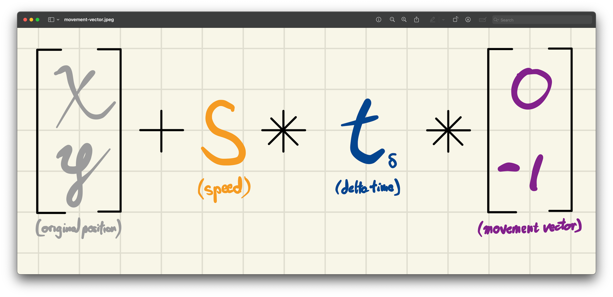
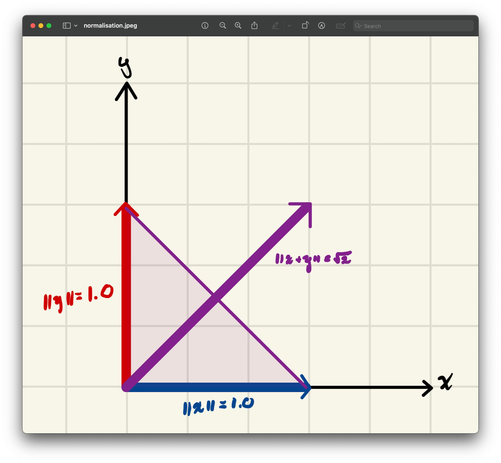
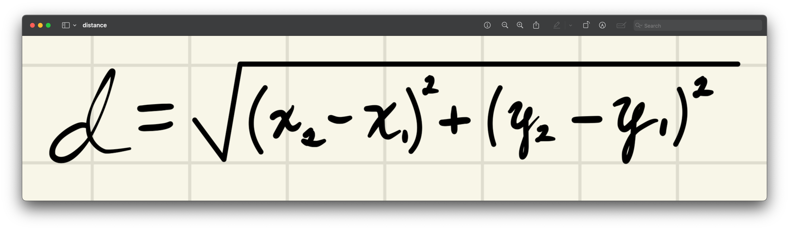
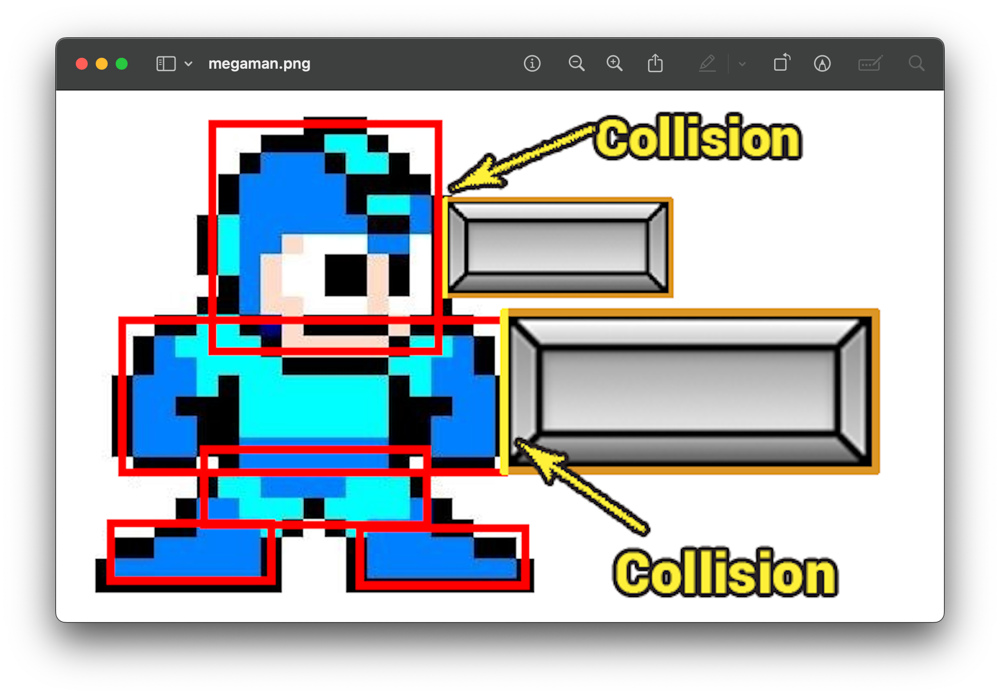
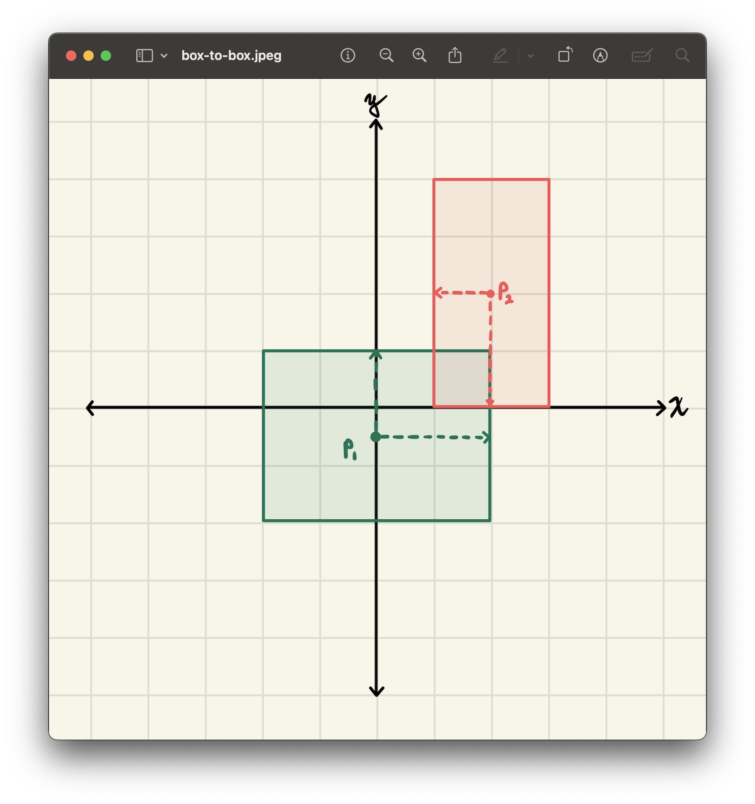
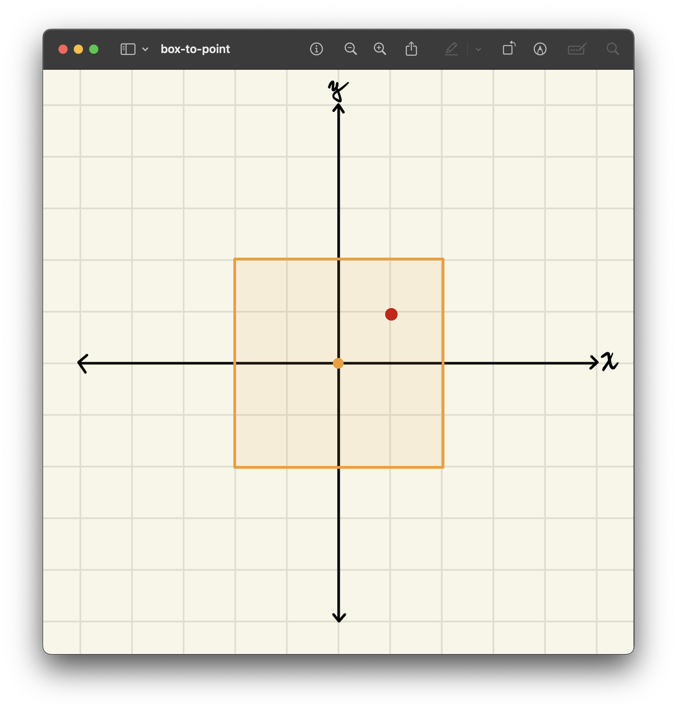

<h2 align=center>Week 04</h2>

<h1 align=center>User Input / Collision Detection</h1>

<h3 align=center>XII Pegasus Moon, Imperial Year MMXXVI</h3>

<p align=center><strong><em>Song of the day</strong>: <a href="https://youtu.be/GQzDG-tILbo?si=qt3ficKGJ8U1woZP"><strong><u>Sam's Town</u></strong></a> by The Killers (2006).</em></p>

---

## Sections

1. [**From Art To Games**](#1)
2. [**Keyboard Input**](#2)
    1. [**`IsKeyPressed`**](#2-1)
    2. [**`IsKeyDown` And The Movement Vector**](#2-2)
        - [**Normalisation**](#2-2-1)
3. [**Mouse Input & Others**](#3)
4. [**Collision Detection Theory**](#4)
    1. [**Circle-to-circle collisions**](#4-1)
    2. [**Point-to-circle collisions**](#4-2)
    3. [**Box-to-box collisions**](#4-3)
    4. [**Point-to-box collisions**](#4-4)

---

<a id="1"></a>

## From Art To Games

Let's touch base for a bit and take a look at our game loop one more time:

```cpp
int main(void)
{
    initialise();

    while (gAppStatus == RUNNING)
    {
        processInput();
        update();
        render();
    }

    shutdown();

    return 0;
}
```

We have:

- Created a starting scene in `initialise`.
- Drawn beautiful objects on our screens in `render`.
- Tranformed these objects in `update`.

If we considered the functions in here that we have, at least once, touched on or covered, we can see that there is one that we have conspicuously not touched yet: **`processInput`**. You might find this funny, since the only thing that differentiates simple computer graphics from a video game is the ability for a player to make decisions, convey those decision to the game, and have those decisions reflect in the game.

Well, that changes today. We have learned enough for us to graduate from the respectable practice of creating raylib art and into the realm of interactive computer graphics. _Id est:_ video games.

<br>

<a id="2"></a>

## Keyboard Input

Alright, let's check out the current state of our `processInput`:

```c++
void processInput()
{
    if (WindowShouldClose()) gAppStatus = TERMINATED;
}
```

Let's examine what's happening, in order:

1. We have a function , `WindowShouldClose`, that is _listening_ for a specific event. In this case, it's any situation in which a raylib window is prompted to close. According to the documentation, this happens if:
    > _"`KEY_ESCAPE` [is] pressed or windows close icon [is] clicked"_
2. If either of those events happen, `gAppStatus` is assigned a value of `TERMINATED` and the game is over in the next frame.

To start us off, let's introduce the first function we use to get keyboard input: **`IsKeyPressed`**.

<a id="2-1"></a>

### `IsKeyPressed`

What `IsKeyPressed` essentially does is to check "if a key has been pressed once". We, generally speaking, call this a **key stroke**. To keep things simple, let's add another condition through which our game would end: if the player pressed the `Q`-key:

```c++
void processInput()
{
    if (IsKeyPressed(KEY_Q) || WindowShouldClose()) gAppStatus = TERMINATED;
}
```

That `KEY_Q`? It's an [**enum**](https://www.learncpp.com/cpp-tutorial/unscoped-enumerations/) from the raylib library!

```c++
enum KeyboardKey::KEY_Q = 81
```

<a id="2-2"></a>

### `IsKeyDown` And The Movement Vector

The next function we're going to look at is **`IsKeyDown`**, which checks "if a key is [in the process of] being pressed". That is, if the key is being held. If you `make run` this week's project, you will see the following scene:

<a id="fg-1"></a>

<p align=center>
    
    </img>
</p>

<p align=center>
    <sub>
        <strong>Figure I</strong>: Link out to get some money. Again, all rights belong to Nintendo.
    </sub>
</p>

Let's make it so that, if the player presses any of the `WASD` KEYS, Link will be able to move around and collect this rupee. We do, however, run into a little bit on a issue. As we learned in our first lecture, the only thing we're allowed to do in `processInput` is:

1. Check for user input.
2. Register that input for later reference.

In other words, we can't (or rather, we _shouldn't_) modify `gLinkPosition` inside of `processInput`. The best we can do is, as stated above, register our input somewhere and later (i.e. in `update`) reference that input in our game logic. For this we're gonna create another `Vector2` for each of our game objects—our **movement vectors**:

```c++
Vector2 gLinkMovement  = { 0.0f, 0.0f },
        // ...
        gRupeeMovement = { 0.0f, 0.0f };
```

You can think of movement vectors as register the following pieces of information:

1. Whether or not we will be translating on either axis this frame.
2. In which direction on either axis we will be translating (i.e. positive/negative).

In these cases, this is what we will be doing: 

1. **For horizontal movement**: if the object will be moving in the positive x-direction (right), we set its x-component to **`1`**; if moving in the negative x-direction (left), we set its x-component to **`-1`**.

2. **For vertical movement**: if the object will be moving in the positive y-direction (down), we set its y-component to **`1`**; if moving in the negative y-direction (up), we set its y-component to **`-1`**.

3. **For no movement**: if the object is stationary on either axis, we set that component to **`0`**.

Once we do this, all that is left to do is to incorporate our movement vectors into our game logic inside `update`. We'll use `IsKeyDown` for this. In this case, since we only want Link to move when we're holding down a key, remember to reset your movement vectors to `0.0`, so that when we stop holding it, Link will stop moving as well:

```c++
constexpr int SPEED = 200;

// ...

void processInput()
{
    gLinkMovement = { 0.0f, 0.0f }; // reset movement vector

    // ...
    // Note that this allows for diagonal movement
    if      (IsKeyDown(KEY_A)) gLinkMovement.x = -1; // left
    else if (IsKeyDown(KEY_D)) gLinkMovement.x =  1; // right
    if      (IsKeyDown(KEY_W)) gLinkMovement.y = -1; // up
    else if (IsKeyDown(KEY_S)) gLinkMovement.y =  1; // down
    // ...
}

void update()
{
    // ...
    gLinkPosition = {
        gLinkPosition.x + SPEED * gLinkMovement.x * deltaTime,
        gLinkPosition.y + SPEED * gLinkMovement.y * deltaTime
    };
    // ...
}
```

For example, if the player decides to only move _updwards_, the operation would look like this:

<a id="fg-2"></a>

<p align=center>
    
    </img>
</p>

<p align=center>
    <sub>
        <strong>Figure II</strong>: A mathematical breakdown of our code above in the case of our player holding down the <code>W</code>-key.
    </sub>
</p>

The result is the following behaviour: we have user-prompted movement!

<a id="fg-3"></a>

<p align=center>
    
    </img>
</p>

<p align=center>
    <sub>
        <strong>Figure III</strong>: Look at him go.
    </sub>
</p>

<a id="2-2-1"></a>

#### Normalisation

It might hard to notice in the gif above (or even at all), but a curious thing is happening with our movement in that, whenever Link is travelling _diagonally_ he is actually doing so _slightly faster_ than when he does so horizontally or vertically. Specifically, he is travelling √2-times faster. Why is this? 

It's a result of vector arithmetic. A diagonal vector is really just the result of a vertical vector and a horizontal vector combined. The length of the combined vector—it's _magnitude (`||v||`)_—is the hypothenuse that results from drawing those two vectors. In the case of our movement vector, if we're moving in the positive direction both horizontally (i.e. `x = 1.0f`) and vertically (i.e. `y = 1.0f`), its resulting hypothenuse would have a value of _√2, or around `1.414f`, which is **larger than `1.0f`**_:

<a id="fg-3"></a>

<p align=center>
    
    </img>
</p>

<p align=center>
    <sub>
        <strong>Figure III</strong>: The resulting vector is longer, and therefore has a larger magnitude.
    </sub>
</p>

The process by which we fix this is called [**normalisation**](https://hogonext.com/how-to-normalize-a-vector/) and, though the math is not really relevant to this class, it is something we will definitelly have to fix to avoid some potentially unfair/wonky circumstances in our games. The process is very easy:

1. Check the magnitude of your movement vector.
2. If the magnitude is greater than `1.0f` (i.e. we're moving in a _diagonalesque_ way), normalise the movement vector so that it's resulting magnitude can go back to being `1.0f`.

I've already written [**these functions**](CS3113/cs3113.cpp) for you, so all you have to do is add this at the end of your `processInput` function:

```c++
// to avoid faster diagonal speed
if (GetLength(&gLinkMovement) > 1.0f) Normalise(&gLinkMovement);
```

<br>

<a id="3"></a>

## Mouse Input & Others

Mouse input is even easier, since once again raylib comes in clutch with a function that gets exactly what we want:

```cpp
Vector2 GetMousePosition(void); // Get mouse position XY
```

For a quick demonstration of how this works, I'm going make it so that Link will automatically approach any region of the screen that I _click and hold_. To implement something like this, we do the following:

```cpp
// ...

Vector2 gMousePosition = GetMousePosition();

// ...

void processInput()
{
    // ...

    /*
    This system will cause quite a bit of "shaking" once the game object
    reaches the mouse position. Ideally, we'd stop checking for this
    once the object reaches a general area AROUND the mouse position.
    */
    if (IsMouseButtonDown(MOUSE_BUTTON_LEFT))
    {
        if (gLinkPosition.x < gMousePosition.x) gLinkMovement.x =  1;
        if (gLinkPosition.x > gMousePosition.x) gLinkMovement.x = -1;
        if (gLinkPosition.y < gMousePosition.y) gLinkMovement.y =  1;
        if (gLinkPosition.y > gMousePosition.y) gLinkMovement.y = -1;
    }

    // ...
}

void update()
{
    // ...
    gMousePosition = GetMousePosition(); // our mouse's position changes every frame
    // ...
}
```

<a id="fg-4"></a>

<p align=center>
    
    </img>
</p>

<p align=center>
    <sub>
        <strong>Figure IV</strong>: Link reacting to my mouse clicks.
    </sub>
</p>

Keep in mind, too, that raylib has [**faculties**](https://www.raylib.com/cheatsheet/cheatsheet.html) for both other types of input, such as gamepad input and even touch screens. Feel free to use any of these in your games!

```c++
// Input-related functions: gamepads
bool IsGamepadAvailable(int gamepad);                  // Check if a gamepad is available
const char *GetGamepadName(int gamepad);               // Get gamepad internal name id
bool IsGamepadButtonPressed(int gamepad, int button);  // Check if a gamepad button has been pressed once
bool IsGamepadButtonDown(int gamepad, int button);     // Check if a gamepad button is being pressed
bool IsGamepadButtonReleased(int gamepad, int button); // Check if a gamepad button has been released once
bool IsGamepadButtonUp(int gamepad, int button);       // Check if a gamepad button is NOT being pressed
int GetGamepadButtonPressed(void);                     // Get the last gamepad button pressed
int GetGamepadAxisCount(int gamepad);                  // Get gamepad axis count for a gamepad
float GetGamepadAxisMovement(int gamepad, int axis);   // Get axis movement value for a gamepad axis
int SetGamepadMappings(const char *mappings);          // Set internal gamepad mappings (SDL_GameControllerDB)
void SetGamepadVibration(int gamepad, float leftMotor, float rightMotor, float duration); // Set gamepad vibration for both motors (duration in seconds)

int GetTouchX(void);                                   // Get touch position X for touch point 0 (relative to screen size)
int GetTouchY(void);                                   // Get touch position Y for touch point 0 (relative to screen size)
Vector2 GetTouchPosition(int index);                   // Get touch position XY for a touch point index (relative to screen size)
int GetTouchPointId(int index);                        // Get touch point identifier for given index
int GetTouchPointCount(void);                          // Get number of touch points
```

<br>

<a id="4"></a>

## Collision Detection Theory

Really kind of the last thing required for us to make something worth of the "video game" title is some sort of physics simulation. The easiest of these, in my opinion, is **collision detection**, so it is no surprise that it was one of the first (if not _the_ first) to get implemented into a game:

<a id="fg-5"></a>

<p align=center>
    
    </img>
</p>

<p align=center>
    <sub>
        <strong>Figure V</strong>: Collision detection is, quite literally, the entire <em>raison d'être</em> of Atari's <a href="https://en.wikipedia.org/wiki/Pong"><strong>Pong</strong></a>.
    </sub>
</p>

There are several ways of detecting collisions—all of them available to you—so let's take a look at them.

<a id="4-1"></a>

### **Circle-to-circle collisions**

The easiest to calculate is **circle to circle collision detection**. Games like [***Hundreds***](https://en.wikipedia.org/wiki/Hundreds_(video_game)) and [***agar.io***](https://agar.io/) almost entirely rely on collisions of this kind, and both are massively popular. One of them was even designed by an [**NYU professor**](http://www.nealen.net/):

<a id="fg-6"></a>

<p align=center>
    
    </img>
</p>

<p align=center>
    <sub>
        <strong>Figure VI</strong>: <a href="http://www.osmos-game.com/"><strong>Hemisphere Games'</strong></a> <a href="https://en.wikipedia.org/wiki/Osmos"><strong><em>Osmos</a></strong></em>.
    </sub>
</p>

My favourite, though, would have to be the absolute arcade classic, Atari's [**Asteroids**](https://en.wikipedia.org/wiki/Asteroids_(video_game)):

<a id="fg-7"></a>

<p align=center>
    
    </img>
</p>

<p align=center>
    <sub>
        <strong>Figure VII</strong>: Circle-to-circle detection at its finest.
    </sub>
</p>

Really, the only thing involved in circle-to-circle detection is a simple distance calculation from their centres. If we are in a cartesian plane, we can easily calculate this distance using arithmetic:

<a id="fg-8"></a>

<p align=center>
    
    </img>
</p>

<p align=center>
    <sub>
        <strong>Figure VIII</strong>: The mathematics of circle-to-circle collision detection. Doesn't get more simple than this.
    </sub>
</p>

In other words, _if the distance from the centres of the circles is less than the sum of their respective radii, we have a **collision**_.

<a id="4-2"></a>

## **Point-to-circle collisions**

There are plenty of uses for _point-to-circle_ collision detection:

- Clicking on a UI element with a mouse pointer.
- Moving the player by selecting a target destination, like [**we did earlier**](#fg-4).
- Selecting a target to approach / attack.

Arguably easier than circle-to-circle, the math of point-to-circle is calculated by measuring the distance between the point to the centre of the circle. If the _point's distance is, at any point, smaller than the length of the radius, we have a collision_. We can calculate this using the distance formula:

<a id="fg-9"></a>

<p align=center>
    
    </img>
</p>

<p align=center>
    <sub>
        <strong>Figure IX</strong>: The distance between two points in cartesian space.
    </sub>
</p>

<a id="4-3"></a>

### **Box-to-box collisions**

While the previous two collisions are easy to calculate, they are not the ones that we will likely be using the most. That honour goes to box-to-box collisions.

<a id="fg-10"></a>

<p align=center>
    
    </img>
</p>

<p align=center>
    <sub>
        <strong>Figure X</strong>: Collisions in Link's Awakening (a.k.a. the best handheld Zelda game, change my mind).
    </sub>
</p>

If you're not convinced, check out the following diagram:

<a id="fg-11"></a>

<p align=center>
    
    </img>
</p>

<p align=center>
    <sub>
        <strong>Figure XI</strong>: Picturing Megaman in terms of boxes. (<a href="https://www.kilobolt.com/collision-detection-basics"><strong>Source</strong></a>)
    </sub>
</p>

The mathematics for this are interesting. We need to keep track of the box's _origin_ (the same way we would with a circle). Let's call them _C1_ and _C2_:

1. Compute the half‑sizes of each box:
    > **HalfWidth<sub>a</sub>** = Scale<sub>a</sub>.x / 2
    > **HalfHeight<sub>a</sub>** = Scale<sub>a</sub>.x / 2
    > **HalfWidth<sub>b</sub>** = Scale<sub>b</sub>.y / 2
    > **HalfHeight<sub>b</sub>** = Scale<sub>b</sub>.y / 2
2. Find the _absolute distance_ of the box centers along each axis:
    > **d<sub>x</sub>** = | Position<sub>a</sub>.x – Position<sub>b</sub>.x |
    > **d<sub>y</sub>** = | Position<sub>a</sub>.y – Position<sub>b</sub>.y |
3. Subtract the combined half‑sizes from the absolute differences to obtain the overlap on each axis:
    > **Overlap<sub>x</sub>** = d<sub>x</sub> – (HalfWidth<sub>a</sub> + HalfWidth<sub>b</sub>)
    > **Overlap<sub>y</sub>** = d<sub>x</sub> – (HalfHeight<sub>a</sub> + HalfHeight<sub>b</sub>)
3. Determine whether a collision happened or not: if Overlap<sub>x</sub> < 0 _and_ Overlap<sub>y</sub> < 0, the boxes intersect.

<a id="fg-12"></a>

<p align=center>
    
    </img>
</p>

<p align=center>
    <sub>
        <strong>Figure XII</strong>: Visualisation of box-to-box collisions.
    </sub>
</p>

In code, this might look at follows:

```c++
bool isColliding(const Vector2 *positionA,  const Vector2 *scaleA, 
                 const Vector2 *positionB, const Vector2 *scaleB)
{
    float xDistance = fabs(positionA->x - positionB->x) - ((scaleA->x + scaleB->x) / 2.0f);
    float yDistance = fabs(positionA->y - positionB->y) - ((scaleA->y + scaleB->y) / 2.0f);

    if (xDistance < 0.0f && yDistance < 0.0f) return true;

    return false;
}
```

<a id="4-4"></a>

### **Point-to-box collisions**

One last collision type that is relatively common is point-to-box; UI buttons in many games are square—shaped, for example. This one is pretty easy: simply _get the coordinates of the **top left** and **bottom right** corners, and check the points' coordinates fall inside of them_.

<a id="fg-13"></a>

<p align=center>
    
    </img>
</p>

<p align=center>
    <sub>
        <strong>Figure XIII</strong>: Visualisation for box-point collisions.
    </sub>
</p>