<h2 align=center>Week 05</h2>

<h1 align=center>Animation / The <code>Entity</code> Class</h1>

<h3 align=center>XX Pegasus Moon, Imperial Year MMXXVI</h3>

<p align=center><strong><em>Song of the day</strong>: <a href="https://youtu.be/GQzDG-tILbo?si=qt3ficKGJ8U1woZP"><strong><u>Sam's Town</u></strong></a> by The Killers (2006).</em></p>

---

## Sections

1. [**Texture Atlases and Sprite Sheets**](#1)
2. [**Isolating Sprites In A Sprite Atlas**](#2)
3. [**Animation**](#3)
    1. [**Animating A Single Row From The Atlas**](#3-1)
    2. [**Animating Multiple Rows From The Atlas**](#3-2)
3. [**The `Entity` Class: _Making A Game Object_**](#4)
    1. [**The `Entity` Class Attributes**](#4-1)
        1. [**The Familiar**](#4-1-1)
        2. [**The New**](#4-1-2)
    2. [**The `Entity` Class Methods**](#4-2)
        1. [**Constructors**](#4-2-1)
        2. [**`update(float deltaTime)` and `render()`**](#4-2-2)

---

<a id="1"></a>

## Texture Atlases and Sprite Sheets

In [**exercise 2**](https://github.com/sebastianromerocruz/CS-3113-Intro-To-Game-Programming/tree/main/exercises/02-textures#the-problem), we explored the possibility of manipulating a [**texture's UV-coordinates**](https://github.com/sebastianromerocruz/CS-3113-Intro-To-Game-Programming/tree/main/lectures/03-textures-delta-time#2-2-1) in order to isolate individual sections from it. That is, we went from having this texture:

<a id="fg-1"></a>

<p align=center>
    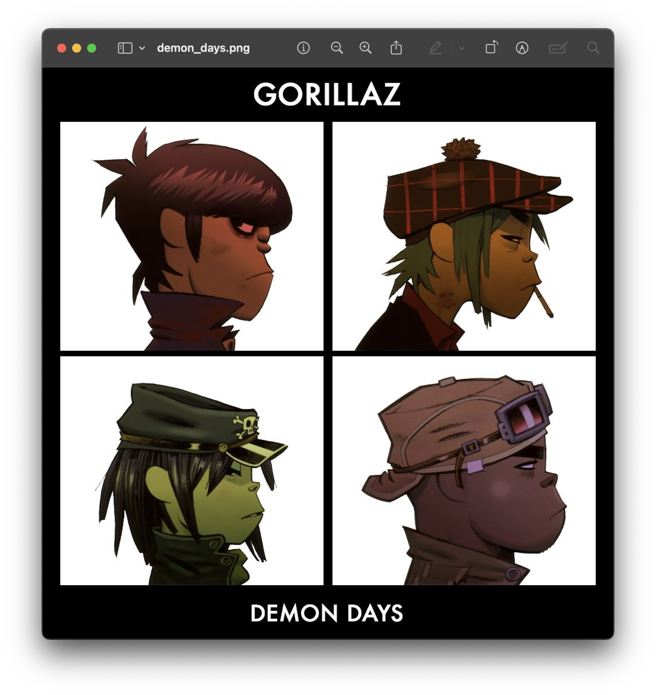
    </img>
</p>

<p align=center>
    <sub>
        <strong>Figure I</strong>: Our entire texture's file.
    </sub>
</p>

To the following result:

<a id="fg-2"></a>

<p align=center>
    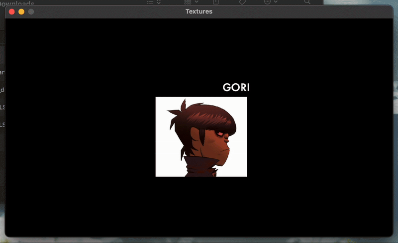
    </img>
</p>

<p align=center>
    <sub>
        <strong>Figure II</strong>: The final result of the exercise, wherein we isolate a different quadrant of the entire texture every 100 frames.
    </sub>
</p>

Granted, this was simply an exercise to get us used to textures, but might there be an actual, practical and commonplace use for this? Absolutely—there are much bigger implication to our ability to "slice" a texture, and we've reached a point where doing so will allow for a tremendous amount of flexibility.

It turns out that this is exactly how we will be doing graphics for a number of situations—perhaps for all of them. Introducing the **texture atlas**, or as it is more commonly known, the **sprite sheet**:

<a id="fg-3"></a>

<p align=center>
    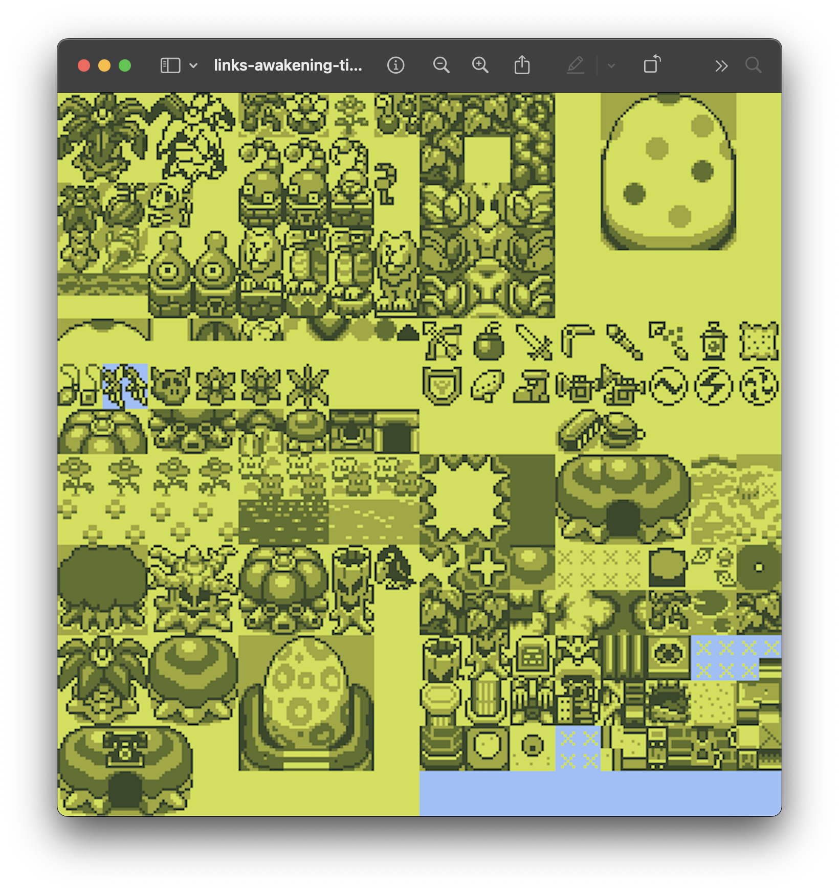
    </img>
</p>

<p align=center>
    <sub>
        <strong>Figure III</strong>: <em>Link's Awakening's</em> sprite sheet.
    </sub>
</p>

What you see in figure III is a single texture. If we were to apply it to our current object, we would indeed get the whole texture onto it, but that is not the goal here. Our goal is to **isolate each individual portion of the image and make it its own texture**:

<a id="fg-4"></a>

<p align=center>
    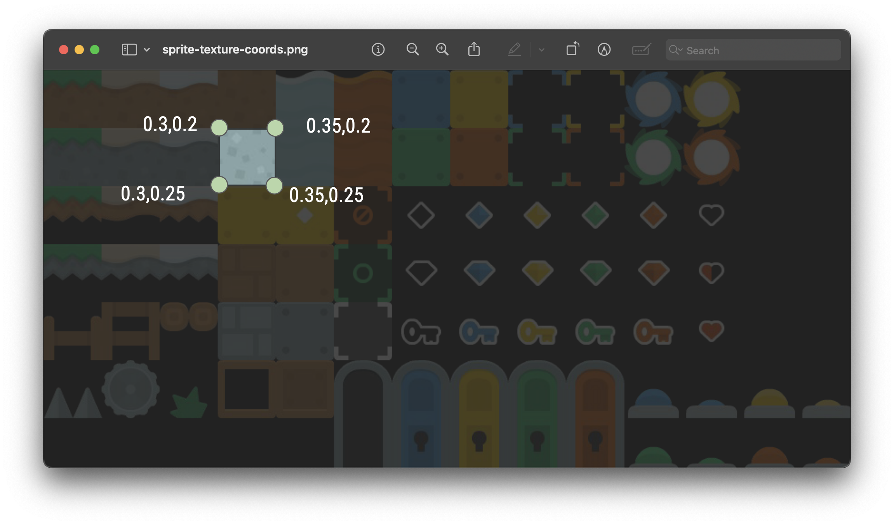
    </img>
</p>

<p align=center>
    <sub>
        <strong>Figure IV</strong>: Sprite sheet with UV-coordinates superimposed on it.
    </sub>
</p>

Now, something that you'll notice about [**the above sprite sheet**](#fg-3) is that all individual objects within it are equally spaced. In other words, don't pick a spritesheet that looks like this:

<a id="fg-5"></a>

<p align=center>
    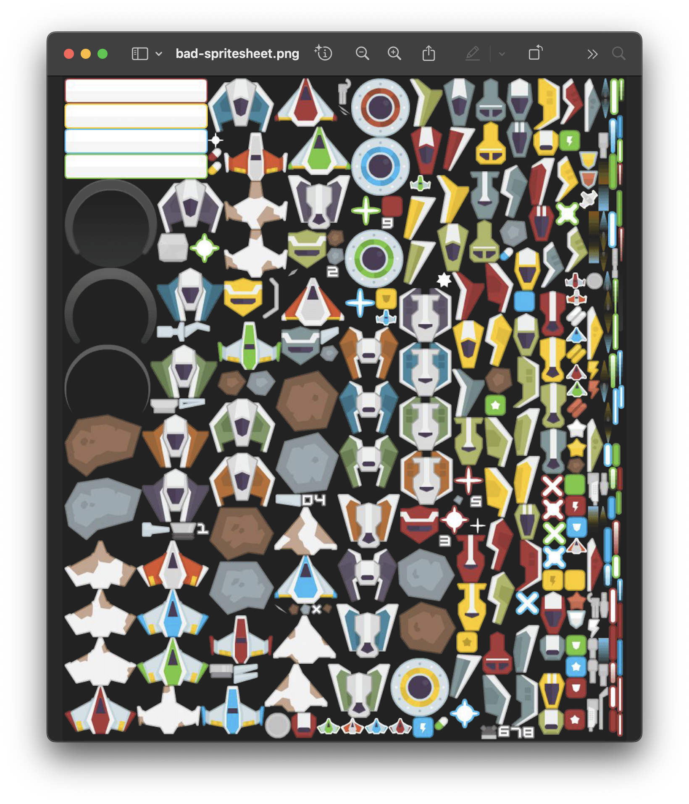
    </img>
</p>

<p align=center>
    <sub>
        <strong>Figure V</strong>: It's basically impossible to split this into a uniform grid.
    </sub>
</p>

This is extremely important, as it simplifies the process of calculating the precise UV-coordinates significantly, as we shall see. What we'll first do is assign, to each individual "frame" in our spritesheet, a specific id. To make things programmatically easier, let's use a sequence of integers starting at `0`, as if they were _indices_:

<a id="fg-6"></a>

<p align=center>
    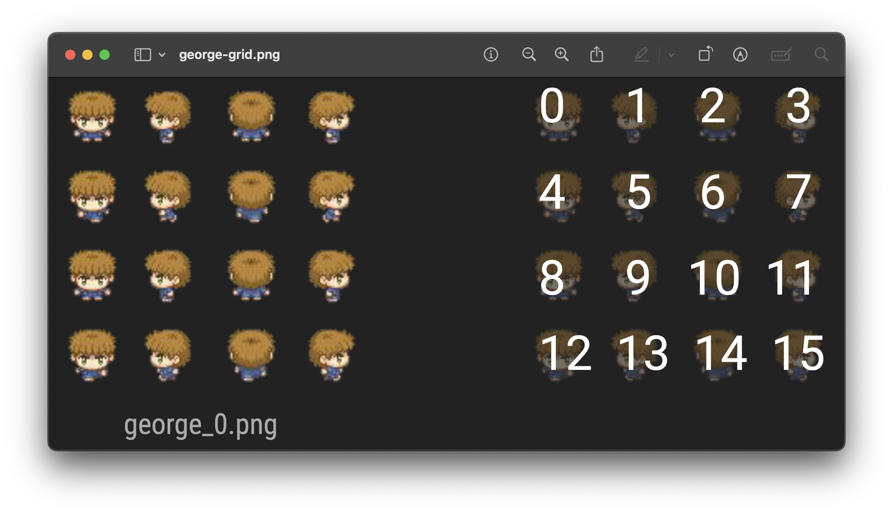
    </img>
</p>

<a id="fg-7"></a>

<p align=center>
    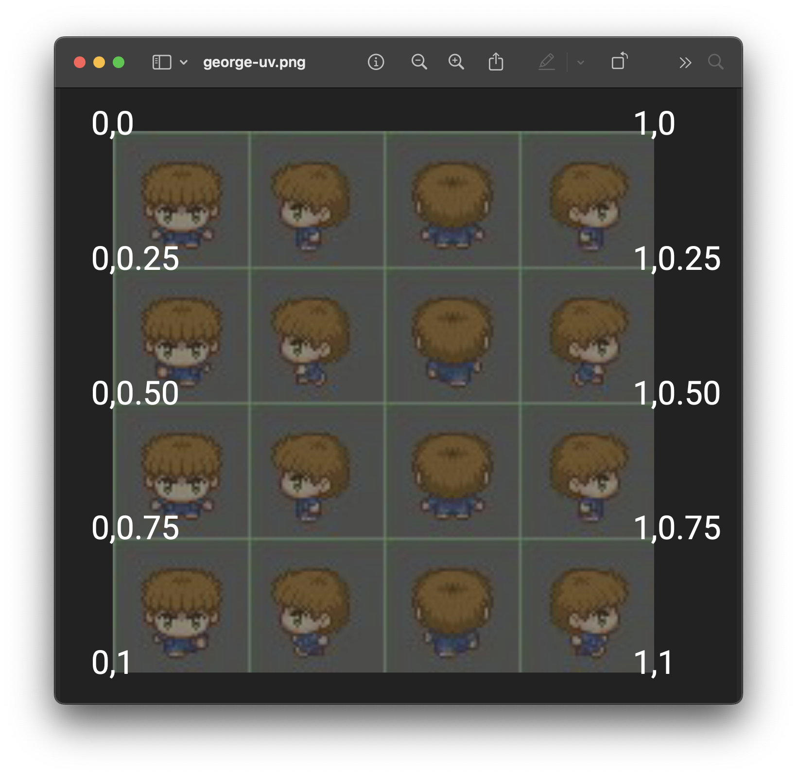
    </img>
</p>

<p align=center>
    <sub>
        <strong>Figures VI & VII</strong>: Breaking our spritesheet into a grid and assigning ids to each "frame".
    </sub>
</p>

<br>

<a id="2"></a>

## Isolating Sprites In A Sprite Atlas

So, how do we program this? Let's take the following sprite sheet:

<a id="fg-8"></a>

<p align=center>
    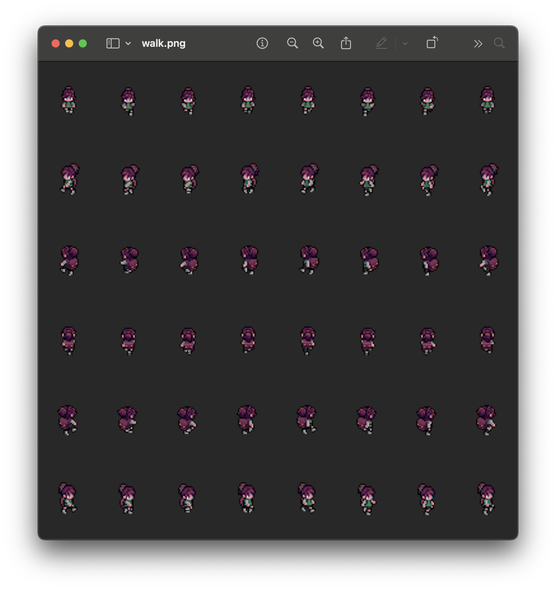
    </img>
</p>

<p align=center>
    <sub>
        <strong>Figure VIII</strong>: Art by <a href="https://sscary.itch.io/"><code>sscary.itch.io</code></a>.
    </sub>
</p>

If I simply substitute the file and load it into our `gTexture` variable, we would see the following:

<a id="fg-9"></a>

<p align=center>
    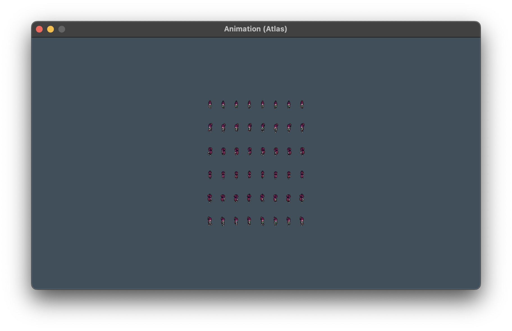
    </img>
</p>

<p align=center>
    <sub>
        <strong>Figure IX</strong>: A good first step.
    </sub>
</p>

Just as we did in [**exercise 2**](https://github.com/sebastianromerocruz/CS-3113-Intro-To-Game-Programming/tree/main/exercises/02-textures#the-problem), we no longer want the _entire_ sprite, but just a small portion of it. The trick will be finding a way to do this based solely on the amount of frames the sprite sheet has (in this case, 8x6) and the id of the frame we want.

Clearly, the answer lies in the `textureArea` `Rectangle` object we create in `render`:

```c++
// Whole texture (UV coordinates)
Rectangle textureArea = {
    // top-left corner
    0.0f, 0.0f,

    // size of the texture, or texture slice
    static_cast<float>(texture->width),
    static_cast<float>(texture->height)
};
```

Assuming that our texture measures 1px-by-1px, we can calculate the current column by taking the selected index and _modding it by the total number of columns_. We can likewise calculate the current row by taking the selected index and _integer dividing it by the total number of columns as well_ (we use the total number of columns in both expressions because the index is laid out in [**row‑major order**](https://en.wikipedia.org/wiki/Row-_and_column-major_order). Don't worry too much about it).

For example, if we had a 3x3 spritesheet and we wanted the 5th index's UV-coordinates. That would make the math:

```
horizontal grid location ("row"): 5 % 3 = 2
vertical grid location ("col"): 5 // 3 = 1
```

We can then normalise these values to the unit range [0, 1] (since we have a 1px-by-1px) by dividing the number of rows and the number of columns. These values are our u- and v-coordinates!

```
unit u-coordinate: 2 / 3 = 0.67
unit v-coordinate: 1 / 3 = 0.33
```

<a id="fg-10"></a>

<p align=center>
    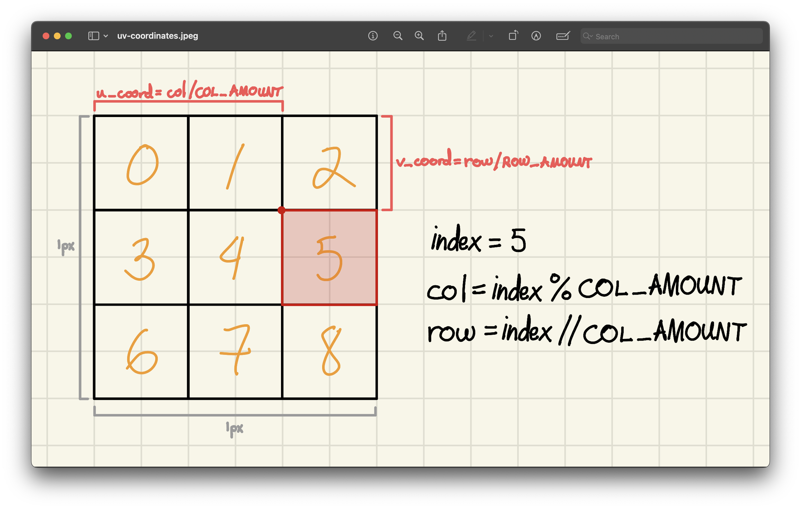
    </img>
</p>

<p align=center>
    <sub>
        <strong>Figure X</strong>: A visualisation of the steps above.
    </sub>
</p>

Of course, since most texture atlases are _not_ 1px-by-1px, we'll have to multiply these coordinates by the actual width and height of the texture:

```
u-coordinate: unit u-coordinate * texture width
v-coordinate: unit v-coordinate * texture height
```

So that's the first two values for our `Rectangle` object. The second two—the width and height of our slice—are easy: simply divide the width by the number of columns and the height by the number of rows:

```
slice width  = texture width  / cols
slice height = texture height / rows
```

Putting this all into a nice little function, we get:

```c++
Rectangle getUVRectangle(const Texture2D *texture, int index, int rows, int cols)
{
    float uCoord = (float) (index % cols) / (float) cols;
    uCoord *= texture->width;

    float vCoord = (float) (index / cols) / (float) rows;
    vCoord *= texture->height;

    float sliceWidth  = texture->width  / (float) cols;
    float sliceHeight = texture->height / (float) rows;

    return {
        uCoord,     // top-left x-coord
        vCoord,     // top-left y-coord
        sliceWidth, // width of slice
        sliceHeight // height of slice
    };
}
```

In order to take full advantage of this system and still have the ability to render textures that occupy the entire file, let's create an enum to differentiate between the two:

```c++
enum TextureType { SINGLE, ATLAS };
```

Now, with the help of a `switch` statement, we can render objects depending on their type. Let's use this to render, say the first sprite within our atlas (i.e. index `0`):

```c++
Rectangle textureArea;

switch (textureType)
{
    case SINGLE:
        // Whole texture (UV coordinates)
        textureArea = {
            // top-left corner
            0.0f, 0.0f,

            // bottom-right corner (of texture)
            static_cast<float>(texture->width),
            static_cast<float>(texture->height)
        };
        break;
    case ATLAS:
        textureArea = getUVRectangle(
            texture, 
            0, // first sprite in atlas
            6, // rows
            8  // cols
        );
    
    default: break;
}

// Destination rectangle – centred on gPosition
Rectangle destinationArea = {
    position->x,
    position->y,
    static_cast<float>(scale->x),
    static_cast<float>(scale->y)
};
```

<a id="fg-11"></a>

<p align=center>
    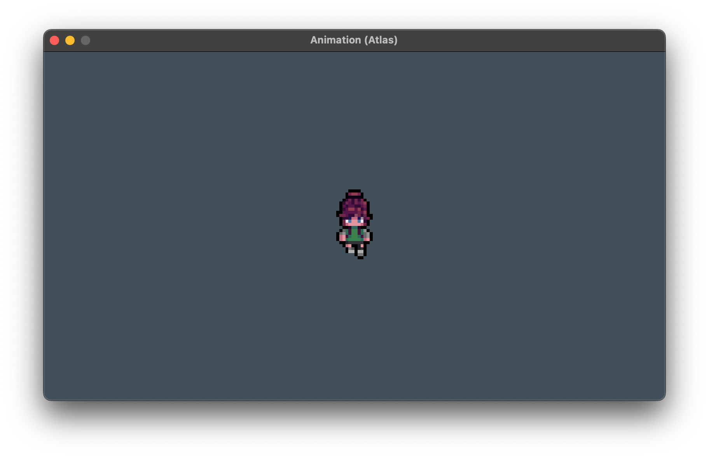
    </img>
</p>

<p align=center>
    <sub>
        <strong>Figure XI</strong>: Yay! We did it! Only one "slice" of our texture is being rendered.
    </sub>
</p>

<br>

<a id="3"></a>

## Animation

So that's step 1. Now, all we have to do is programmatically _cycle_ trough these indices in order to give the impression of animation. Have you ever seen one of these?

<a id="fg-12"></a>

<p align=center>
    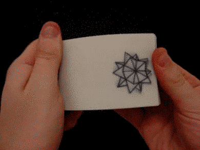
    </img>
</p>

<p align=center>
    <sub>
        <strong>Figure XII</strong>: <strong><a href="https://nubuntu.org/">Source</a></strong>.
    </sub>
</p>

This an example of a flipbook animation, wherein every single page contains a frame of animation that is subsequently "switched" for its following one at a specific _rate_. In other words, the speed of animation wholly depends on how quickly or slowly the artists flips through the pages of the book. This speed of animation is not necessarily rooted on how fast the artist _can_ flip the book, but rather on how fast they _choose to_ flip the book.

<a id="3-1"></a>

### Animating A Single Row From The Atlas

It turns out that we'll be doing something extremely similar in code here. We will be:

1. Choosing a "speed" of animation that is completely independent of the frame rate (although it can be, if you want, be dependent on it. Why not?)
2. Keeping track of the current index of animation we are in and...
3. Every time we reach the speed we chose in step 1, we'll update the index from step 2.
4. Repeat.

In other words:

```cpp
constexpr int FRAMES_PER_SECOND = 8                                        // "speed" of animation
constexpr std::array<int, 8> DOWN_ANIMATIONS = { 0, 1, 2, 3, 4, 5, 6, 7 }; // linear frames we're indexing

float gAnimationTime = 0.0f; // accumulator for "flipping" between frames
int gAnimationIndex = 0;     // of the current frame in DOWN_ANIMATIONS

// ...

void renderObject(const Texture2D *texture, const Vector2 *position, 
                  const Vector2 *scale, TextureType textureType)
{
    Rectangle textureArea;

    switch (textureType)
    {
        case SINGLE:
            textureArea = {
                0.0f, 0.0f,

                static_cast<float>(texture->width),
                static_cast<float>(texture->height)
            };
            break;
        case ATLAS:
            textureArea = getUVRectangle(
                texture, 
                gAnimationIndex, // right here!
                6, 
                8
            );
        
        default: break;
    }

    Rectangle destinationArea = {
        position->x,
        position->y,
        static_cast<float>(scale->x),
        static_cast<float>(scale->y)
    };

    Vector2 originOffset = {
        static_cast<float>(scale->x) / 2.0f,
        static_cast<float>(scale->y) / 2.0f
    };

    DrawTexturePro(
        *texture, 
        textureArea, destinationArea, originOffset,
        gAngle, WHITE
    );
}

// ...

void update()
{
    // ...

    gAnimationTime += deltaTime;                      // accumulate some time
    float secondsPerFrame = 1.0f / FRAMES_PER_SECOND; // calculate how many frames need to pass before we "flip" frames

    if (gAnimationTime >= secondsPerFrame)            // if time accumulated > seconds needed for one frame
    {
        gAnimationTime = 0.0f;                        // reset animation time

        gAnimationIndex++;                            // "flip" to the next frame
        gAnimationIndex %= DOWN_ANIMATIONS.size();    // reset to index 0 if necessary
    }
}

// ...
```

<a id="fg-13"></a>

<p align=center>
    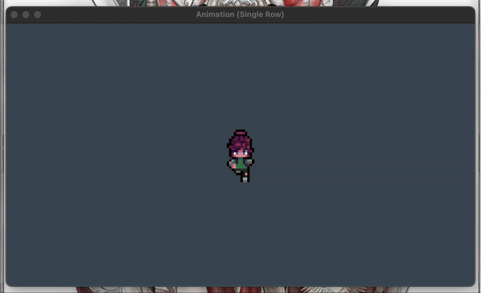
    </img>
</p>

<p align=center>
    <sub>
        <strong>Figure XIII</strong>: <em>Habemus animātiōnem</em>.
    </sub>
</p>

Of course, we only want this to happen _when_ we move, so we can simply ask our code to run this code only if the magnitude of our movement vector is greater than `0.0f`:

```c++
if (GetLength(&gMovement) != 0)
{
    gAnimationTime += deltaTime;
    float secondsPerFrame = 1.0f / FRAMES_PER_SECOND;

    if (gAnimationTime >= secondsPerFrame)
    {
        gAnimationTime = 0.0f;

        gAnimationIndex++;
        gAnimationIndex %= DOWN_ANIMATIONS.size();
    }
}
```

<a id="fg-14"></a>

<p align=center>
    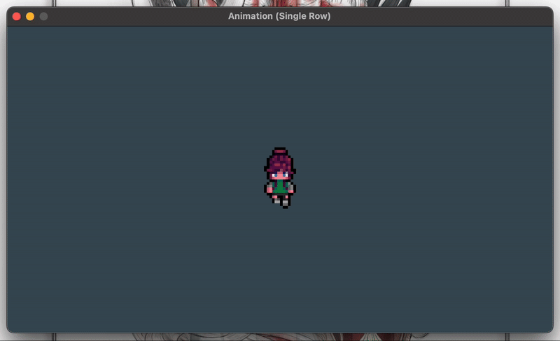
    </img>
</p>

<p align=center>
    <sub>
        <strong>Figure XIV</strong>: User-triggered animation.
    </sub>
</p>

<a id="3-2"></a>

### Animating Multiple Rows From The Atlas

From there, adding the rest of the cardinal directions is really just a question of adding an extra dimension to our data structures. Right now, we have:

1. A vector of indices, and an
2. Integer letting us know which of the frame indices inside the vector we should be displaying on screen at that moment.

There are a few ways in which you could implement multiple rows of the atlas (e.g. an [**array of arrays**](https://github.com/sebastianromerocruz/CS3113-intro-to-game-programming-ARCHIVED/tree/main/lectures/sprites-and-text#part-4-animation) a vector of vectors, etc.). Personally, I really like my enums, so I'll be creating a map where each key will be a directional enum and each value will be the vector of indices we want to cycle through at that particular moment:

```c++
// ...
enum Direction { LEFT, UP, RIGHT, DOWN }; // For walking

// ...

// a collection of all rows for walking
const std::map<Direction, std::vector<int>> ANIMATION_ATLAS = {
    {DOWN,  {  0,  1,  2,  3,  4,  5,  6,  7 }},
    {LEFT,  {  8,  9, 10, 11, 12, 13, 14, 15 }},
    {UP,    { 24, 25, 26, 27, 28, 29, 30, 31 }},
    {RIGHT, { 40, 41, 42, 43, 44, 45, 46, 47 }},
};

// ...

// the current row we're animating
Direction        gWalkingDirection = DOWN;
std::vector<int> gAnimationIndices = ANIMATION_ATLAS.at(gWalkingDirection);

// ...

void renderObject(const Texture2D *texture, const Vector2 *position, 
                  const Vector2 *scale, TextureType textureType)
{
    Rectangle textureArea;

    switch (textureType)
    {
        case SINGLE:
            textureArea = {
                0.0f, 0.0f,

                static_cast<float>(texture->width),
                static_cast<float>(texture->height)
            };
            break;
        case ATLAS:
            textureArea = getUVRectangle(
                texture, 

                // we now index the current row we're animating
                gAnimationIndices[gAnimationIndex], 

                6, 8
            );
        
        default: break;
    }

    // ...
}

// ...

void processInput() 
{
    // ...

    // switch the direction enum every time the user "turns"
    if (IsKeyDown(KEY_A)) 
    {
        gMovement.x = -1;
        gWalkingDirection = LEFT;
    }
    else if (IsKeyDown(KEY_D)) 
    {
        gMovement.x =  1;
        gWalkingDirection = RIGHT;
    }
    if (IsKeyDown(KEY_W)) 
    {
        gMovement.y = -1;
        gWalkingDirection = UP;
    }
    else if (IsKeyDown(KEY_S)) 
    {
        gMovement.y =  1;
        gWalkingDirection = DOWN;
    }

    // ...
}
```

<a id="fg-15"></a>

<p align=center>
    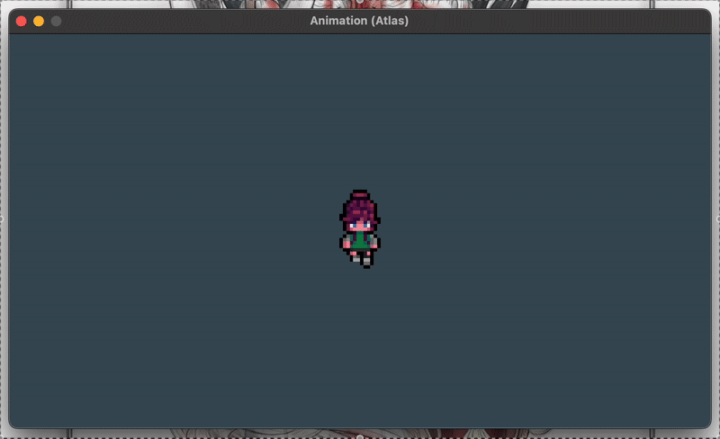
    </img>
</p>

<p align=center>
    <sub>
        <strong>Figure XV</strong>: Starting to feel like real game, huh?
    </sub>
</p>

<br>

<a id="4"></a>

## The `Entity` Class: _Making A Game Object_

Phew! That was a lot of work! Our `main` is getting pretty chonky at this point, too, and we only have one fully animated, collidable object. Just check out every single line in our file that's strictly dedicated to our protagonist "object":

```cpp
// ...

constexpr int SIZE              = 500 / 2,
              SPEED             = 200,
              SECONDS_PER_FRAME = 14;

constexpr float SIZE_RATIO  = 48.0f / 64.0f;

constexpr Vector2 BASE_SIZE   = { (float) SIZE * SIZE_RATIO, (float) SIZE },
                  SPRITESHEET_DIMENSIONS = { 8, 6 };

constexpr TextureType TEXTURE_TYPE = ATLAS;

const std::map<Direction, std::vector<int>> ANIMATION_ATLAS = {
    {DOWN,  {  0,  1,  2,  3,  4,  5,  6,  7 }},
    {LEFT,  {  8,  9, 10, 11, 12, 13, 14, 15 }},
    {UP,    { 24, 25, 26, 27, 28, 29, 30, 31 }},
    {RIGHT, { 40, 41, 42, 43, 44, 45, 46, 47 }},
};

// Assets from @see https://sscary.itch.io/the-adventurer-female
constexpr char PROTAG_FILEPATH[] = "assets/game/walk.png";

// ...

float gAnimationTime = 0.0f;

Vector2 gPosition  = ORIGIN,
        gMovement  = { 0.0f, 0.0f },
        gScale     = BASE_SIZE;

Texture2D gTeardropTexture;

int gAnimationIndex = 0;

Direction        gWalkingDirection = DOWN;
std::vector<int> gAnimationIndices = ANIMATION_ATLAS.at(gWalkingDirection);

// ...

void initialise()
{
    // ...

    gTexture  = LoadTexture(PROTAG_FILEPATH);

    // ....
}

void processInput() 
{
    gMovement = { 0.0f, 0.0f };

    if (IsKeyDown(KEY_A)) 
    {
        gMovement.x = -1;
        gWalkingDirection = LEFT;
    }
    else if (IsKeyDown(KEY_D)) 
    {
        gMovement.x =  1;
        gWalkingDirection = RIGHT;
    }
    if (IsKeyDown(KEY_W)) 
    {
        gMovement.y = -1;
        gWalkingDirection = UP;
    }
    else if (IsKeyDown(KEY_S)) 
    {
        gMovement.y =  1;
        gWalkingDirection = DOWN;
    }

    if (GetLength(&gMovement) > 1.0f) Normalise(&gMovement);

    // ...
}

void update() 
{
    // ...

    gAnimationIndices = ANIMATION_ATLAS.at(gWalkingDirection);

    gPosition = {
        gPosition.x + SPEED * gMovement.x * deltaTime,
        gPosition.y + SPEED * gMovement.y * deltaTime
    };

    if (GetLength(&gMovement) != 0)
    {
        gAnimationTime += deltaTime;
        float secondsPerFrame = 1.0f / SECONDS_PER_FRAME;

        if (gAnimationTime >= secondsPerFrame)
        {
            gAnimationTime = 0.0f;

            gAnimationIndex++;
            gAnimationIndex %= gAnimationIndices.size();
        }
    }
}

void render()
{
    // ...

    renderObject(&gTexture, &gPosition, &gScale, TEXTURE_TYPE);

    // ...
}

void shutdown() 
{ 
    // ...
    UnloadTexture(gTexture);
}
```

_That's ~63 lines for a single object_. What are we going to do when we have entire levels' worth of fully animated, moving, collidable objects? Clearly, we need to think of packaging some of this functionality into something we can easily use and reuse when necessary. In programming, we call this _encapsulation_, and we generally do it by forming a _class_.

Our main, base class that will be representing game objects in this course is called **`Entity`**, and you can find it [**defined here**](CS3113/entities/Entity.h) and [**implemented here**](CS3113/entities/Entity.cpp). Most of the code remains the same, and we'll go over the differences / new stuff in a bit, but take a look at the number of lines now dedicated to creating the same object if we use the `Entity` class in the same file:

```cpp
#include "CS3113/entities/Entity.h"

// ...

Entity *protag = nullptr;

// ...

void initialise()
{
    // ...

    std::map<Direction, std::vector<int>> animationAtlas = {
        {DOWN,  {  0,  1,  2,  3,  4,  5,  6,  7 }},
        {LEFT,  {  8,  9, 10, 11, 12, 13, 14, 15 }},
        {UP,    { 24, 25, 26, 27, 28, 29, 30, 31 }},
        {RIGHT, { 40, 41, 42, 43, 44, 45, 46, 47 }},
    };

    float sizeRatio  = 48.0f / 64.0f;

    // Assets from @see https://sscary.itch.io/the-adventurer-female
    protag = new Entity(
        ORIGIN,                       // position
        {250.0f * sizeRatio, 250.0f}, // scale
        "assets/game/walk.png",       // texture file address
        ATLAS,                        // single image or atlas?
        { 6, 8 },                     // atlas dimensions
        animationAtlas                // actual atlas
    );

    // ...
}

void processInput() 
{
    protag->resetMovement();

    if      (IsKeyDown(KEY_A)) protag->moveLeft();
    else if (IsKeyDown(KEY_D)) protag->moveRight();
    if      (IsKeyDown(KEY_W)) protag->moveUp();
    else if (IsKeyDown(KEY_S)) protag->moveDown();

    // to avoid faster diagonal speed
    if (GetLength(protag->getMovement()) > 1.0f) 
        protag->normaliseMovement();

    // ...
}

void update() 
{
    // ...

    // we're not checking collisions—for now
    protag->update(deltaTime);
}

void render()
{
    // ...

    protag->render();

    // ...
}

// ...
```

We've shrink this down to only 26 lines. And not _all_ objects are going to take in user input or are necessarily going to be animated, so most other objects will not require the 12 lines of code required by animation and user input. Not only that, but the level of modularity that this adds cannot be understated. You took object-oriented programming (presumably); you understand.

<a id="4-1"></a>

### The `Entity` Class Attributes

<a id="4-1-1"></a>

#### The Familiar

Most of the attributes belonging to the `Entity` class will look pretty familiar to you, as we've been using them pretty regularly. Here's the list of the ones _that we know_ already (note that the `m` prefix stands for "member", for "member variable"—another way of saying attribute):

```c++
// for translation
Vector2 mPosition;
Vector2 mMovement;
int mSpeed;

// for scaling
Vector2 mScale;

// for rendering
Texture2D mTexture;
Vector2   mSpriteSheetDimensions; // {rows, cols}

// for animation
std::map<Direction, std::vector<int>> mAnimationAtlas;
std::vector<int> mAnimationIndices;
Direction mDirection;
int mFrameSpeed;

int mCurrentFrameIndex = 0;
float mAnimationTime = 0.0f;

// for rotation
float mAngle;
```

Most of these, as you can see in the [**header file**](CS3113/entities/Entity.h), also come with their respective getters and setters.

<a id="4-1-2"></a>

#### The New

The only new attributes we have here is the following:

```c++
TextureType mTextureType;    // either ATLAS or SINGLE

Vector2 mColliderDimensions;
```

This second one won't be too relevant until we get to our physics lecture, but the idea basically is that, so far, we've been using the scale of our game objects to calculate collision detection. However, sometimes, our texture file is considerably larger than the actual contents inside of it. So, we'll have a separate set of dimensions for our collider in such case we want to shrink that "solid" area:

<a id="fg-16"></a>

<p align=center>
    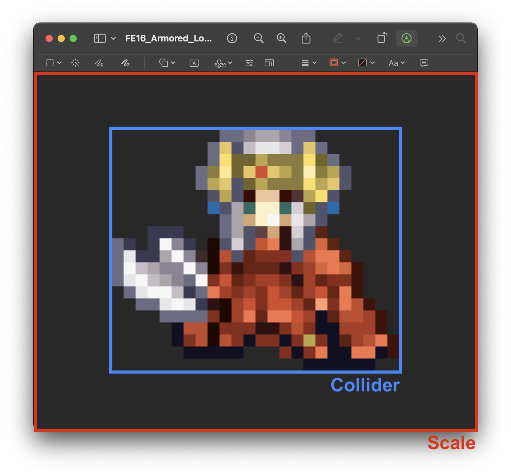
    </img>
</p>

<p align=center>
    <sub>
        <strong>Figure XVI</strong>: This way, our scale won't necessarily dictate when we collide.
    </sub>
</p>

<a id="4-2"></a>

### The `Entity` Class Methods

<a id="4-2-1"></a>

#### Constructors

We have three initialisers as of this week:

```c++
// default 
Entity();

// for single, non-atlas textured objects
Entity(Vector2 position, Vector2 scale, const char *textureFilepath);

// for atlas textured objects
Entity(Vector2 position, Vector2 scale, const char *textureFilepath, 
    TextureType textureType, Vector2 spriteSheetDimensions, 
    std::map<Direction, std::vector<int>> animationAtlas);
```

Note that, in their actual [**implementation**](CS3113/entities/Entity.cpp), each of these constructors gives many of our attributes default values.

<a id="4-2-2"></a>

#### `update(float deltaTime)` and `render()`

`update` and `render` essentially remain unchanged. All that we're doing is creating a parameter to give access to the game's delta time for `update`, which is calculated at `main` level. Note that I put all of the animation and collision detection logic inside their own respective helper methods.