 <h2 align=center>Week 06</h2>

<h1 align=center>Physics</h1>

<h3 align=center>XXVII Pegasus Moon, Imperial Year MMXXVI</h3>

<p align=center><strong>Songs of the day</strong>:</p>
<p align=center>
    <em>
        <a href="https://youtu.be/r9nyEmHW0EA?si=8L75uSLdRwtQIxp2">
            <strong>
                Iambic 9 Poetry
            </strong>
        </a> by Squarepusher (2024)
    </em>
</p>

---

## Sections

1. [**Gravity**](#1)
    1. [**Implementation**](#1-1)
    2. [**Adding Platforms**](#1-2)
    3. [**Vertical Collisions and Collision Overlap**](#1-3)
    4. [**Horizontal Collisions and Their Quirks**](#1-4)
    5. [**Jumping**](#1-5)
2. [**The `EntityStatus` Enum**](#2)
3. [**Fixed-Time Step**](#3)

---

<a id="1"></a>

## Gravity

Our next step in our game dev journey is to be able to hop and land onto some platforms—create a [**_platformer_**](https://en.wikipedia.org/wiki/Platformer), in other words:

<a id="fg-1"></a>

<p align=center>
    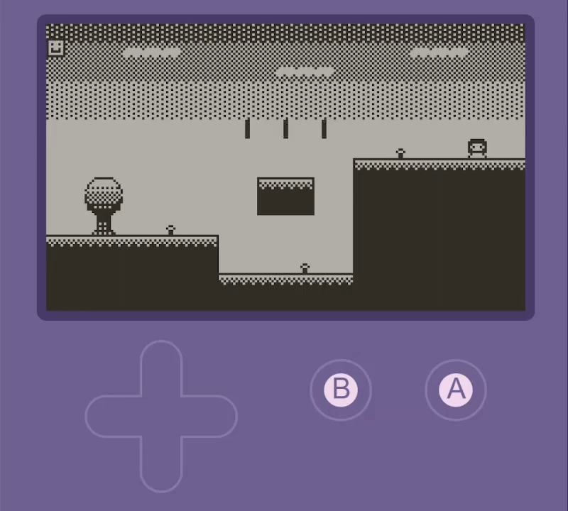
    </img>
</p>

<p align=center>
    <sub>
        <strong>Figure I</strong>: A platformer demo, courtesy of Yousurname over at <strong><a href="https://devforum.play.date/t/platformer-demo/2631">Playdate Developer Forum</a></strong>.
    </sub>
</p>

Gravity, as defined by physics, is an acceleration—the rate at which velocity increases with respect to time. For Planet Earth, this rate of change of another rate of change is usually approximated to be 9.81 m/s². Now, the key value that we need to have is **position**, since its _x_- and _y_-components are the ones that we use during the rendering process. If we are giving a certain value for acceleration, we must go through its derivative to reach position—velocity:

<a id="fg-2"></a>

<p align=center>
    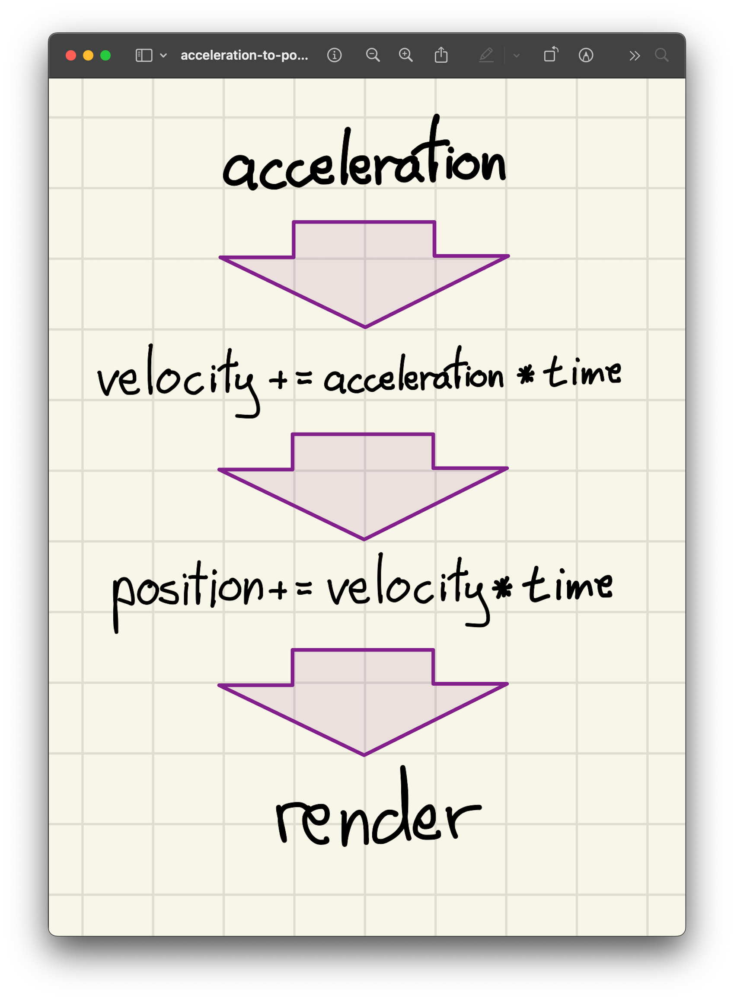
    </img>
</p>

<p align=center>
    <sub>
        <strong>Figure II</strong>: Our general process when simulating accelerative forces.
    </sub>
</p>

<a id="1-1"></a>

### Implementation

So, let's add attributes for these values to our `Entity` class:

```cpp
// Entity.h

// ...

class Entity
{
private:
    // ...

    Vector2 mVelocity;
    Vector2 mAcceleration;

    // ...

public:
    // ...

    Vector2 getVelocity()     const { return mVelocity;     }
    Vector2 getAcceleration() const { return mAcceleration; }

    // ...

    // we don't really need a setter for velocity for now
    void setAcceleration(Vector2 newAcceleration)
        { mAcceleration = newAcceleration; }
}
```

```cpp

Entity::Entity() : mPosition {0.0f, 0.0f}, mMovement {0.0f, 0.0f}, 

                   // we added these two
                   mVelocity {0.0f, 0.0f}, mAcceleration {0.0f, 0.0f},

                   mScale {DEFAULT_SIZE, DEFAULT_SIZE},
                   mColliderDimensions {DEFAULT_SIZE, DEFAULT_SIZE}, 
                   mTexture {NULL}, mTextureType {SINGLE}, mAngle {0.0f},
                   mSpriteSheetDimensions {}, mDirection {RIGHT}, 
                   mAnimationAtlas {{}}, mAnimationIndices {}, mFrameSpeed {0} { }

Entity::Entity(Vector2 position, Vector2 scale, const char *textureFilepath) : 
    mPosition {position}, 
    
    // and these two
    mVelocity {0.0f, 0.0f}, mAcceleration {0.0f, 0.0f}, 
    
    mScale {scale}, mMovement {0.0f, 0.0f}, mColliderDimensions {scale},
    mTexture {LoadTexture(textureFilepath)}, mTextureType {SINGLE}, 
    mDirection {RIGHT}, mAnimationAtlas {{}}, mAnimationIndices {}, 
    mFrameSpeed {0}, mSpeed {DEFAULT_SPEED}, mAngle {0.0f} { }

Entity::Entity(Vector2 position, Vector2 scale, const char *textureFilepath, 
        TextureType textureType, Vector2 spriteSheetDimensions, std::map<Direction, 
        std::vector<int>> animationAtlas) : mPosition {position}, 

        // ...and these two
        mVelocity {0.0f, 0.0f}, mAcceleration {0.0f, 0.0f}, 

        mMovement { 0.0f, 0.0f }, mScale {scale}, mColliderDimensions {scale},
        mTexture {LoadTexture(textureFilepath)}, mTextureType {ATLAS}, 
        mSpriteSheetDimensions {spriteSheetDimensions}, 
        mAnimationAtlas {animationAtlas}, mDirection {RIGHT}, 
        mAnimationIndices {animationAtlas.at(RIGHT)}, 
        mFrameSpeed {DEFAULT_FRAME_SPEED}, mAngle { 0.0f }, 
        mSpeed { DEFAULT_SPEED } { }
```

And, implementing the [**pipeline we came up with earlier**](#fg-2), we get the following:

```c++
// Entity.cpp
void Entity::update(void deltaTime)
{
    // ...

    // 1. Set the initial horizontal velocity whatever was decided by the 
    //    player when the started moving; We'll multiply in the delta time 
    //    later.
    mVelocity.x = mMovement.x * mSpeed;

    // 2. Next, we'll add in any additional velocity contributed by the
    //    acceleration. In our case, we only have a vertical (y) component
    //    but we add in both just in case that changes in the future. 
    //    Multiplying acceleration by (delta) time yields velocity.
    mVelocity.x += mAcceleration.x * deltaTime;
    mVelocity.y += mAcceleration.y * deltaTime;

    // 3. Finally, we convert our velocity into position by multiplying it by
    //    the delta time one last time.
    mPosition.y += mVelocity.y * deltaTime;
    mPosition.x += mVelocity.x * deltaTime;

    // ...
}
```

```cpp
// main.cpp

// ...

// in m/ms², since delta time is in ms
constexpr float ACCELERATION_OF_GRAVITY = 981.0f;

// ...

void initialise()
{
    // ...

    gProtag->setAcceleration({0.0f, ACCELERATION_OF_GRAVITY});

    // ...
}
```

<a id="fg-3"></a>

<p align=center>
    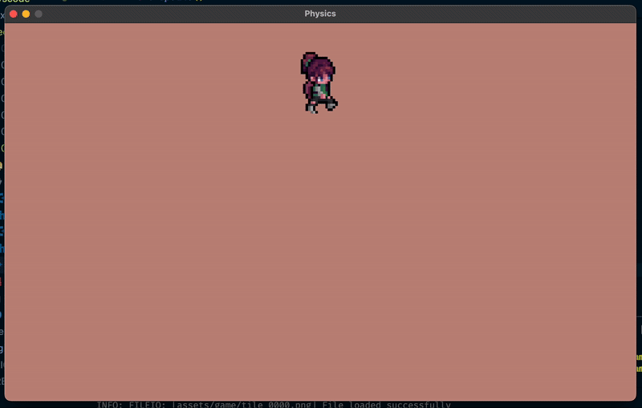
    </img>
</p>

<p align=center>
    <sub>
        <strong>Figure III</strong>: There she goes.
    </sub>
</p>

<br>

<a id="1-2"></a>

### Adding Platforms

Amazing! We've got our simulated acceleration of gravity up and working. Now, it's time for us to add some platforms to test it out. I went ahead and got some free assets from a great source called [**kenney.nl**](https://kenney.nl/). We'll be using the following one-sprite texture:

<a id="fg-4"></a>

<p align=center>
    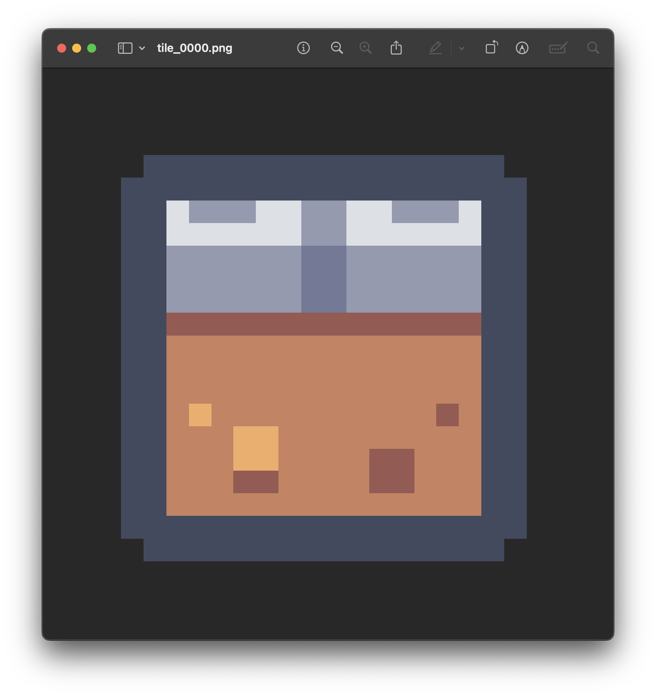
    </img>
</p>

<p align=center>
    <sub>
        <strong>Figure IV</strong>: We'll build our platforms from multiple of these.
    </sub>
</p>

I'll programmatically lay out a platform under our character by utilizing some logic based on the dimension of the tiles' `Entity` objects. In order, here's what I'm doing:

1. Preparing to create my platform.
    ```cpp
    constexpr int   NUMBER_OF_TILES = 10;
    constexpr float TILE_DIMENSION  = 50.0f

    Entity *gTiles  = nullptr; // this will be an array
    ```
2. Instantiate our tile array. Note that this calls the default constructor of each of the entities in the array.
    ```cpp
    gTiles = new Entity[NUMBER_OF_TILES];
    ```
3. Calculate where the leftmost tile would be so that the entire platform will be centered about the horizontal origin.
    ```cpp
    float leftMostX = ORIGIN.x - (NUMBER_OF_TILES * TILE_DIMENSION) / 2.0f;
    ```
4. Bulk assign the important attributes to each of our tiles, with the position being based on the `leftMostX` variable we calculated.
    ```cpp
    for (int i = 0; i < NUMBER_OF_TILES; i++) 
    {
        // assets from @see https://kenney.nl/assets/pixel-platformer-industrial-expansion
        gTiles[i].setTexture("assets/game/tile_0000.png");
        gTiles[i].setScale({TILE_DIMENSION, TILE_DIMENSION});
        gTiles[i].setColliderDimensions({TILE_DIMENSION, TILE_DIMENSION});
        gTiles[i].setPosition({
            leftMostX + i * TILE_DIMENSION, 
            ORIGIN.y + TILE_DIMENSION
        });
    }
    ```
5. Bulk update all tiles.
    ```cpp
    for (int i = 0; i < NUMBER_OF_TILES; i++) 
            gTiles[i].update(FIXED_TIMESTEP);
    ```
6. Bulk render all tiles.
    ```cpp
    for (int i = 0; i < NUMBER_OF_TILES; i++) gTiles[i].render();
    ```

<a id="fg-5"></a>

<p align=center>
    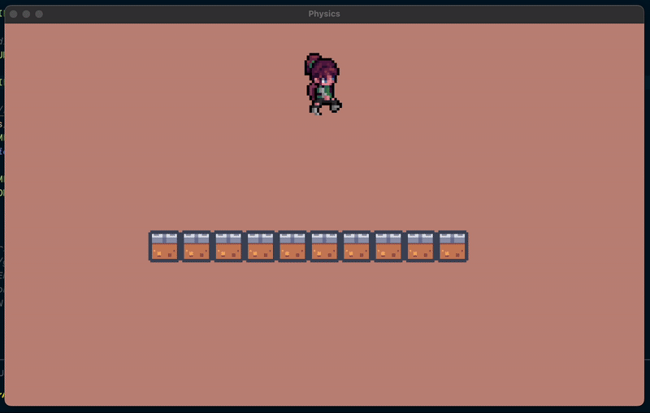
    </img>
</p>

<p align=center>
    <sub>
        <strong>Figure V</strong>: Our first platform!
    </sub>
</p>

<a id="1-3"></a>

### Vertical Collisions and Collision Overlap

We already have our very basic collision detection method:

```cpp
// Entity.cpp
bool Entity::isColliding(Entity *other) const 
{
    float xDistance = fabs(mPosition.x - other->getPosition().x) - 
        ((mColliderDimensions.x + other->getColliderDimensions().x) / 2.0f);
    float yDistance = fabs(mPosition.y - other->getPosition().y) - 
        ((mColliderDimensions.y + other->getColliderDimensions().y) / 2.0f);

    if (xDistance < 0.0f && yDistance < 0.0f) return true;

    return false;
}
```

As is clear from its signature, this method needs to be exposed to another `Entity` object in order to confirm a collision. For this, we're going to want open up our `Entity` class definition a little bit and pass in any **collidable entities** that we want to check collisions with. Since `update` is the method that deals with game logic, we'll make the changes there:

```cpp
// Entity.h

// ...

class Entity 
{
    // ...
public:
    // ...

    void update(float deltaTime, Entity *collidableEntities, int collisionCheckCount);

    // ...
};
```
```cpp
// Entity.cpp

// ...

void Entity::update(float deltaTime, Entity *collidableEntities, int collisionCheckCount)
{
    // ...
}

// ...
```
```cpp
// main.cpp

// ...
void update()
{
    // ...

    /*
    Note here that we're only checking collisions from the PLAYER'S point of 
    view. This is, in general, the best practice.
    */
    gProtag->update(FIXED_TIMESTEP, gTiles, NUMBER_OF_TILES);

    for (int i = 0; i < NUMBER_OF_TILES; i++) 
        gTiles[i].update(FIXED_TIMESTEP, nullptr, 0);

    // ...
}

// ...
```

So how to we utilise `isColliding` appropriately here? A good first, if simplistic, first step is to simply skip all movement mechanics should a collision be detected. Naturally, this also means that we can't move left or right _on_ the platforms, but at the very least it gives the impression of a collision with a floor:

```cpp
// Entity.cpp

// ...

void Entity::update(float deltaTime, Entity *collidableEntities, int collisionCheckCount)
{
    // these are the FIRST few lines of update
    for (int i = 0; i < collisionCheckCount; i++)
    {
        if (isColliding(&collidableEntities[i])) return;
    }

    // ...
}

// ...
```

<a id="fg-6"></a>

<p align=center>
    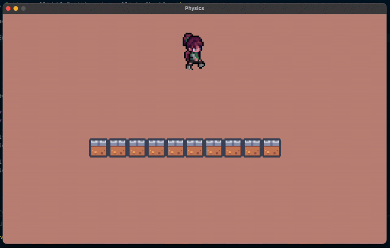
    </img>
</p>

<p align=center>
    <sub>
        <strong>Figure VI</strong>: Solid ground. Again, though, even if I tried to move once I landed, the game wouldn't let me.
    </sub>
</p>

We can certainly do better—but how? Well, it have already become apparent to you that, at least in situations where the force of gravity is a vertical one, we need to decouple both the x- and y-components; we can allow for movement on the x-axis, but not on the y-axis. It might be tempting to simply throw all of our downward [**gravity logic**](#1-1) under that same `if`-statement, but the reality of the matter is a little more complicated than that.

Suppose our protagonist object colliding with the floor is represented by the following diagram:

<a id="fg-7"></a>

<p align=center>
    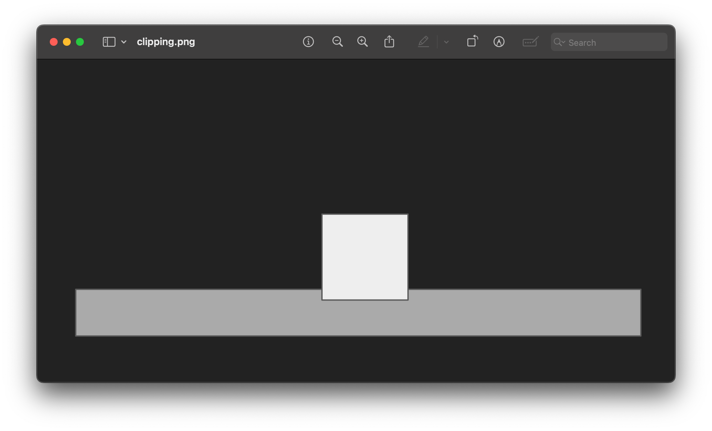
    </img>
</p>

<p align=center>
    <sub>
        <strong>Figure VII</strong>: The character (i.e. the white square) will register a collision every frame, since we are <em>inside</em> of the platform.
    </sub>
</p>

This is known as _clipping_, and it can cause all sorts of logic errors in your game because of that small amount of **overlap** (which, itself, is caused by the floating-point number limitations that your translations have). In other words, the issue right now is not only detecting the collision, but also making sure that we don't get stuck in an eternal collision.

In order to achieve this, we'll do the following:

1. Check for collisions with every single collidable entity using `isColliding`.
2. If there's a collision detected, we'll use the collidably entity's position and collider dimensions (along with the protagonist's) in order to calculate the amount of overlap between the two. The formula for that is the following:
    ```
    Vertical Overlap = Distance - Height₁ / 2 - Height₂ / 2
    ```
3. If this vertical collision resulted during a positive velocity state (i.e. we "fell" onto the entity we collided, since downwards is positive in raylib), _subtract_ the amount of overlap from the y-compenent of the player's position.
4. If this vertical collision resulted during a negative velocity state (i.e. we "jumped" to "hit" the entity we collided), _add_ the amount of overlap to the y-compenent of the player's position.
5. In either case, zero out the player's velocity, since they've just stopped moving in that direction.

Putting all of this into a handy method, we get the following:

```cpp
// Entity.h

// ...
class Entity 
{
private:
    // ...
    void checkCollisionY(Entity *collidableEntities, int collisionCheckCount);
    // ...
};
// ...
```
```cpp
// Entity.cpp

// ...
void Entity::checkCollisionY(Entity *collidableEntities, int collisionCheckCount)
{
    for (int i = 0; i < collisionCheckCount; i++)
    {
        // STEP 1: For every entity that our player can collide with...
        Entity *collidableEntity = &collidableEntities[i];
        
        if (isColliding(collidableEntity))
        {
            // STEP 2: Calculate the distance between its centre and our centre
            //         and use that to calculate the amount of overlap between
            //         both bodies.
            float yDistance = fabs(mPosition.y - collidableEntity->mPosition.y);
            float yOverlap  = fabs(yDistance - (mColliderDimensions.y / 2.0f) - (collidableEntity->mColliderDimensions.y / 2.0f));
            
            // STEPS 3, 4, & 5: "Unclip" ourselves from the other entity, and 
            // zero our vertical velocity.
            if (mVelocity.y > 0) 
            {
                mPosition.y -= yOverlap;
                mVelocity.y  = 0;
            } else if (mVelocity.y < 0) 
            {
                mPosition.y += yOverlap;
                mVelocity.y  = 0;
            }
        }
    }
}

// ...

void Entity::update(float deltaTime, Entity *collidableEntities, int collisionCheckCount)
{
    // ...

    mPosition.y += mVelocity.y * deltaTime; // after adjusting velocity...
    checkCollisionY(collidableEntities, collisionCheckCount);

    // ...
}
```

<a id="fg-8"></a>

<p align=center>
    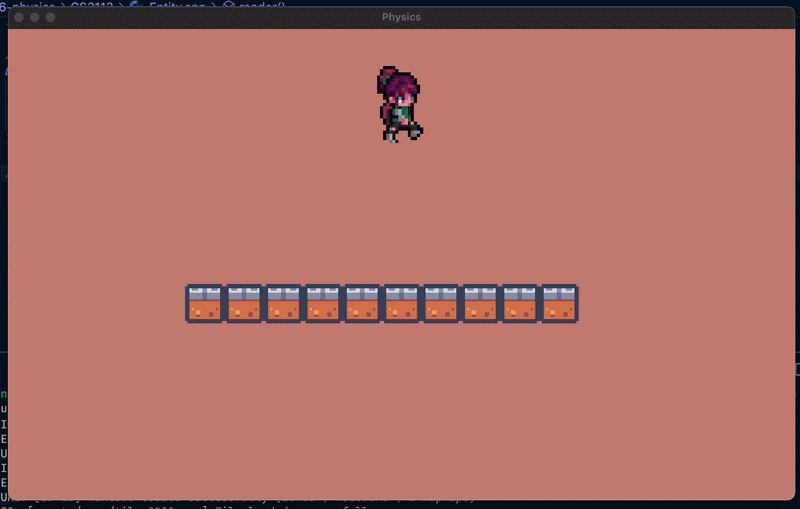
    </img>
</p>

<p align=center>
    <sub>
        <strong>Figure VIII</strong>: One HUGE step for Xochitl (yes, that's her <a href="https://www.behindthename.com/name/xochitl"><strong>name</strong></a>).
    </sub>
</p>

<a id="1-4"></a>

### Horizontal Collisions and Their Quirks

Checking for horizontal collisions works pretty much the same way. In fact, its corresponding method looks almost identical:


```cpp
// Entity.h

// ...
class Entity
{
private:
    // ...
    void checkCollisionX(Entity *collidableEntities, int collisionCheckCount);
    // ...
};
```
```cpp
// Entity.cpp

// ...
void Entity::checkCollisionX(Entity *collidableEntities, int collisionCheckCount)
{
    for (int i = 0; i < collisionCheckCount; i++)
    {
        Entity *collidableEntity = &collidableEntities[i];
        
        if (isColliding(collidableEntity))
        {

            float xDistance = fabs(mPosition.x - collidableEntity->mPosition.x);
            float xOverlap  = fabs(xDistance - (mColliderDimensions.x / 2.0f) - (collidableEntity->mColliderDimensions.x / 2.0f));

            if (mVelocity.x > 0) {
                mPosition.x     -= xOverlap;
                mVelocity.x      = 0;
            } else if (mVelocity.x < 0) {
                mPosition.x    += xOverlap;
                mVelocity.x     = 0;
            }
        }
    }
}

// ...
void Entity::update(float deltaTime, Entity *collidableEntities, int collisionCheckCount)
{
    // ...

    mPosition.x += mVelocity.x * deltaTime;
    checkCollisionX(collidableEntities, collisionCheckCount);

    // ...
}
```

Now, because we are landing on a flat surface and we have no obstacle at eye level, we really shouldn't be seeing any difference when we implement and call `checkCollisionX` in this case, right?

<br>

...[**right**](assets/README/right.png)?

<br>

...well, let's run it.

<a id="fg-9"></a>

<p align=center>
    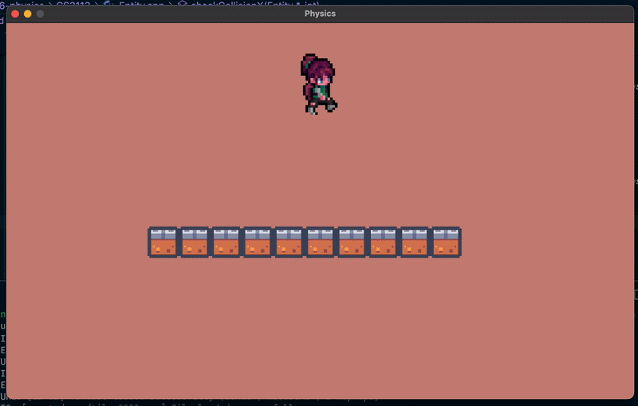
    </img>
</p>

<p align=center>
    <sub>
        <strong>Figure IX</strong>: ...
    </sub>
</p>

Of course not. Things are never quite so easy. The reason why this is happening is in no way obvious, and less so if we can't see the shape of our colliders. Thankfully, our wonderful CA Eric (who also figured out the solution for this little bug) wrote the following method to help us visualise our `Entity` objects' colliders:

```cpp
// Entity.h

// ...
class Entity
{
    // ...
public:
    // ...
    void displayCollider();
    // ...
};
```
```cpp
// Entity.cpp

// ...
void Entity::displayCollider() 
{
    Rectangle colliderBox = {
        mPosition.x - mColliderDimensions.x / 2.0f,  
        mPosition.y - mColliderDimensions.y / 2.0f,  
        mColliderDimensions.x,                        
        mColliderDimensions.y                        
    };

    DrawRectangleLines(
        colliderBox.x,      // Top-left X
        colliderBox.y,      // Top-left Y
        colliderBox.width,  // Width
        colliderBox.height, // Height
        GREEN               // Color
    );
}

// ...
void Entity::render()
{
    // ...
    displayCollider();
}
```

<a id="fg-10"></a>

<p align=center>
    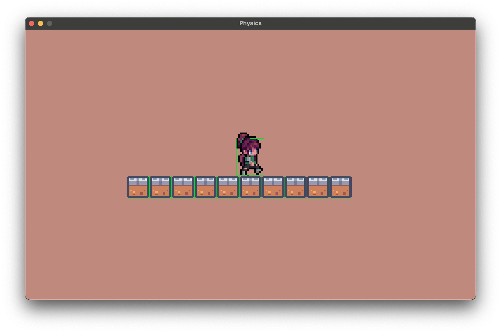
    </img>
</p>

<a id="fg-11"></a>

<p align=center>
    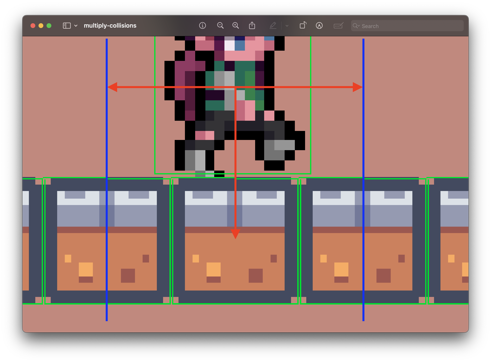
    </img>
</p>

<p align=center>
    <sub>
        <strong>Figures X & XI</strong>: The colliders of each of our objects, with the zoomed in image having added guiding lines for the tiles' centres.
    </sub>
</p>

It's clear to see from these images that Xochitl is touching more than one tile when she lands on the platform. Why does this matter? Well, it turns out that because these tiles are smaller than our character, at every point that there's a y-overlap, _we also have an x-overlap_:

<a id="fg-12"></a>

<p align=center>
    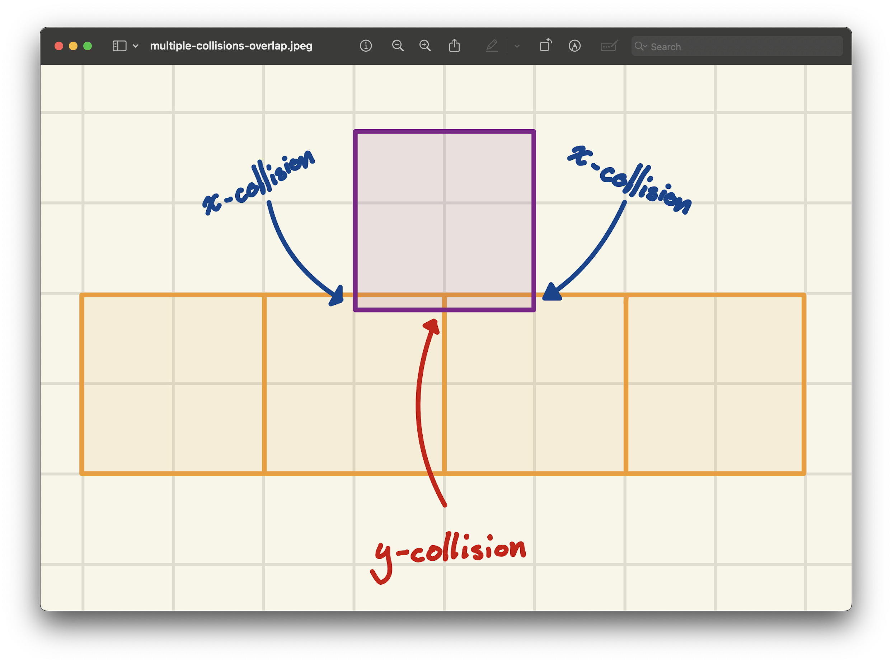
    </img>
</p>

<p align=center>
    <sub>
        <strong>Figure XII</strong>: Assuming that the player is standing right in the middle of the two tiles, this x-overlap is actually quite large.
    </sub>
</p>

Since `isColliding` is axis-agnostic, it doesn't care if we're inside of `checkCollisionX` or inside of `checkCollisionY`. If it sees that we're colliding—even by 1 pixel—in any direction, it will return `true`.

And in situations like those shown in [**figure 12**](#fg-12), the x-overlap is actually quite large: about **`mColliderDimensions.x / 2.0f`** of the player. Adjusting for an overlap of that size can cause all sorts of erratic behaviour—such as [**shooting poor Xochitl over the edge**](#fg-9).

This fix for this is simple: when checking x-collisions, simply skip over those where there's a miniscule y-overlap. Those objects are clearly not in large enough to warrant a collision overlap fix, since they are not at "eye-level". In other words, simply add the following lines to your `checkCollisionX` method:

```cpp
// Entity.h

// ...
class Entity
{
    // ...
public:
    // ...
    static constexpr float Y_COLLISION_THRESHOLD = 0.5f;
    // ...
};
// ...
```
```cpp
// Entity.cpp
void Entity::checkCollisionX(Entity *collidableEntities, int collisionCheckCount)
{
    for (int i = 0; i < collisionCheckCount; i++)
    {
        Entity *collidableEntity = &collidableEntities[i];
        
        if (isColliding(collidableEntity))
        {

            float xDistance = fabs(mPosition.x - collidableEntity->mPosition.x);
            float xOverlap  = fabs(xDistance - (mColliderDimensions.x / 2.0f) - (collidableEntity->mColliderDimensions.x / 2.0f));
            
            // When standing on a platform, we're always slightly overlapping
            // it vertically due to gravity, which causes false horizontal
            // collision detections. So the solution I found is only resolve X
            // collisions if there's significant Y overlap, preventing the 
            // platform we're standing on from acting like a wall.
            float yDistance = fabs(mPosition.y - collidableEntity->mPosition.y);
            float yOverlap  = fabs(yDistance - (mColliderDimensions.y / 2.0f) - (collidableEntity->mColliderDimensions.y / 2.0f));

            // Skip if barely touching vertically (standing on platform)
            if (yOverlap < Y_COLLISION_THRESHOLD) continue;

            // ...
        }
    }
}
```
```cpp
// main.cpp
void initialise()
{
    // ...
    for (int i = 0; i < NUMBER_OF_TILES - 1; i++) 
    {
        // assets from @see https://kenney.nl/assets/pixel-platformer-industrial-expansion
        gTiles[i].setTexture("assets/game/tile_0000.png");
        gTiles[i].setScale({TILE_DIMENSION, TILE_DIMENSION});
        gTiles[i].setColliderDimensions({TILE_DIMENSION, TILE_DIMENSION});
        gTiles[i].setPosition({
            leftMostX + i * TILE_DIMENSION, 
            ORIGIN.y + TILE_DIMENSION
        });
    }

    // Allocate the tile for the horizontal collision
    gTiles[NUMBER_OF_TILES - 1].setTexture("assets/game/tile_0000.png");
    gTiles[NUMBER_OF_TILES - 1].setScale({TILE_DIMENSION, TILE_DIMENSION});
    gTiles[NUMBER_OF_TILES - 1].setColliderDimensions({TILE_DIMENSION, TILE_DIMENSION});
    gTiles[NUMBER_OF_TILES - 1].setPosition({ORIGIN.y + TILE_DIMENSION, ORIGIN.y - TILE_DIMENSION});

    // ...
}

// ...
```

<a id="fg-13"></a>

<p align=center>
    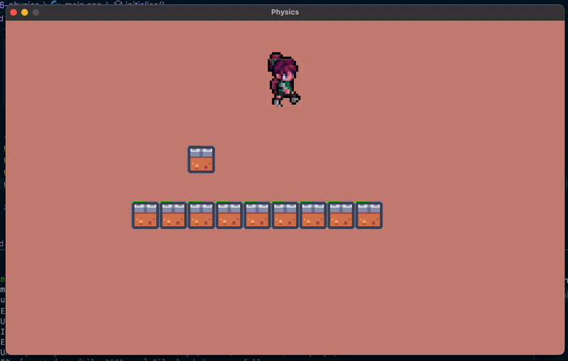
    </img>
</p>

<p align=center>
    <sub>
        <strong>Figure XIII</strong>: Smooth walking from here on out.
    </sub>
</p>

<a id="1-5"></a>

### Jumping

No platformer worthy of the name would be complete without jumping, and it's a fairly simple operation to program. Essentially, the only thing we want to do is to **negatively boost the y-component of our player's velocity** if the player is in a jumping state—easy:

```cpp
// Entity.h

// ...
class Entity 
{
private:
    // ...
    bool mIsJumping = false;
    float mJumpingPower = 0.0f;
    // ...
public:
    // ...
    void jump() { mIsJumping = true; }
    // ...
};
```
```cpp
// Entity.cpp
void Entity::update(float deltaTime, Entity *collidableEntities, int collisionCheckCount)
{
    // ...
    // ––––– JUMPING ––––– //
    if (mIsJumping)
    {
        // STEP 1: Immediately return the flag to its original false state
        mIsJumping = false;
        
        // STEP 2: The player now acquires an upward velocity
        mVelocity.y -= mJumpingPower;
    }
    // ...
}
```
```cpp
// main.cpp

// ...
void processInput()
{
    // ...
    if (IsKeyPressed(KEY_W)) gProtag->jump();
    // ...
}
// ...
```

This should work. There's only one slight problem...

<a id="fg-14"></a>

<p align=center>
    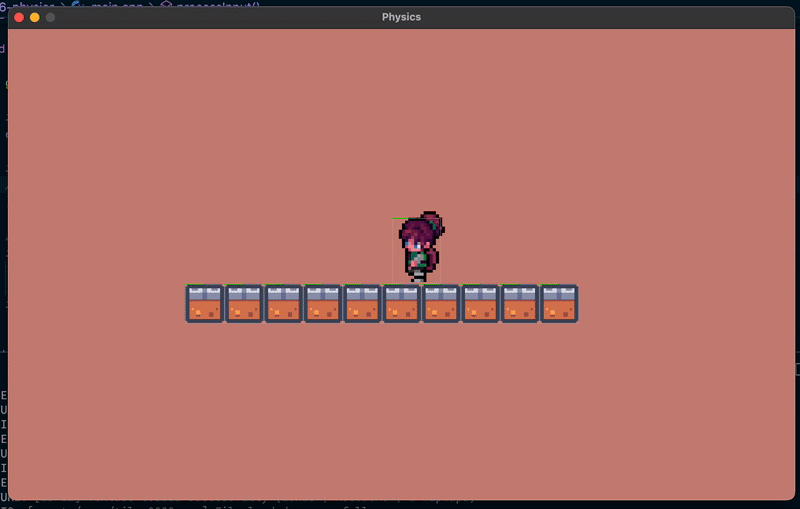
    </img>
</p>

<p align=center>
    <sub>
        <strong>Figure XIV</strong>: Double, triple, quadruple jump mechanic, anyone?
    </sub>
</p>

Unfortunately, we currently can jump regardless of whether we are touching the ground or not. And, maybe, that's okay in your game! Maybe you're not actually jumping but actually boosting yourself through the water. However, in our situation, we do actually want Xochitl to be touching the ground for her to be able to jump.

For this, we'll employ the use of **flags**. In other words, if we're colliding on the ground, we'll set our `mIsCollidingBottom` flag to `true`. And, while we're at it, we'll add three more flags to register collisions on all four cardinal directions:

```cpp
// Entity.h

// ...
class Entity
{
private:
    // ...
    bool mIsCollidingTop    = false;
    bool mIsCollidingBottom = false;
    bool mIsCollidingRight  = false;
    bool mIsCollidingLeft   = false;

    // ...

    void resetColliderFlags() 
    {
        mIsCollidingTop    = false;
        mIsCollidingBottom = false;
        mIsCollidingRight  = false;
        mIsCollidingLeft   = false;
    }

    // ...
public:

    // ...

    // we'll only add a getter for this one for now
    bool isCollidingBottom() const { return mIsCollidingBottom; }

    // ...
};
```
```cpp
// Entity.cpp

// ...

void Entity::checkCollisionY(Entity *collidableEntities, int collisionCheckCount)
{
    for (int i = 0; i < collisionCheckCount; i++)
    {
        // STEP 1: For every entity that our player can collide with...
        Entity *collidableEntity = &collidableEntities[i];
        
        if (isColliding(collidableEntity))
        {
            // ...

            if (mVelocity.y > 0) 
            {
                mPosition.y -= yOverlap;
                mVelocity.y  = 0;

                // Collision!
                mIsCollidingBottom = true;
            } else if (mVelocity.y < 0) 
            {
                mPosition.y += yOverlap;
                mVelocity.y  = 0;

                // Collision!
                mIsCollidingTop = true;
            }
        }
    }
}

void Entity::checkCollisionX(Entity *collidableEntities, int collisionCheckCount)
{
    for (int i = 0; i < collisionCheckCount; i++)
    {
        Entity *collidableEntity = &collidableEntities[i];
        
        if (isColliding(collidableEntity))
        {            
            // ...

            if (mVelocity.x > 0) {
                mPosition.x     -= xOverlap;
                mVelocity.x      = 0;

                // Collision!
                mIsCollidingRight = true;
            } else if (mVelocity.x < 0) {
                mPosition.x    += xOverlap;
                mVelocity.x     = 0;
 
                // Collision!
                mIsCollidingLeft = true;
            }
        }
    }
}

// ...

void Entity::update(float deltaTime, Entity *collidableEntities, int collisionCheckCount)
{
    // We start each frame assuming that no collisions have happened
    resetColliderFlags();

    // ...

    // Only animate if we're on the ground (not necessary)
    if (mTextureType == ATLAS && GetLength(mMovement) != 0 && mIsCollidingBottom) 
        animate(deltaTime);
}
```
```cpp
// main.cpp

// ...

void processInput()
{
    // ...

    if (IsKeyPressed(KEY_W) && gProtag->isCollidingBottom()) gProtag->jump();

    // ...
}

// ...
```

And this fixes our jumping problem!

<br>

<a id="2"></a>

## The `EntityStatus` Enum

One final important flag we're gonna add to our `Entity` class will determine whether or not the object is active or not. An inactive `Entity` object can mean many things, but fundamentally, it is one that:

- is not **updated**, and
- is not **rendered**.

You can use this flag for enemies that have been eliminated, platforms that have crumbled, and items that have been acquired and should no longer be displayed. We'll implement this system using an enum:

```cpp
// Entity.h

// ...
enum EntityStatus { ACTIVE, INACTIVE };
// ...

class Entity
{
private:
    // ...
    EntityStatus mEntityStatus = ACTIVE;
    // ...
public:
    // ...

    // could also be a traditional getter EntityStatus getStatus()
    bool isActive() { return mEntityStatus == ACTIVE ? true : false; }
    
    // ...
};
```

<br>

<a id="3"></a>

## Fixed Time Step

Just like in real life, video game physics must follow very rigid, consistent laws. One of those axiomatic measures that must be foolproof is the amount of space a body moves over time. We took our first step towards standardising this by adopting [**delta time**](https://github.com/sebastianromerocruz/CS-3113-Intro-To-Game-Programming/tree/main/lectures/03-textures-delta-time#3). Currently, however, this "timestep" is as fast as our computer can go, which makes it variable. Now, while the delta time provides smooth movement on variable frame rates and is relatively simple to implement, physics simulations can become unstable if `Δt` varies too much. For instance, if our computer slows down / speeds up for whatever reason, we might end up with something like this:

<a id="fg-15"></a>

<p align=center>
    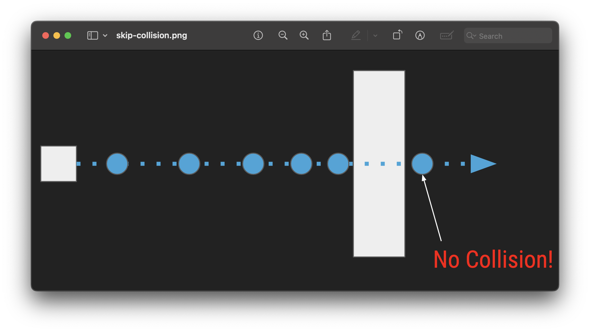
    </img>
</p>

<p align=center>
    <sub>
        <strong>Figure V</strong>: This is what we call "clipping" through a wall.
    </sub>
</p>

Using only the raw frame‑to‑frame delta time makes physics, animation, and game logic run at whatever speed the rendering loop happens to achieve, which can vary wildly across hardware, [**load spikes**](https://wilcovanes.ch/articles/what-are-the-differences-between-load-stress-spike-and-soak-testing/), or [**V‑sync changes**](https://en.wikipedia.org/wiki/Screen_tearing#Vertical_synchronization).

Because an ever‑changing `Δt` can cause the simulation to diverge, we need a way to decouple real time from the physics update rate. By accumulating the elapsed delta time and then advancing the simulation in constant, predefined increments—the so‑called _fixed timestep_—the core mechanics stay deterministic and stable: collisions resolve the same way each frame, physics integrators remain numerically well‑behaved, and replay/network synchronization become far easier. The delta time is still needed to know how much real time has passed, but the accumulator guarantees that the simulation advances in uniform chunks, while any leftover fraction is carried over to the next frame so no time is lost. A fixed‑timestep, in other words, _normalises_ our delta time.

The steps to do this are as follows:

1. Measure elapsed wall‑clock time
    ```c++
    float ticks = (float) GetTime();          // current time in seconds (or ms)
    float deltaTime = ticks - gPreviousTicks; // time since last frame
    gPreviousTicks = ticks;                   // store for next iteration
    ```
    `deltaTime` now holds the raw frame‑to‑frame duration.

2. Add any previously unprocessed remainder
    ```c++
    deltaTime += gTimeAccumulator;
    ```
    `gTimeAccumulator` stores the fraction of time that was too small to form a full fixed step during the previous frame.

3. Check whether we have enough time for even one fixed step
    ```c++
    if (deltaTime < FIXED_TIMESTEP)
    {
        gTimeAccumulator = deltaTime; // keep the leftover for next frame
        return;                       // skip simulation this frame
    }
    ```
    If the accumulated time is less than the desired step size, we bail out early, preserving the leftover.

4. Consume as many whole fixed steps as possible

    ```c++
    while (deltaTime >= FIXED_TIMESTEP)
    {
        gProtag->update(FIXED_TIMESTEP);  // advance player logic
        deltaTime -= FIXED_TIMESTEP;      // remove the consumed slice
    }
    ```
    - Each iteration represents one deterministic simulation tick (`FIXED_TIMESTEP`).
    - All game objects (the protagonist and each tile) are updated with exactly the same time step, ensuring consistent physics and gameplay regardless of frame rate.
    - After processing, deltaTime holds any remaining fraction that didn’t fit another full step.

5. Store the leftover for the next frame
    (Implicitly done because `gTimeAccumulator` isn’t overwritten after the loop.)
    The residual `deltaTime` (now < `FIXED_TIMESTEP`) will be added to the next frame’s raw delta time at step 2, guaranteeing that no time is ever discarded.

Here's our game running at different 5, 30, and 120 frames-per-second:

<a id="fg-16"></a>

<p align=center>
    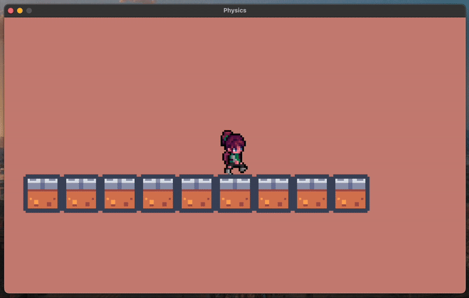
    </img>
</p>

<a id="fg-17"></a>

<p align=center>
    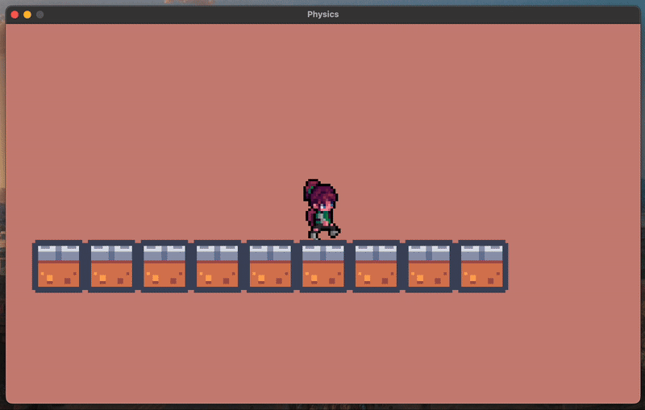
    </img>
</p>

<a id="fg-18"></a>

<p align=center>
    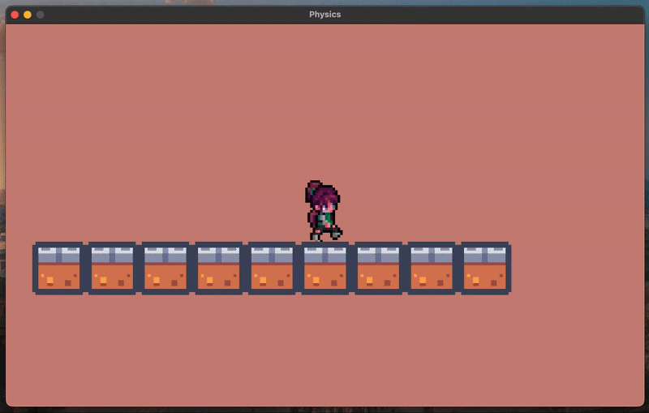
    </img>
</p>

<p align=center>
    <sub>
        <strong>Figures VI, VII, & VIII</strong>: In spite of the different FPSs and potential load spikes, all objects are where they're meant to be.
    </sub>
</p>

This way, our games run at a steady, predictable rate while still respecting the actual passage of real time—meaning smoother physics, reproducible behavior, and easier networking or replay support.