 <h2 align=center>Week 10</h2>

<h1 align=center>Effects / Shaders</h1>

<h3 align=center>7 Red Wolf Moon, Imperial Year MMXXV</h3>

<p align=center><strong><em>Song of the day</strong></em>: <em><a href="https://youtu.be/dWvJPmfmhDA?si=zQb8U1mcbmCa48vH"><strong>Existential Crisis</a></strong> by WENDY (2025)</em></p>

---

## Sections

1. [**Effects**](#1)
    - [**The `Effects` Class**](#1-1)
    - [**The `drawOverlay` Method**](#1-2)
    - [**The `render` Method**](#1-3)
    - [**The `start` Method**](#1-4)
    - [**The `update` Method**](#1-5)
        - [**`FADEIN` and `FADEOUT`**](#1-5-1)
        - [**`GROW` and `SHRINK`**](#1-5-2)
2. [**Shaders**](#2)
    - [**Vertex Shader**](#2-1)
        - [**Inputs: data coming from the CPU or vertex buffer**](#2-1-1)
        - [**Outputs: data to be passed to the fragment shader**](#2-1-2)
        - [**Uniforms: constant data supplied by the CPU**](#2-1-3)
        - [**The `main` function**](#2-1-4)
    - [**Fragment Shader**](#2-2)
        - [**Basic Shader Programming**](#2-2-1)
        - [**Greyscale**](#2-2-2)
    - [**Communicating With Shaders**](#2-3)
---

<a id="1"></a>

## Effects

We should be proud of ourselves; we have reached a point where we're going to focus on the polish of our games instead of working on the actual mechanics. The first thing we should think about is adding some special effects, such as transition overlays and camera shaking.

How does this work? For transitions such as fade-ins and -outs, the trick is to create a black square that covers the entire screen. For fade-ins, we want to make this black square go from completely solid to completely invisible. We do this by manipulating the [**alpha-channel**](https://en.wikipedia.org/wiki/Alpha_compositing). We'll thus keep track of this value and change it accordingly. The following enum will keep track of which event will currently be "in effect" in the game:

```cpp
enum EffectType { NONE, FADEIN, FADEOUT, SHRINK, GROW };
```

In order:

- **`FADEIN`**: The screen begins totally covered by a black (or any other colour) overlay, which slowly disappears to give way to what's behind it.
- **`FADEOUT`**: The screen slowly fades to a totally black (or any other coloured) overlay.
- **`SHRINK`**: The same overlay from `FADEIN` starts out covering the entirety of the screen and slowly shrinks until it disappears completely. This effect is great for starting levels.
- **`GROW`**: The same overlay from `FADEIN` starts out with a scale of (0, 0) and slowly grows until it covers the entire scene. This effect is great for ending levels.

These effects are independent to any particular scene, as they could even serve as transition elements between levels, and thus they will exist at the global level, in `main`. We'll round them all up in a simple class, **`Effects`**, from which we will be able to call them at any moment we want.

<a id="1-1"></a>

### The `Effects` Class

The definition of the `Effects` class is as follows:

```cpp
// Effects.h
class Effects
{
private:
    float mAlpha;
    float mEffectSpeed;
    float mOverlayWidth;
    float mOverlayHeight;
    EffectType mCurrentEffect;
    Vector2 mViewOffset;
    Vector2 mOrigin;
    Vector2 mMaxWindowDimensions;

    void drawOverlay();
public:
    static constexpr float SOLID       = 1.0f,
                           TRANSPARENT = 0.0f,
                           DEFAULT_SPEED = 1.0f,
                           OVERLAY_MAX_SIZE = 1000.0f,
                           SIZE_SPEED_MULTIPLIER = 100.0f;

    Effects(Vector2 origin, float windowWidth, float windowHeight);

    void start(EffectType effectType);
    void update(float deltaTime, Vector2 *viewOffset);
    void render();

    // getters

    // setters
};
```

In order, our attributes are the following:

1. **`float mAlpha`**: Since we're going to be making our overlay transparent/solid during certain effect, this will keep track of how transparent that overlay will currently be.
2. **`float mEffectSpeed`**: This multiplier will determine how fast or how slow our effect will be in-game.
3. **`float mOverlayWidth`** / **`float mOverlayHeight`**: These are the current dimensions of the overlay, which we will change during shrinking/growing.
4. **`EffectType mCurrentEffect`**: This keeps track of which of our effects we are currently running.
5. **`Vector2 mViewOffset`**: Since our game now has a camera that could potentially be following the player, we have to also tell our overlay to follow that camera position so that it remains at the centre of the screen. This could also be used for other camera-related effects.
6. **`Vector2 mOrigin`**: As with all position-based structures in this class, we need to have a sense of where the origin is to accurately render.
7. **`Vector2 mMaxWindowDimensions`**: We'll use these in order to guarantee that our overlay covers the entire screen.

The constructor is pretty simple, too:

```cpp
// Effects.cpp
Effects::Effects(Vector2 origin, float windowWidth, float windowHeight) : mAlpha{SOLID}, 
                     mEffectSpeed{DEFAULT_SPEED},
                     mOverlayWidth{windowWidth}, 
                     mOverlayHeight{windowHeight}, mCurrentEffect{NONE},
                     mViewOffset{{}}, mOrigin{origin}, 
                     mMaxWindowDimensions{windowWidth, windowHeight} {}
```

<a id="1-2"></a>

### The `drawOverlay` Method

```cpp
void Effects::drawOverlay()
{
    float left = mViewOffset.x - mOverlayWidth  / 2.0f;
    float top  = mOrigin.y - mOverlayHeight / 2.0;

    DrawRectangle(left,
                  top,
                  mOverlayWidth,
                  mOverlayHeight,
                  Fade(BLACK, mAlpha));
}
```

The draw overlay is pretty simple. It simply draws a rectangle in a very similar way that we create rectangles in `render`:

```cpp
void DrawRectangle(int posX, int posY, int width, int height, Color color); // Draw a color-filled rectangle
```

I calculate my x- and y-coordinates—`left` and `top`—using a combination of the view offset and the origin. This is not exactly set in stone, though. In my current game, the camera isn't following Xochi in the y-direction. For this reason, I am simply using the origin (which is static) as a point of reference for its y-coordinate. Since the camera is following Xochi horizontally, I use the view offset instead, which I can update every frame by assigning it Xochi's or the camera's position.

The `Fade` function, as per [**raylib**](https://www.raylib.com/cheatsheet/cheatsheet.html), gets a "color with `alpha` [channel] applied, `alpha` goes from `0.0f` to `1.0f`", which is exactly what we need when using effects such as `FADEIN` and `FADEOUT`.

<a id="1-3"></a>

### The `render` Method

```cpp
void Effects::render()
{
    switch (mCurrentEffect)
    {
        case FADEIN:
        case FADEOUT:
        case SHRINK:
        case GROW:
            drawOverlay();
            break;

        case NONE:
    
    default:
        break;
    }
}
```

The `render` method is possibly the simplest one (at least, with the effects we currently have in mind). In all cases, the only thing we want to draw onto the screen is our solid overlay by calling `drawOverlay`.

<a id="1-4"></a>

### The `start` Method

```cpp
void Effects::start(EffectType effectType)
{
    mCurrentEffect = effectType;

    switch (mCurrentEffect)
    {
        case FADEIN:
            mAlpha = SOLID;
            break;

        case FADEOUT:
            mAlpha = TRANSPARENT;
            break;

        case SHRINK:
            mOverlayHeight = mMaxWindowDimensions.y;
            mOverlayWidth  = mMaxWindowDimensions.x;
            break;

        case GROW:
            mOverlayHeight = 0.0f;
            mOverlayWidth  = 0.0f;
            break;

        case NONE:
        default:
            break;
    }
}
```

The starting conditions vary depending on our effect of choice:

- **`FADEIN`**: The screen begins totally covered by a black (or any other colour) overlay, so its alpha value must be `SOLID` (`1.0f`).
- **`FADEOUT`**: The screen slowly fades to a totally black (or any other coloured) overlay, meaning it starts completely `TRANSPARENT` (i.e. an alpha value of `0.0f`).
- **`SHRINK`**: The overlay starts out covering the entirety of the screen, so we set its dimensions to the screen's dimensions.
- **`GROW`**: The overlay starts out with a scale of (0, 0), so that's what we set its width and height to.

<a id="1-5"></a>

### The `update` Method

`update`'s logic is a little more involved, so let's cover it line by line, effect by effect. As previously explained, the position of our effects can be sometimes dependent on an external set of coordinates (like our player's, or the camera's), so the first thing we're going to do is update that offset:

```cpp
void Effects::update(float deltaTime, Vector2 *viewOffset)
{
    if (viewOffset != nullptr) mViewOffset = *viewOffset;

    // ...
}
```

Next, to make sure that our overlay shrinks/grows uniformly in both directions, we'll need to calculate the ratio between its width and height (basically, longer dimensions have to grow faster than shorter ones in order for the whole screen to get covered at the same time):

```cpp
void Effects::update(float deltaTime, Vector2 *viewOffset)
{
    // ...
    float diagonalRatio = mMaxWindowDimensions.y / mMaxWindowDimensions.x;
    // ...
}
```

<a id="1-5-1"></a>

#### `FADEIN` and `FADEOUT`

`FADEIN` and `FADEOUT` work pretty much exactly the same, just in the opposite direction:

1. Add/subtract a little to/from the alpha value (in our case, the delta time multiplied by some speed we choose).
2. Once we reach either full transparency/solidity, make sure to turn off the effects (i.e. switch the current effect to `NONE`)

```cpp
void Effects::update(float deltaTime, Vector2 *viewOffset)
{
    // ...

    switch (mCurrentEffect)
    {
        case FADEIN:
            mAlpha -= mEffectSpeed * deltaTime;

            if (mAlpha <= TRANSPARENT)
            {
                mAlpha = TRANSPARENT;
                mCurrentEffect = NONE;
            }

            break;

        case FADEOUT:
            mAlpha += mEffectSpeed * deltaTime;

            if (mAlpha >= SOLID)
            {
                mAlpha = SOLID;
                mCurrentEffect = NONE;
            }

            break;

        // ...
    }
    
    // ...
}
```

Let's give both a go by adding them to `main`:

```cpp
// main.cpp
// ...

Effects *gEffects = nullptr;

// ...

void initialise()
{
    // ...

    gEffects = new Effects(ORIGIN, (float) SCREEN_WIDTH * 1.5f, (float) SCREEN_HEIGHT * 1.5f);
    gEffects->start(FADEIN);

    // or...
    // gEffects->start(FADEOUT);

    // ...
}

// ...

void update() 
{
    // ...

    while (deltaTime >= FIXED_TIMESTEP)
    {
        // ...

        Vector2 cameraTarget = { gCurrentScene->getState().xochitl->getPosition().x, ORIGIN.y };
        panCamera(&gCamera, &cameraTarget);
        gEffects->update(FIXED_TIMESTEP, &cameraTarget);

        // ...
    }
}

void render()
{
    // ...

    gEffects->render();

    // ...
}

void shutdown() 
{
    // ...

    delete gEffects;
    gEffects = nullptr;

    // ...
}

// ...
```

To see the following:

<a id="fg-1"></a>

<p align=center>
    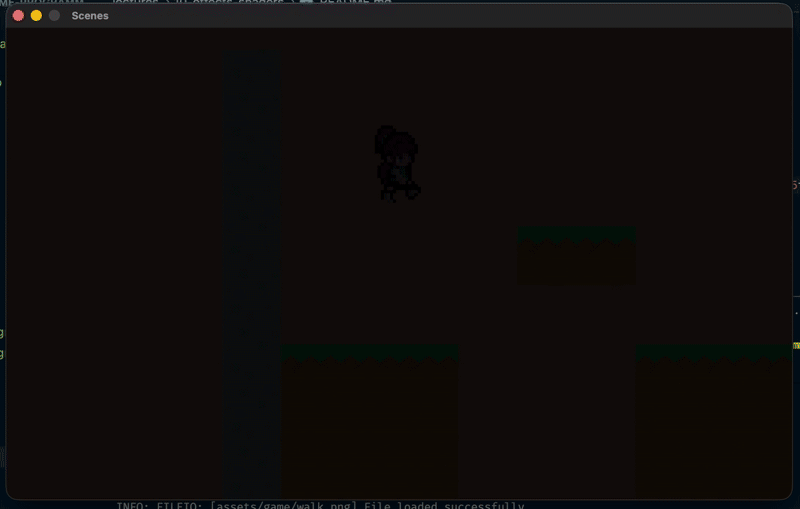
    </img>
</p>

<a id="fg-2"></a>

<p align=center>
    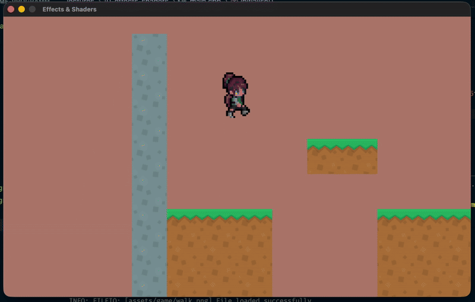
    </img>
</p>

<p align=center>
    <sub>
        <strong>Figures I & II</strong>: Fade-in and -out in action.
</p>

<a id="1-5-2"></a>

#### `GROW` and `SHRINK`

`GROW`/`SHRINK` mirrors this logic pretty nicely, with the attributes that we're updating every frame being the overlay width and height. Note the inclusion of the `diagonalRatio` multiplier that we calculated earlier:

```cpp
void Effects::update(float deltaTime, Vector2 *viewOffset)
{
    // ...

    switch (mCurrentEffect)
    {
        // ...

        case SHRINK:
            mOverlayHeight -= mEffectSpeed * SIZE_SPEED_MULTIPLIER * deltaTime * diagonalRatio;
            mOverlayWidth  -= mEffectSpeed * SIZE_SPEED_MULTIPLIER * deltaTime;

            if (mOverlayHeight <= 0.0f ||
                mOverlayWidth  <= 0.0f)
            {
                mOverlayHeight = 0.0f;
                mOverlayWidth  = 0.0f;
                mCurrentEffect = NONE;
            }
            break;

        case GROW:
            mOverlayHeight += mEffectSpeed * SIZE_SPEED_MULTIPLIER * deltaTime * diagonalRatio;
            mOverlayWidth  += mEffectSpeed * SIZE_SPEED_MULTIPLIER * deltaTime;

            if (mOverlayHeight >= mMaxWindowDimensions.y ||
                mOverlayWidth  >= mMaxWindowDimensions.x)
            {
                mOverlayHeight = mMaxWindowDimensions.y;
                mOverlayWidth  = mMaxWindowDimensions.x;
                mCurrentEffect = NONE;
            }
            break;

        case NONE:
        default:
            break;
    }
}
```

<a id="fg-3"></a>

<p align=center>
    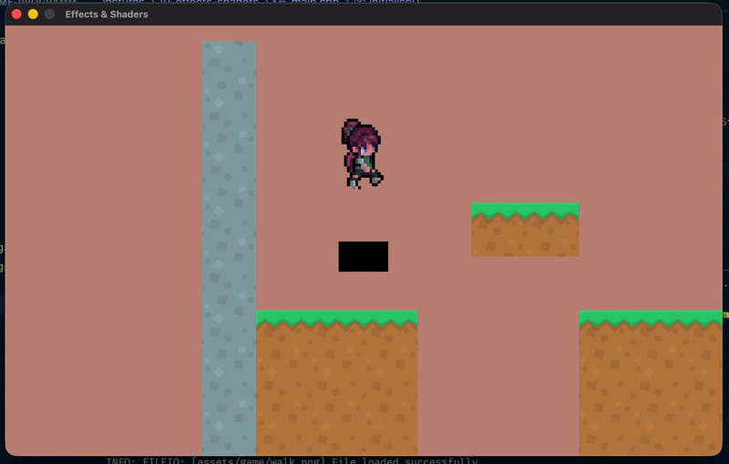
    </img>
</p>

<a id="fg-4"></a>

<p align=center>
    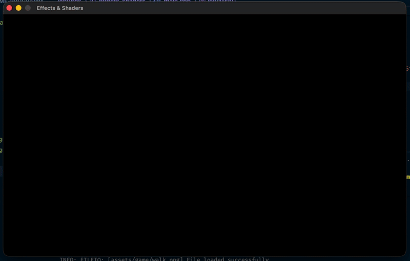
    </img>
</p>

<p align=center>
    <sub>
        <strong>Figures III & IV</strong>: Grow and shrink in action.
</p>

<br>

<a id="2"></a>

## Shaders

This is perhaps my favourite topic of the entire course, so it's a shame that we only get to touch it so briefly. Shaders are basically programs that run _directly on the GPU_ and control nearly every stage of the rendering pipeline. Instead of relying on [fixed-function graphics](https://en.wikipedia.org/wiki/Fixed-function_(computer_graphics)) (as we did in ye olde days), modern rendering is fully programmable: the GPU asks us how to process vertices, how to colour pixels, and how to apply lighting or special effects. Shaders give us that control. This also makes our games much more efficient—any work you can move from the CPU to the GPU—lighting, transformations, filtering—will run much faster.

We have two types of shaders:
- **Vertex Shader**: This shader translates the vertices that we feed into it to screen positions.
- **Fragment Shader**: For _each pixel_, the fragment shader determines exactly what colour to draw onto the screen. It does this by either grabbing a pixel/colour from a texture, or by interpolating by distance from the vertices.

<a id="fg-5"></a>

```
 +———————————————————+       +———————————————————+       +——————————————————————————————————————+
 |     Vertices      | ----> |   Vertex Shader   |       |                                      |
 +———————————————————+       +———————————————————+       |                                      |
                                      |                  |         +——————————————————+         |
                                      V                  |         | SUPER MARIO BROS |         |
                             +———————————————————+       |         +——————————————————+         |
                             |  Fragment Shader  | ----> |                                      |
                             +———————————————————+       |                                      |
                                                         |           > Start                    |
                                                         |           > Settings                 |
                                                         |                                      |
                                                         +——————————————————————————————————————+
```

<p align=center>
    <sub>
        <strong>Figure V</strong>: The shader pipeline.
</p>

So, what _can_ we program with shaders? Everything beyond the most basic rendering depends on shaders: lighting models, shadows, fog, bloom, outlines, distortion effects, water, particles, post-processing, and more. If you can think of an effect, you can usually write a shader to do it and, because shaders operate per-vertex and per-pixel, you can decide exactly how every pixel in your game should appear, using math, textures, and uniform parameters you pass in from the CPU to the GPU.

In order to get started, let's take a look at some bare-bones examples of both shaders.

<a id="2-1"></a>

### Vertex Shader

Shaders are typically written in [**glsl**](https://en.wikipedia.org/wiki/OpenGL_Shading_Language), or "[Open]GL Shading Language", which looks a lot like C. Let's take a look at it:

```glsl
// vertex.glsl
#version 330

in vec3 vertexPosition;
in vec2 vertexTexCoord;

out vec2 fragTexCoord;
out vec2 fragPosition;

uniform mat4 mvp;

void main()
{
    fragTexCoord = vertexTexCoord;
    fragPosition = vertexPosition.xy;
    gl_Position = mvp * vec4(vertexPosition, 1.0);
}
```

This is a **vertex shader**, which runs once per vertex. Its job is to prepare data for the fragment shader and to compute each vertex’s final position on screen.

<a id="2-1-1"></a>

#### **Inputs**: data coming from the CPU or vertex buffer

```glsl
in vec3 vertexPosition;
in vec2 vertexTexCoord;
```

- `in` variables are what we call **vertex attributes**—data provided for each vertex (by Raylib internally).
- `vertexPosition` is the position of the vertex in x-/y-coordinates.
- `vertexTexCoord` is the 2D coordinate used to look up into a texture (i.e. the u-/v-coordinate).

These values are different for _each vertex_, so the shader will execute once per vertex with different input values.

<a id="2-1-2"></a>

#### **Outputs**: data to be passed to the fragment shader

```glsl
out vec2 fragTexCoord;
out vec2 fragPosition;
```

- `out` variables carry data from the **vertex shader** to the **fragment shader**. They are automatically interpolated across the polygon being drawn, meaning that if one vertex has `texCoord` (0,0) and another has (1,1), pixels in between get intermediate values.
- `fragTexCoord` is used for texture sampling in the fragment shader.
- `fragPosition` holds the 2D world position (x-/y-coordinates).

<a id="2-1-3"></a>

#### **Uniforms**: constant data supplied by the CPU

```glsl
uniform mat4 mvp;
```

- Uniforms don’t change per vertex; they change _per draw call_.
- Any variable marked as `uniform` represents data that is being manually passed (either by us or by raylib) into the shaders from our C++ code.
- `mvp` stands for **Model–View–Projection** matrix. This transforms a vertex from object space to the world space, then to the camera space and finally to the screen space.
- In raw OpenGL, we would upload this matrix each frame. Thankfully, raylib takes care of most of it for us.

<a id="2-1-4"></a>

#### The `main` function

```glsl
void main()
{
    fragTexCoord = vertexTexCoord;
    fragPosition = vertexPosition.xy;
    gl_Position = mvp * vec4(vertexPosition, 1.0);
}
```

Line-by-line, we:

1. Pass the texture coordinate to the fragment shader. Sometimes there will be some calculations involved here in the case of shadows and lighting, but in our case the fragment shader will simply sample the sprite/tileset.
2. Store the X and Y components of the vertex’s position.
3. Define where the vertex ends up on screen. This step is actually extremely important but, again, we don't need to worry about this in our class.

<a id="2-2"></a>

### Fragment Shader

The fragment shader is where most of the action that we'll see in this class will happen. Right now, it's very simple:

```glsl
#version 330

uniform sampler2D texture0;

in vec2 fragTexCoord;
in vec2 fragPosition;

out vec4 finalColor;

void main()
{
    finalColor = texture(texture0, fragTexCoord);
}
```

- We've got `fragTexCoord` and `fragPosition` coming in from the _vertex shader_ (since they're `in` variables).
- We've got `texture0` being fed into the shader by our CPU every frame (since it's a `uniform` variable). This represents the actual texture file we use when calling the `render` function.
- We've got `finalColor` being pushed out of the shader. Basically, every fragment shader must output the final color of the current pixel it is working with. In our code, there's not a lot going on, we're simply sampling directly from the texture:
    ```glsl
    finalColor = texture(texture0, fragTexCoord);
    ```
    Just remember that this `out` variable is a `vec4` because it includes red, green, blue, and alpha values.

<a id="2-2-1"></a>

#### Basic Shader Programming

How can we change things up? Well, let's say we removed one or more of the channels out of `finalColor`:

```glsl
void main()
{
    vec4 color = texture(texture0, fragTexCoord);
    finalColor = vec4(color.r, 0.0, 0.0, color.a);
}
```

Xochitl now looks like she's in danger:

<a id="fg-6"></a>

<p align=center>
    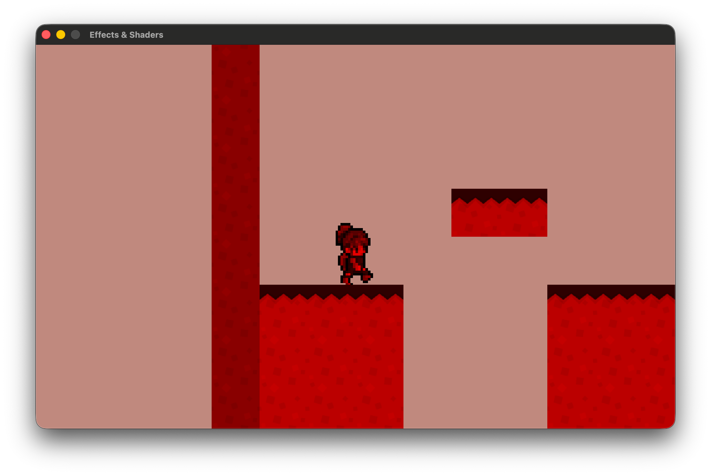
    </img>
</p>

<p align=center>
    <sub>
        <strong>Figure VI</strong>: Isolating only the red channel.
    <sub>
</p>

Or if we mixed the channels up:

```glsl
void main()
{
    vec4 color = texture(texture0, fragTexCoord);
    finalColor = vec4(color.g, color.b, color.r, color.a);
}
```

<a id="fg-7"></a>

<p align=center>
    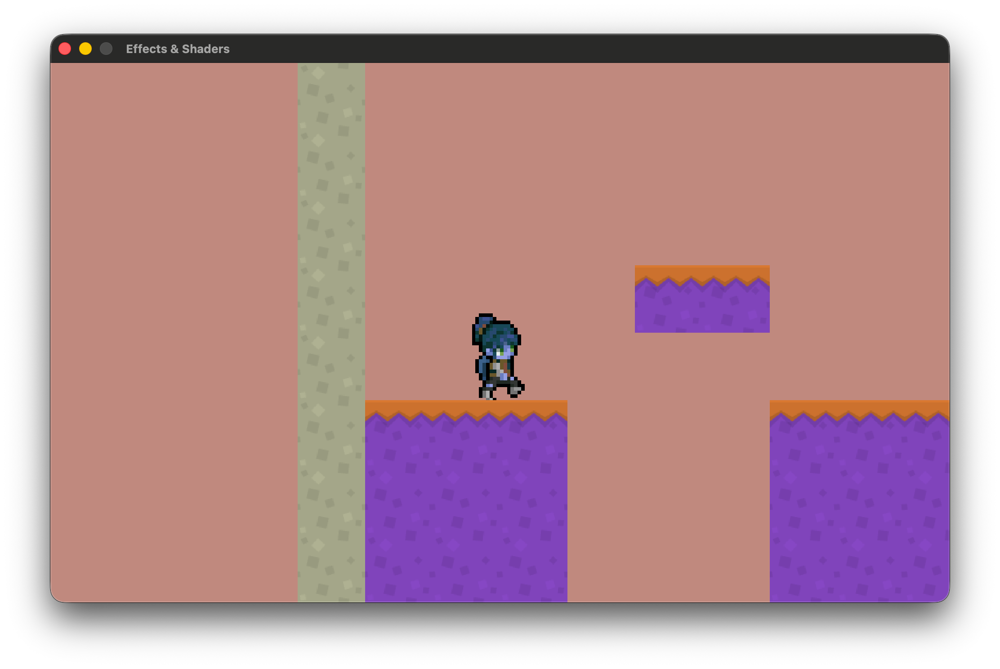
    </img>
</p>

<p align=center>
    <sub>
        <strong>Figure VII</strong>: Scrambling the colour channels.
    <sub>
</p>

Or even inverting them?

```glsl
void main()
{
    vec4 color = texture(texture0, fragTexCoord);
    finalColor = vec4(1 - color.r, 1 - color.g, 1 - color.b, color.a);
}
```

<a id="fg-8"></a>

<p align=center>
    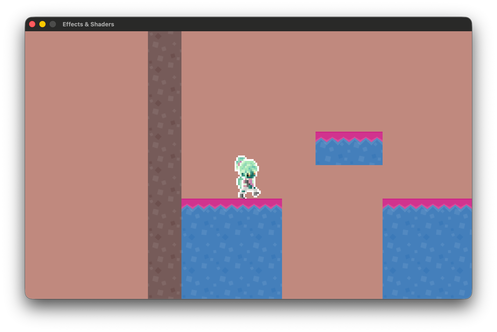
    </img>
</p>

<p align=center>
    <sub>
        <strong>Figure VIII</strong>: Inverting the colour channels. I personally love this one.
    <sub>
</p>

<a id="2-2-2"></a>

#### Greyscale

We can also take advantage of luminance, the intensity of light emitted from a surface, to get a basic greyscale palette:

<a id="fg-9"></a>

<p align=center>
    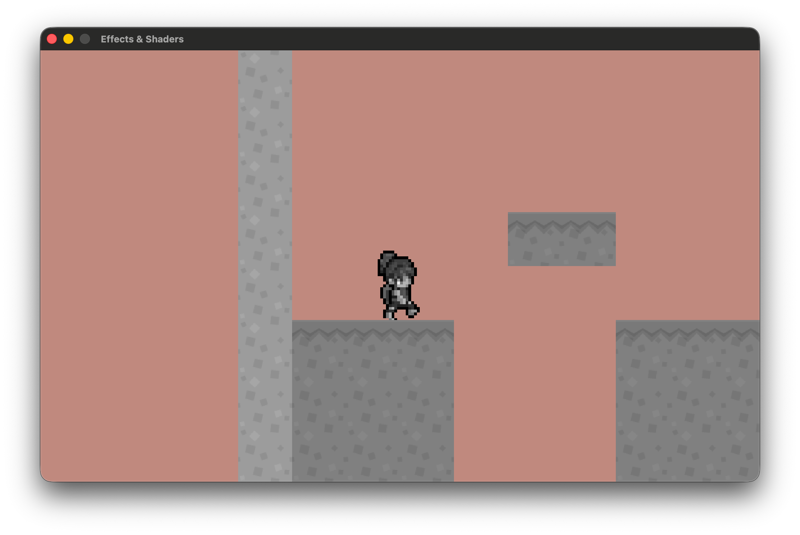
    </img>
</p>

<p align=center>
    <sub>
        <strong>Figure IX</strong>: A very basic form of monochrome.
    <sub>
</p>

We can also get a more nuanced grayscale by taking advantage of something called "perceived luminance", or how bright a light source appears to the human eye. Basically, in human vision:
- Green contributes most to perceived brightness
- Red contributes a bit less
- Blue contributes least

Research in colour science quantifies this into a standard formula for converting an RGB color into perceived luminance, using what are called the [**ITU-R BT.709 (sRGB) luminance coefficients**](https://en.wikipedia.org/wiki/Rec._709):

> *Y* = 0.2126*R* + 0.7152*G* + 0.0722*B*

I'm gonna add these in to my code, and use this formula to give me a nice, "realistic" monochrome (the dot product, by the way, is a compact way to write the above formula):

```glsl
// ...

const float RED_LUM_CONSTANT   = 0.2126;
const float GREEN_LUM_CONSTANT = 0.7152;
const float BLUE_LUM_CONSTANT  = 0.0722;

// ...

void main()
{
    vec4 color = texture(texture0, fragTexCoord);
    vec3 luminance = vec3(
        dot(
            vec3(RED_LUM_CONSTANT, GREEN_LUM_CONSTANT, BLUE_LUM_CONSTANT), 
            color.rgb
        )
    );
    finalColor = vec4(luminance.rgb, color.a);
}
```

<a id="fg-10"></a>

<p align=center>
    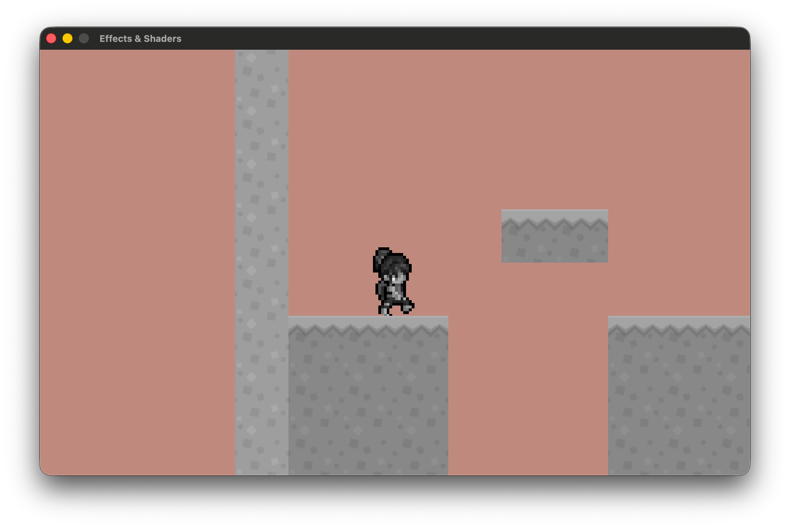
    </img>
</p>

<p align=center>
    <sub>
        <strong>Figure X</strong>: All around me are familiar faces.
    <sub>
</p>

<a id="2-3"></a>

### Communicating With Shaders

This is all well and good, but none of it necessarily does anything that couldn't be also done by simply adding more textures to our assets folder. Let's try something a little more exciting. If you've ever played [**Paper Mario 64**](https://en.wikipedia.org/wiki/Paper_Mario_(video_game)), you might recognise the following scene:

<a id="fg-11"></a>

<p align=center>
    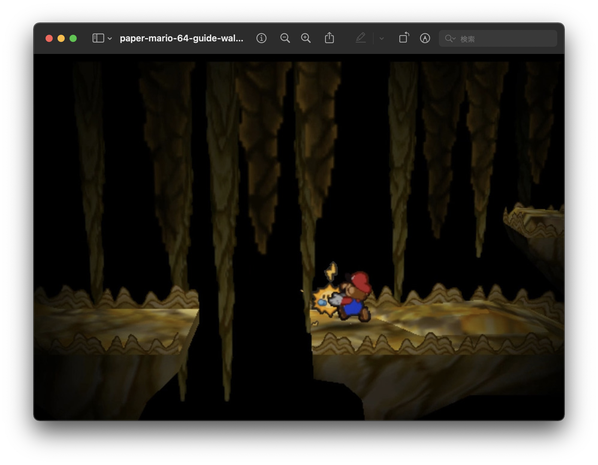
    </img>
</p>

<p align=center>
    <sub>
        <strong>Figure XI</strong>: Mario and his partner, Sparky.
    <sub>
</p>

When Mario has Sparky as his partner, she acts like a light source as she follows him around in dark rooms. The textures around the room never change at all—the brightness gradient is completely calculated (based on the position of Mario and Sparky) and applied by the shaders.

How can we do this? First, look at the shader-related code that I've included in our `main`:

```cpp
// main.cpp
// ...

ShaderProgram gShader;

// ...

void initialise()
{
    // ...

    gShader.load("shaders/vertex.glsl", "shaders/fragment.glsl");

    // ...
}

// ...

void render()
{
    BeginDrawing();
    BeginMode2D(gCamera);
    gShader.begin();

    // Shader-affected rendering happens here!

    gShader.end();
    gEffects->render();  // note that the shaders are not affecting the effects
    EndMode2D();
    EndDrawing();
}

void shutdown() 
{
    // ..

    gShader.unload();

    // ...
}

// ...
```

The `ShaderProgram` class is defined as follows:

```cpp
class ShaderProgram 
{
private:
    Shader mShader;
    bool mIsLoaded;

public:
    static constexpr int NOT_LOADED = -1;

    ShaderProgram();
    ~ShaderProgram();

    bool load(const std::string &vertexPath, const std::string &fragmentPath);
    void unload();

    void begin();
    void end();

    void setVector2(const std::string &name, const Vector2 &value);
    void setFloat(const std::string &name, float value);
    void setInt(const std::string &name, int value);

    Shader &getShader()     { return mShader;   }
    bool   isLoaded() const { return mIsLoaded; }
};
```

The key lies in those setter methods:

```cpp
void setVector2(const std::string &name, const Vector2 &value);
void setFloat(const std::string &name, float value);
void setInt(const std::string &name, int value);
```

Remember how we said that [**`uniform` variables**](#2-1-3) are those whose values that we can send from our code to directly to the shaders? Let's take advantage of this system and start sending Xochitl's position to our fragment shader. 

First, add the variable to the shader file:

```glsl
// fragment.glsl
// ...

uniform vec2 lightPosition;

// ...
```

And use our setters in `main` to send it in:

```cpp
// main.cpp
// ...

Vector2 gLightPosition = { 0.0f, 0.0f };

// ...

void update() 
{
    // ...

    while (deltaTime >= FIXED_TIMESTEP)
    {
        // ...

        gLightPosition = gCurrentScene->getState().xochitl->getPosition();

        // ...
    }
}

void render()
{
    // ...

    gShader.begin();

    
    gShader.setVector2("lightPosition", gLightPosition);

    gCurrentScene->render();

    gShader.end();

    // ...
}
```

Note that the first parameter of each of these setters is the actual name of the `uniform` variable inside of the shader. It has to match _exactly_. One of the more frustrating sides of shader programming is that if you make a mistake, there will be no error messages; we're communicating directly with the GPU, and the GPU has no compiler.

Anyway, this, by itself, doesn't do anything—we'll have to add logic inside of the fragment shader to achieve our desired effect. The trick here is to check the distance from the light of each pixel. For this, we use something called the [**inverse-square law**](https://en.wikipedia.org/wiki/Inverse-square_law):

<a id="fg-12"></a>

<p align=center>
    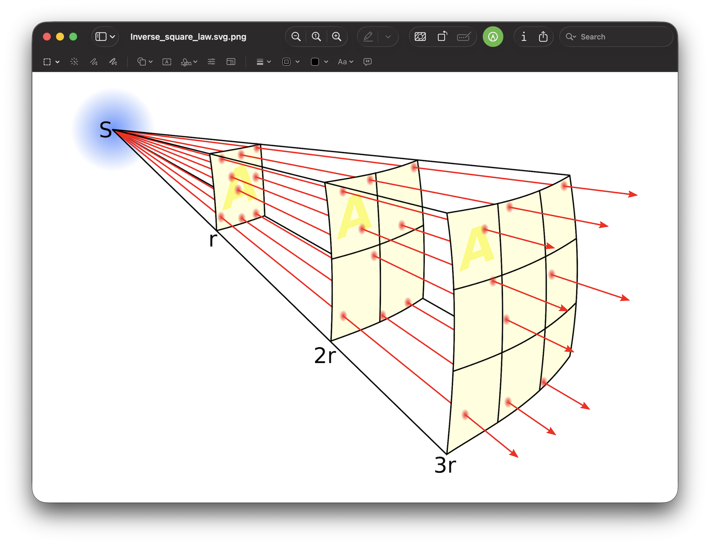
    </img>
</p>

<p align=center>
    <sub>
        <strong>Figure XII</strong>: <code>S</code> represents the light source, while <code>r</code> represents the measured points. The lines represent the flux emanating from the sources and fluxes. The density of flux lines is inversely proportional to the square of the distance from the source because the surface area of a sphere increases with the square of the radius. Thus the field intensity is inversely proportional to the square of the distance from the source.
    <sub>
</p>

The formula to calculate how much light reaches a pixel based on distance—otherwise known as **attenuation**, is as follows:

```glsl
const float MIN_BRIGHTNESS = 0.05; // avoid total darkness

float attenuate(float distance, float linearTerm, float quadraticTerm)
{
    float attenuation = 1.0 / (1.0 + 
                               linearTerm * distance + 
                               quadraticTerm * distance * distance);
                               
    return max(attenuation, MIN_BRIGHTNESS);
}
```

Meaning, when `distance` is small, brightness ~= `1.0f` (a.k.a. full intensity). Now, let's apply it:

```glsl
// fragment.glsl
// ...

// Adjustable attenuation parameters
const float LINEAR_TERM    = 0.00003; // linear term
const float QUADRATIC_TERM = 0.00003; // quadratic term

// ...

void main()
{
    float distance   = distance(lightPosition, fragPosition);
    float brightness = attenuate(distance, LINEAR_TERM, QUADRATIC_TERM);
    vec4 color = texture(texture0, fragTexCoord);
    finalColor = vec4(color.rgb * brightness, color.a);
}
```

And we get this wonderful effect!

<a id="fg-13"></a>

<p align=center>
    
    </img>
</p>

<p align=center>
    <sub>
        <strong>Figure XIII</strong>: The result is an effect that gives such an impression of polish and finesse for very little code.
    <sub>
</p>